<!-- README.md is generated from README.Rmd. Please edit that file -->

# Introduction

Continuing with the previous article [The fabrication of an artificial
intelligence agent for reservoir history matching from the Volve
dataset](http://blog.oilgainsanalytics.com/publications/the-fabrication-of-an-artificial-intelligence-agent-for-reservoir-history-matching-from-the-volve-dataset/),
and the generation of a master dataset for an AI agent to perform
history matching of reservoir models, we will extract additional data
from the output of the Volve reservoir model, the `PRT` text file. This
is the output “as-is”, as we found it. No additional simulation runs
have been performed over this model.

In addition to the PRT file there are binary files that Eclipse
generates as part of the output. We still don’t have a reader for those
files but we are close to take a look at some code written in Python by
a Reservoir Engineer who I have been in touch for the past few days.
Working with binary files should be your more preferred option than
dealing with the painful extraction of variables using regular
expressions (regex). At any rate, we could take these last two posts as
an exercise of applying regex to text files when we don’t have access to
the binary files format.

## Data blocks in the simulator output

In the previous article, we extracted the **field totals**, or
cumulatives, from the text blocks with the keyword **BALANCE AT** in the
`PRT` file; produced volumes of oil, gas and water as well as the COIP,
or currently oil in place. There is another block of interest in the
text file, that we could call the **STEP** block. This block contains
instantaneous production variables such as GOR, watercut, WGR and the
average bottomhole pressure (PAV). WHat we are looking here is to
improve the current dataset from containing cumulative volumes to
include these new production variables. In other other words, we want a
more comprehensive dataset that we could use as part of a machine
learning algorithm later.

## Challenges ahead

There are some challenges though while doing this:

  - The number of observations (rows) of the variables extracted from
    the **STEP** block is greater than the observations of the field
    totals dataset.

  - Since the data originated from the **STEP** block is more granular
    than that of the **BALANCE-AT** block, we will face the challenge of
    mismatched dates between both. So, a more complete dataset of
    production variables comes with its costs. Merging two dataframes
    will have to be carefully performed.

  - Additionally, we may not getting all the variables from the **PRT**
    text file as from the binary files generated by Eclipse. As one of
    the reservoir engineers, who read the previous article, noticed
    there is an inconsistency in the **produced water** between the PRT
    file values I got and the binary files he was able to read. This is
    one of the drawbacks of reading the **PRT** text file and mining for
    data; it is difficult to find all the output variables from the
    simulation, and some of them -if not properly identified- could be
    misleading.

  - While the extraction of data from a text file serves a purpose, when
    a reader of binary files from the simulation is not available, we
    should exercise caution with those extracted from a text file.

  - It is nice to get a good match of volumes between simulation and the
    real world. But we also have to be prepared for the bad news: when
    one of the reservoir fluids is far, far away from the match.

# Read the simulation output data

## Read the PRT text file

As we did in the previous step, we start by reading the reservoir
simulation output file: the text file **VOLVE\_2016.PRT\`**. It is a
relatively big file: 228 megabytes. I have zipped it in order to save
some disk space and prevent Github from complaining about the size of
the file. Maximum size of a file in Github is 100 megabytes.

This data operation was shown in the previous article with the only
difference that I used Google drive instead. In a second case, I used
Zenodo, a service that allows sharing datasets up to 50 gigabytes per
dataset. I am providing the links to the datasets living in Zenodo at
the end of this article.

``` r
library(dplyr)
library(ggplot2)

# read the Eclipse PRT output report
proj_root <- rprojroot::find_rstudio_root_file()
# had to zip the PRT file because it's 225 MB and too big for Github
volve_2016_zip <- file.path(proj_root, "inst/rawdata", "VOLVE_2016.zip")
temp <- tempdir()

volve_2016_txt <- readLines(unzip(volve_2016_zip, exdir = temp))
```

Once with the contents of `VOLVE_2016.PRT` loaded in the object
**volve\_2016\_txt**, we proceed to perform the extraction.

We start by extracting few rows after the **STEP** keyword.

``` r
# get a list of rows from " STEP" 

# find the rows where we find the word " STEP"
step_rows <- grep("^ STEP", volve_2016_txt)

# add rows ahead to where the keyword was found
step_info_range <- lapply(seq_along(step_rows), function(x) 
    c(step_rows[x], step_rows[x]+1:2))               # add two extra row indices

step_info_range[[1]]   # sample for report page 1 only
#> [1] 1548178 1548179 1548180
```

These extra row indices are lines of text where the report keeps more
information of the evolution of the simulation. Here is a couple of
screenhots.

Step at day
**1**:

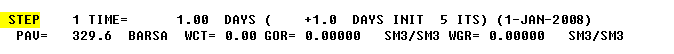

Step at day
**3,197**:

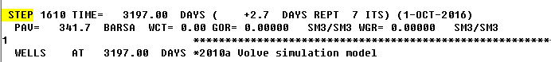

Now, knowing the row indices for the text we need to extract from the
`PRT` file, we can proceed to extracting those lines of text and putting
them in a list, one page or one step, per list element. We do this to
later iterate through all the steps and extract the data we want. The
object `steps_info_txt_pages` is a list containing the row indices that
are of our interest.

``` r
# get the text from all pages and put them in a list
steps_info_txt_pages <- lapply(seq_along(step_info_range), function(x) 
    volve_2016_txt[step_info_range[[x]]])
```

For example, this is an example of the first page for step \#1.

``` r
steps_info_txt_pages[1]
#> [[1]]
#> [1] " STEP    1 TIME=      1.00  DAYS (    +1.0  DAYS INIT  5 ITS) (1-JAN-2008)       "
#> [2] "  PAV=   329.6  BARSA  WCT= 0.00 GOR= 0.00000   SM3/SM3 WGR= 0.00000   SM3/SM3   "
#> [3] ""
```

## Extracting step data from the text file

### Extract the days from the STEP block

Although we could extract all the data we require from the text file in
one go, it is better to see one or two examples of seeing **regular
expressions** or **regex** at work. Regular expressions are practically
available to all programming languages: C++, Java, JavaScript, Python,
Perl, R, etc.

In this first example, we will extract the number of days at the current
simulation step. If this is the first step
page:

``` 
 STEP    1 TIME=      1.00  DAYS (    +1.0  DAYS INIT  5 ITS) (1-JAN-2008)       
  PAV=   329.6  BARSA  WCT= 0.00 GOR= 0.00000   SM3/SM3 WGR= 0.00000   SM3/SM3
```

to extract the days we have to provide a regex pattern that detects a
real number like `1.00`, which is `".*?(\\d+.\\d.)+.*"`.

**Explanation**

  - `.*?` will match any characters. lazy matching.
  - `(\\d+.\\d.)` capturing group.
  - `\\d+` matches any number of digits
  - `\\d.` matches a digit and then any character

Here we iterate through the list *steps\_info\_txt\_pages*, extract the
step-page, extract the number of days from the text. After that, we
convert the vector to a dataframe.

``` r
# iterate through the list of STEP pages
days_dfs <- lapply(seq_along(steps_info_txt_pages), function(x) {
    page <- steps_info_txt_pages[[x]]   # put all pages text in a list
    days_row_txt <- page[1]                                # get 1st row of page
    days_value <- sub(".*?(\\d+.\\d.)+.*", "\\1", days_row_txt,
                      perl = TRUE) # extract the days
    
    # dataframe; days as double; no factors.
    data.frame(days = as.double(days_value), stringsAsFactors = FALSE) 
})

days_df <- do.call("rbind", days_dfs)
```

### Extract the days

Let’s see a sample of the first ten and last ten rows for the dataframe
*days\_df* just
extracted:

``` r
rbind(head(days_df, 10), tail(days_df, 10))   # show the first 10 and last 10 rows
#>         days
#> 1       1.00
#> 2       1.63
#> 3       2.32
#> 4       3.50
#> 5       5.45
#> 6       8.22
#> 7      11.00
#> 8      14.61
#> 9      17.80
#> 10     21.00
#> 1601 1601.00
#> 1602 1602.00
#> 1603 1603.00
#> 1604 1604.00
#> 1605 1605.00
#> 1606 1606.00
#> 1607 1607.00
#> 1608 1608.00
#> 1609 1609.00
#> 1610 1610.00
```

This is just 20 rows of data. The dataframe *days\_df* has 1610
observations or rows.

### Extract the simulator running date

This is the second example of data extraction using *regex*.

The following regular expresion pattern extracts the date from the
current text line.

**Explanation**

  - `.*?(\\d{1,2}-[A-Z]{3}-\\d{4}).` entire regex pattern  
  - `(\\d{1,2}-[A-Z]{3}-\\d{4})` parenthesis indicate a group to extract
    the date  
  - `.*?` match any character  
  - `\\d{1,2}` match one or two digits (day)  
  - `-[A-Z]{3}` match a dash followed by three letters (month)  
  - `-\\d{4}` match four digits (year)

Again, we iterate through the list *steps\_info\_txt\_pages*, select a
step-page, and then extract the date. Notice the difference between the
previous *regex* and this one for capturing the date.

``` r
# iterate through the list of pages: dates
date_dfs <- lapply(seq_along(steps_info_txt_pages), function(x) {
    page <- steps_info_txt_pages[[x]]  # put all pages text in a list
    date_row_txt <- grep(" STEP", page)  # get row index at word STEP
    date_value <- sub(".*?(\\d{1,2}-[A-Z]{3}-\\d{4}).", "\\1", page[date_row_txt])
    
    # dataframe; no factors
    data.frame(date = date_value, stringsAsFactors = FALSE) 
})

date_df <- do.call("rbind", date_dfs)

# size of the dataframe: rows by columns
dim(date_df)
#> [1] 1610    1

rbind(head(date_df, 10), tail(date_df, 10))   # show the first 10 and last 10 rows
#>                   date
#> 1    1-JAN-2008       
#> 2    1-JAN-2008       
#> 3    2-JAN-2008       
#> 4    3-JAN-2008       
#> 5    5-JAN-2008       
#> 6    8-JAN-2008       
#> 7    11-JAN-2008      
#> 8    14-JAN-2008      
#> 9    17-JAN-2008      
#> 10   21-JAN-2008      
#> 1601 17-SEP-2016      
#> 1602 20-SEP-2016      
#> 1603 20-SEP-2016      
#> 1604 20-SEP-2016      
#> 1605 20-SEP-2016      
#> 1606 21-SEP-2016      
#> 1607 23-SEP-2016      
#> 1608 25-SEP-2016      
#> 1609 28-SEP-2016      
#> 1610 1-OCT-2016
```

This second dataframe *date\_df* also has 1610 rows. You see a kind of a
pattern here, right? We are extracting columns with the same number of
observations (rows).

### Extract all the values from the **STEP** block

After showing this pair of examples, we continue with the extraction of
the rest of the values. If you take a look at the PRT file you will
recognize these as the variables to be extracted:

  - `STEP` simulation step number
  - `TIME` number of days elapsed at the simulation step
  - `date` current date at the simulation run
  - `PAV` average pressure
  - `WCT` watercut
  - `GOR` gas oil ratio
  - `WGR` water gas ratio

The mission here is to extract all the variables that are made available
by the simulator in the **STEP** block. As shown above, they are seven
variables. The two previous examples were showing the work for two of
these variables.

The following is an **R** script that extracts all the variables from
all the occurrences of the **STEP** block in the **PRT** file.

Something that we need to know: the steps are not entirely sequential.
They may skip a day, or more, or could have been generated after “few
hours” in the simulation, and they do not necessarily match the date in
the *field totals* dataframe. This is something to consider. Both
dataframes will have different number of rows.

What is new here is that I am extracting several values from the text in
one shot: **step** (group 1), **days** (group 2), and **date** (group
4). Then assign them to their respective memory objects. A second thing
that we do here -and very common in text files-, is the correction of
the short name of the month. I am not sure what the reservoir guys were
thinking about, but they decided to baptize the month of **July** as
**JLY**, when the standard practice is to short-name it **JUL**. Anyway,
the side effect of this is that at the moment of converting character to
date formats, the date using **JLY** will be translated as *NULL*, since
the date converter doesn’t know anything about a month short-called
**JLY**. I didn’t know this in advance, but examining the output I found
some gaps in the output that didn’t show up in the raw data. So, be
mindful of these events.

``` r
# script that extracts production variables from the simulator output
library(lubridate)

# get the row indices where we find the keyword " STEP"
step_rows <- grep("^ STEP", volve_2016_txt)

# get rows ahead range. by block of text or per page
# in the case of the STEP block we are only interested in the next two rows
step_info_range <- lapply(seq_along(step_rows), function(x) 
    c(step_rows[x], step_rows[x]+1:2))

# get the text from all STEP pages and store each in a list element
steps_info_txt_pages <- lapply(seq_along(step_info_range), function(x) 
    volve_2016_txt[step_info_range[[x]]])

# iterate through the list of pages for the STEP blocks in the report
step_info_dfs <- lapply(seq_along(steps_info_txt_pages), function(x) {
    page <- steps_info_txt_pages[[x]]             # load a STEP block/page
    
    # this is line 1
    row_txt <- grep(" STEP", page)  # line 1 starts with STEP
    # pattern extraction for 1st line of text: STEP, TIME, date
    line_1_pattern <- ".*?(\\d+)+.*?(\\d+.\\d+)+.*?(\\d+)+.*?(\\d{1,2}-[A-Z]{3}-\\d{4})+.*"
    step_value <- sub(line_1_pattern, "\\1", page[row_txt], perl = TRUE) # extract step
    days_value <- sub(line_1_pattern, "\\2", page[row_txt], perl = TRUE) # extract days
    date_value <- sub(line_1_pattern, "\\4", page[row_txt], perl = TRUE) # extract date
    date_value <- sub("JLY", "JUL", date_value)              # change JLY by JUL
    
    
    # this is line 2
    row_txt <- grep(" PAV", page) # line 2 starts with PAV=
    # pattern extraction for 2nd line of text: PAV, WCT, GOR, WGR
    line_2_pattern <- ".*?(\\d+.\\d+)+.*?(\\d+.\\d+)+.*?(\\d+.\\d+)+.*?(\\d+.\\d+).*"
    pav_value <- sub(line_2_pattern, "\\1", page[row_txt], perl = TRUE) # Get avg pres
    wct_value <- sub(line_2_pattern, "\\2", page[row_txt], perl = TRUE) # get WCT
    gor_value <- sub(line_2_pattern, "\\3", page[row_txt], perl = TRUE) # get GOR
    wgr_value <- sub(line_2_pattern, "\\4", page[row_txt], perl = TRUE) # get WGR
    
    # dataframe; 
    data.frame(step = as.integer(step_value), 
               date = dmy(date_value),
               time_days = as.double(days_value), 
               pav_bar   = as.double(pav_value),
               wct_pct   = as.double(wct_value),
               gor_m3m3  = as.double(gor_value), 
               wgr_m3m3  = as.double(wgr_value),
               stringsAsFactors = FALSE) 
})

step_info <- do.call("rbind", step_info_dfs) # put together all dataframes in list

# show a summary of the dataframe
glimpse(step_info)
#> Observations: 1,610
#> Variables: 7
#> $ step      <int> 1, 2, 3, 4, 5, 6, 7, 8, 9, 10, 11, 12, 13, 14, 15, 1...
#> $ date      <date> 2008-01-01, 2008-01-01, 2008-01-02, 2008-01-03, 200...
#> $ time_days <dbl> 1.00, 1.63, 2.32, 3.50, 5.45, 8.22, 11.00, 14.61, 17...
#> $ pav_bar   <dbl> 329.6, 329.6, 329.6, 329.6, 329.6, 329.6, 329.6, 329...
#> $ wct_pct   <dbl> 0, 0, 0, 0, 0, 0, 0, 0, 0, 0, 0, 0, 0, 0, 0, 0, 0, 0...
#> $ gor_m3m3  <dbl> 0.00, 0.00, 0.00, 0.00, 0.00, 0.00, 0.00, 0.00, 0.00...
#> $ wgr_m3m3  <dbl> 0, 0, 0, 0, 0, 0, 0, 0, 0, 0, 0, 0, 0, 0, 0, 0, 0, 0...
```

Finally, we get all the vectors for **step** number, **date**, **date**,
average **pressure**, **watercut**, **GOR** and **WGR** in a dataframe.

Then, we show the dataframe as a *tibble*, which is an elegant way of
presenting long dataframes. This dataframe *step\_info*, in particular,
has 1610 rows and 7 columns.

``` r
# show as a tibble
(step_info <- as_tibble(step_info))
#> # A tibble: 1,610 x 7
#>     step date       time_days pav_bar wct_pct gor_m3m3 wgr_m3m3
#>    <int> <date>         <dbl>   <dbl>   <dbl>    <dbl>    <dbl>
#>  1     1 2008-01-01      1       330.       0        0        0
#>  2     2 2008-01-01      1.63    330.       0        0        0
#>  3     3 2008-01-02      2.32    330.       0        0        0
#>  4     4 2008-01-03      3.5     330.       0        0        0
#>  5     5 2008-01-05      5.45    330.       0        0        0
#>  6     6 2008-01-08      8.22    330.       0        0        0
#>  7     7 2008-01-11     11       330.       0        0        0
#>  8     8 2008-01-14     14.6     330.       0        0        0
#>  9     9 2008-01-17     17.8     330.       0        0        0
#> 10    10 2008-01-21     21       330.       0        0        0
#> # ... with 1,600 more rows
```

These are the names of the variables in the dataframe:

``` r
names(step_info)
#> [1] "step"      "date"      "time_days" "pav_bar"   "wct_pct"   "gor_m3m3" 
#> [7] "wgr_m3m3"
```

You can see that the **STEP** block does not carry any data regarding
cumulative production.

### A Sample of the *step\_info* dataframe

Let’s test the first day and last day of the simulation:

``` r
tail(step_info$date,1) - head(step_info$date,1)
#> Time difference of 3196 days
```

The simulation runs for 3196 days of the reservoir life.

### Save to data files

Now, let’s save the data as a *.Rdata* file (readable from R) and as as
*CSV* file (capable of being imported practically by any software).

``` r
data_folder <- file.path(proj_root, "data")   # project folder
# full filename, including path
save(step_info, file = file.path(data_folder, "data_from_step.Rdata"))
write.csv(step_info, file = file.path(data_folder, 
                                         "data_from_step.CSV"), 
          row.names = FALSE)
```

### Plots from the step block

Next, we proceed to show some of the data as visualization output. Here
we will use the R package **ggplot2**. This is a flexible and
sophisticated visualization tool using the Grammar of Graphics. These
will be very simple plots of the variables we just extracted.

#### Plot pressure vs time

Let’s take a look at the pressure over the life of the field, from the
simulator perspective.

``` r
ggplot(step_info, aes(x =date, y = pav_bar)) +
    geom_line(color = "red") +
    labs(title = "Pressure over time", subtitle = "Simulator output",
         y = "Average Pressure (PAV), bar")
```

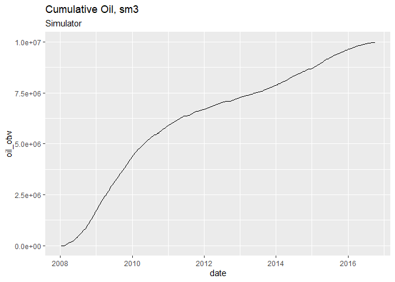

#### Plot watercut vs time

``` r
# plot from PRT simulator output (STEP block)
ggplot(step_info, aes(x =date, y = wct_pct)) +
    geom_line(color = "blue") +
    labs(title = "Field watercut over time", subtitle = "Simulator output",
         y = "Watercut, percent")
```

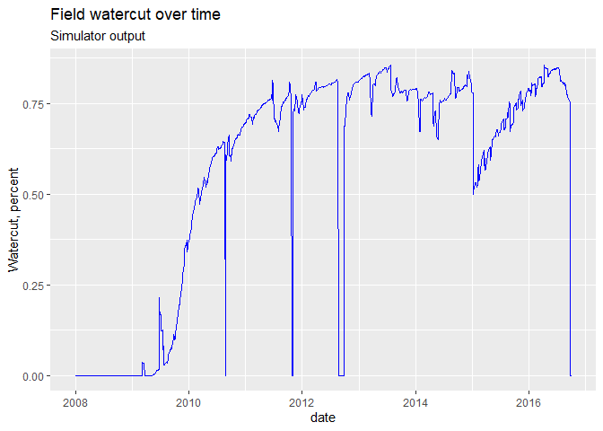

### Plot all variables from `STEP` block

To prevent cluttering our report from lots of plots, we will show all
plots in one figure using **facets**. In order to achieve this, we will
have to transform our data in **tidy format**.

``` r
library(tidyr)

# convert to tidy format
step_info_gather <- 
step_info %>% 
  select(-c(step, time_days)) %>% 
  gather(key = var, value, pav_bar:wgr_m3m3) %>% 
  print()
#> # A tibble: 6,440 x 3
#>    date       var     value
#>    <date>     <chr>   <dbl>
#>  1 2008-01-01 pav_bar  330.
#>  2 2008-01-01 pav_bar  330.
#>  3 2008-01-02 pav_bar  330.
#>  4 2008-01-03 pav_bar  330.
#>  5 2008-01-05 pav_bar  330.
#>  6 2008-01-08 pav_bar  330.
#>  7 2008-01-11 pav_bar  330.
#>  8 2008-01-14 pav_bar  330.
#>  9 2008-01-17 pav_bar  330.
#> 10 2008-01-21 pav_bar  330.
#> # ... with 6,430 more rows
  
# plot production variables from the STEP block in the PRT file

# change the name of the facet labels
facet_labels <- c(`gor_m3m3` = "GOR, m3/m3", `pav_bar` = "Avg.Pres, bar",
                  `wct_pct` = "Watercut, %", `wgr_m3m3` = "Water Gas Ratio, m3/m3")

# plot the facets with free y-axis.
ggplot(step_info_gather, aes(x = date, y = value)) +
  geom_line() +
  facet_wrap(.~var, scales = "free_y", labeller = as_labeller(facet_labels)) +
  labs(title = "Production variables from STEP block", 
       subtitle = "Simulator output", y = "", x = "")
```

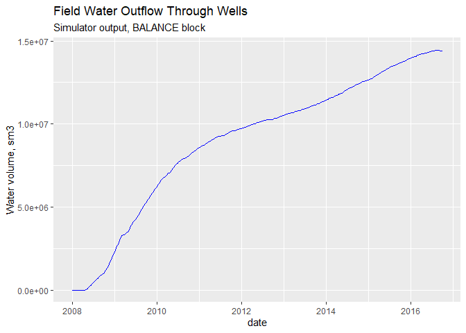

## Merge cumulative oil with simulator steps

Next step is combining the data from the *steps* dataframe with the
*balance-at* production cumulatives. This is not an straight operation
since both dataframes have different date references.

1.  First, we will extract the production cumulatives (field totals)
    from the PRT file. This is something we already did in the previous
    article. We will load that script.

2.  Save the production cumulatives dataframe as a CSV file.

3.  Join the field\_totals and step\_info dataframe by a common
    variable.

4.  Plot variables

5.  Calculate cumulatives

6.  Fix the dates in the merge dataframe so they are continuous from
    2018 till October 2016.

7.  Calculate cumulatives and volumes by month

## Extract Field cumulatives from the `BALANCE-AT` block

``` r
# load a script with functions
r_folder <- file.path(proj_root, "R")
r_script <- file.path(r_folder, "extract_data_from_prt.R")
source(r_script)

# run function to extract field totals or cumulative production
field_totals <- extract_field_totals(prt_file_content = volve_2016_txt)
field_totals
#> # A tibble: 340 x 8
#>    date        days     ocip     ooip oil_otw wat_otw  gas_otw   pav
#>    <date>     <int>    <dbl>    <dbl>   <dbl>   <dbl>    <dbl> <dbl>
#>  1 2007-12-31     0 21967455 21967455       0       0        0  330.
#>  2 2008-01-11    11 21967456 21967455       0       0        0  330.
#>  3 2008-01-21    21 21967455 21967455       0       0        0  330.
#>  4 2008-01-31    31 21967454 21967455       0       0        0  330.
#>  5 2008-02-10    41 21967454 21967455       0       0        0  330.
#>  6 2008-02-20    51 21948189 21967455   19265       0  3055593  325.
#>  7 2008-02-26    57 21936614 21967455   30840       0  4884638  323.
#>  8 2008-03-01    61 21925419 21967455   42035       0  6650055  320.
#>  9 2008-03-11    71 21897024 21967455   70430       0 11113293  314.
#> 10 2008-03-21    81 21867231 21967455  100223       1 15777548  308.
#> # ... with 330 more rows
```

#### Save field totals to data files

``` r
# save the data
data_folder <- file.path(proj_root, "data")
save(field_totals, file = file.path(data_folder, "field_totals_balance.Rdata"))
write.csv(field_totals, file = file.path(data_folder, 
                                         "field_totals_balance.CSV"), 
          row.names = FALSE)
```

We quickly plot the water outflow over the years.

> Note. This data might not correct. The PRT file does not explicitely
> assign a variable for the water outflow. Besides, this volume comes
> with a negative sign, which indicates injection rather than water
> production.

``` r
# plot from PRT simulator output (BALANCE AT block)
ggplot(field_totals, aes(x =date, y = wat_otw)) +
    geom_line(color = "blue") +
    labs(title = "Field Water Outflow Through Wells", 
         subtitle = "Simulator output, BALANCE block",
         y = "Water volume, sm3")
```

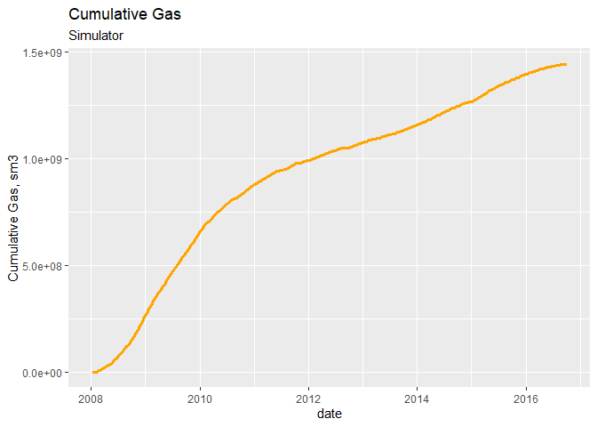

Now, we know that the STEP dataframe has more rows than the BALANCE-AT
dataframe. What we want is to correlate the step with the oil
cumulatives.

These are the rows in the *step\_info* dataframe:

``` r
dim(step_info)
#> [1] 1610    7
```

These are the number of rows and colums of the *field\_totals*
dataframe.

``` r
dim(field_totals)
#> [1] 340   8
```

## Join field totals and step dataframes

We merge both tables, steps and field cumulatives. The resultant
dataframe we call it *step\_totals*.

``` r
# join both tables by the common variable "date"
step_totals <- 
left_join(step_info, field_totals, by = "date") %>% 
    na.omit() %>% 
    select(date, time_days, days, everything()) %>% 
    as_tibble() %>% 
    print
#> # A tibble: 524 x 14
#>    date       time_days  days  step pav_bar wct_pct gor_m3m3 wgr_m3m3
#>    <date>         <dbl> <int> <int>   <dbl>   <dbl>    <dbl>    <dbl>
#>  1 2008-01-11      11      11     7    330.       0       0         0
#>  2 2008-01-21      21      21    10    330.       0       0         0
#>  3 2008-01-31      31      31    13    330.       0       0         0
#>  4 2008-02-10      41      41    15    330.       0       0         0
#>  5 2008-02-20      51      51    17    325.       0     158.        0
#>  6 2008-02-26      57      57    18    323.       0     158.        0
#>  7 2008-03-01      61      61    19    320.       0     158.        0
#>  8 2008-03-11      71      71    21    314.       0     157.        0
#>  9 2008-03-21      81      81    23    308.       0     156.        0
#> 10 2008-03-21      81.5    81    24    308        0     156.        0
#> # ... with 514 more rows, and 6 more variables: ocip <dbl>, ooip <dbl>,
#> #   oil_otw <dbl>, wat_otw <dbl>, gas_otw <dbl>, pav <dbl>
```

The dataframe step\_totals has 524 rows or observations and 14 columns
or variables.

Looking at this dataframe closer we observe that the date intervals is
not uniform; it is not weekle, bi-weekly or monthly because it is a
merged dataframe. What we will do next is transforming this dataframe to
a monthly summary or where the date intervals is a month separation.

### Plot outflow through wells from simulator

Without additional data transformations we plot the cumulatives of the
merged dataset.

``` r
ggplot(step_totals, aes(x = date, y = oil_otw)) +
    geom_line(color = "dark green", size = 1.1) +
    ggtitle("Cumulative Oil, sm3", subtitle = "Simulator")
```


This ggplot for the cumulative gas.

``` r
ggplot(step_totals, aes(x = date, y = gas_otw)) +
    geom_line(color = "orange", size = 1.1) +
    labs(title = "Cumulative Gas", subtitle = "Simulator",
         y = "Cumulative Gas, sm3")
```

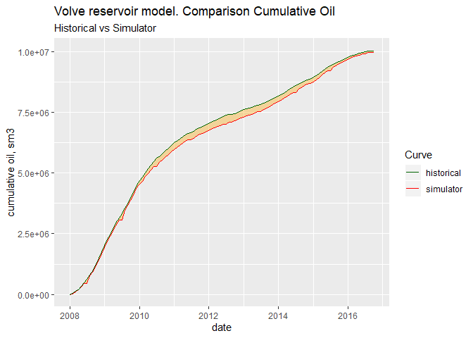

And this another one for cumulative water.

Let’s just keep in mind that this curve may not be right because we are
extracting from an incorrect labeled column (water outflow from wells).

``` r
ggplot(step_totals, aes(x = date, y = wat_otw)) +
    geom_line(color = "blue", size = 1.1) +
    labs(title = "Cumulative Water", subtitle = "Simulator",
         y = "Cumulative Water, sm3")
```

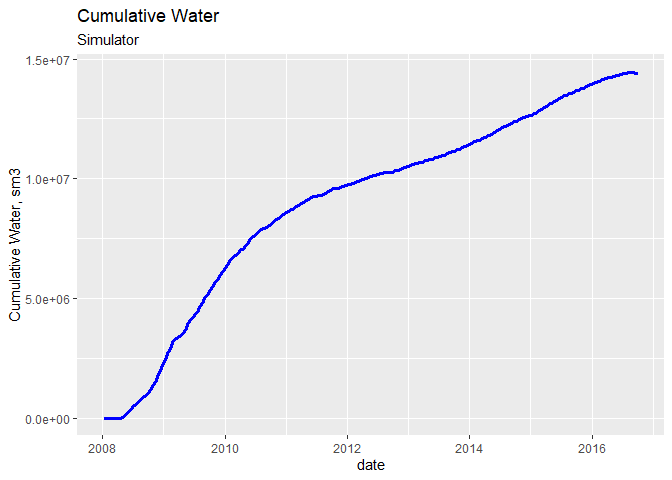

### Calculate cumulatives for oil, gas and water for monthly period

This is where we transform the dataframe from an heterogeneous date
steps to monthly periods. We use the *group\_by* function operating on
the year and the month. This operation, in the end, brings us to a more
organized table with a periodic variation. The extra work is
recalculating the volumes and cumulatives on the new monthly basis. All
these series of transformations are very common when you merge
dataframes with different number of rows. What is happening here is:

  - calculating the volume at the current period, which is the
    difference between the current row and the previous one. Wee do that
    with the *lag* function.
  - decomposing the date in year and month
  - grouping by year and month
  - summarize the data calculating the volumes per month
  - convert the (year, month) to (year, month, day) date format

<!-- end list -->

``` r
# step field totals
sim_cumulatives <- 
step_totals %>% 
    select(date, oil_otw, gas_otw, wat_otw) %>% 
    mutate(oil_this_period = oil_otw - lag(oil_otw, default = 0)) %>%
    mutate(gas_this_period = gas_otw - lag(gas_otw, default = 0)) %>%
    mutate(wat_this_period = wat_otw - lag(wat_otw, default = 0)) %>% 
    mutate(year = year(date), month = month(date)) %>%
    group_by(year, month) %>%
    summarize(vol_oil = sum(oil_this_period), 
              vol_gas = sum(gas_this_period), 
              vol_wat = sum(wat_this_period)) %>%
    ungroup() %>%
    mutate(date = ymd(paste(year, month, "01", sep = "-"))) %>%
    # mutate(source = "simulator") %>%
    mutate(cum_oil = cumsum(vol_oil), 
           cum_gas = cumsum(vol_gas), 
           cum_wat = cumsum(vol_wat)) %>%
    select(date, year, month, everything()) %>%
    print()
#> # A tibble: 106 x 9
#>    date        year month vol_oil  vol_gas vol_wat cum_oil  cum_gas cum_wat
#>    <date>     <dbl> <dbl>   <dbl>    <dbl>   <dbl>   <dbl>    <dbl>   <dbl>
#>  1 2008-01-01  2008     1       0        0       0       0   0.           0
#>  2 2008-02-01  2008     2   30840  4884638       0   30840   4.88e6       0
#>  3 2008-03-01  2008     3   90029 14117066       1  120869   1.90e7       1
#>  4 2008-04-01  2008     4   73833 11469357   22292  194702   3.05e7   22293
#>  5 2008-05-01  2008     5  124196 19115952  212550  318898   4.96e7  234843
#>  6 2008-06-01  2008     6  137247 20967327  192961  456145   7.06e7  427804
#>  7 2008-07-01  2008     7  155664 24005385  212739  611809   9.46e7  640543
#>  8 2008-08-01  2008     8  170057 26420155  227653  781866   1.21e8  868196
#>  9 2008-09-01  2008     9  163015 25205884  137169  944881   1.46e8 1005365
#> 10 2008-10-01  2008    10  221230 33570835  317736 1166111   1.80e8 1323101
#> # ... with 96 more rows
```

### Filling the date gaps with periodic dates

In this case, at first sight, it seems that we got periodic dates for
the production of the field. But what if we are missing a month or two?
One way to ensure we have all months accounted for is building a known
sequence of dates from *2016-01-01* until *2008-10-01*. That is what we
do with the function `seq.Date()`:

`seq.Date(as.Date("2008-01-01"), as.Date("2016-10-01"), by = "month")`

``` r
# create a dataframe with complete dates from 2008 until Oct-2016
# this will fill any holes in the dates of any of the two dataframes
dates_complete <- as_tibble(data.frame(date= seq.Date(as.Date("2008-01-01"), 
                                          as.Date("2016-10-01"), by = "month"),
                 cum_oil = 0, cum_gas = 0, cum_wat = 0))
dates_complete
#> # A tibble: 106 x 4
#>    date       cum_oil cum_gas cum_wat
#>    <date>       <dbl>   <dbl>   <dbl>
#>  1 2008-01-01       0       0       0
#>  2 2008-02-01       0       0       0
#>  3 2008-03-01       0       0       0
#>  4 2008-04-01       0       0       0
#>  5 2008-05-01       0       0       0
#>  6 2008-06-01       0       0       0
#>  7 2008-07-01       0       0       0
#>  8 2008-08-01       0       0       0
#>  9 2008-09-01       0       0       0
#> 10 2008-10-01       0       0       0
#> # ... with 96 more rows
```

So, there are 106 months from start to end of production.

Next, we proceed to merge the dataframe of known dates (above) with the
dataframe *sim\_cumulatives* that we obtained above. Finally, we
calculate the volumes and cumulatives.

``` r
# simulator production
# merge incomplete dataframe and fill with complete dates
# there will be blank rows or NAs where previously was not data
sim_cumulatives_dt <-
left_join(dates_complete, sim_cumulatives, by = "date") %>% 
    # remove NAs from the cumulatives .y
    tidyr::replace_na(list(cum_oil.y = 0, vol_oil = 0,
                           cum_gas.y = 0, vol_gas = 0,
                           cum_wat.y = 0, vol_wat = 0)) %>%        # replace NAs with zeros
    # add up cumulatives .x and .y
    mutate(cum_oil = cum_oil.x + cum_oil.y, 
           cum_gas = cum_gas.x + cum_gas.y,
           cum_wat = cum_wat.x + cum_wat.y) %>%       # sum cumulatives
    select(date, cum_oil, cum_gas, cum_wat, vol_oil, vol_gas, vol_wat) %>%
    # replace 0s with previous cumulative. these were rows that didn't exist
    mutate(cum_oil = ifelse(cum_oil == 0, lag(cum_oil, default = 0), cum_oil)) %>%
    mutate(cum_gas = ifelse(cum_gas == 0, lag(cum_gas, default = 0), cum_gas)) %>%
    mutate(cum_wat = ifelse(cum_wat == 0, lag(cum_wat, default = 0), cum_wat)) %>%
    mutate(vol_oil = ifelse(vol_oil == 0, lag(vol_oil, default = 0), vol_oil)) %>%
    mutate(vol_gas = ifelse(vol_gas == 0, lag(vol_gas, default = 0), vol_gas)) %>%
    mutate(vol_oil = ifelse(vol_wat == 0, lag(vol_wat, default = 0), vol_wat)) %>%
    as_tibble() %>% 
    print
#> # A tibble: 106 x 7
#>    date       cum_oil   cum_gas cum_wat vol_oil  vol_gas vol_wat
#>    <date>       <dbl>     <dbl>   <dbl>   <dbl>    <dbl>   <dbl>
#>  1 2008-01-01       0         0       0       0        0       0
#>  2 2008-02-01   30840   4884638       0       0  4884638       0
#>  3 2008-03-01  120869  19001704       1       1 14117066       1
#>  4 2008-04-01  194702  30471061   22293   22292 11469357   22292
#>  5 2008-05-01  318898  49587013  234843  212550 19115952  212550
#>  6 2008-06-01  456145  70554340  427804  192961 20967327  192961
#>  7 2008-07-01  611809  94559725  640543  212739 24005385  212739
#>  8 2008-08-01  781866 120979880  868196  227653 26420155  227653
#>  9 2008-09-01  944881 146185764 1005365  137169 25205884  137169
#> 10 2008-10-01 1166111 179756599 1323101  317736 33570835  317736
#> # ... with 96 more rows
```

The negative volume of water and oil are possibly volume corrections by
the operator.

``` r
# show observations with negative volumes
sim_cumulatives_dt %>% 
  filter(vol_oil <0 | vol_wat < 0 | vol_gas < 0)
#> # A tibble: 2 x 7
#>   date       cum_oil    cum_gas  cum_wat vol_oil vol_gas vol_wat
#>   <date>       <dbl>      <dbl>    <dbl>   <dbl>   <dbl>   <dbl>
#> 1 2016-09-01 9980819 1443979050 14400379  -50860 2640331  -50860
#> 2 2016-10-01 9980819 1443979050 14400379  -50860 2640331       0
```

## Comparative of simulator vs historical production

The last step is reading the historical production and compare them
against the numbers from the simulation. We start by reading the
historical production.

### Reading the historical production

Like we did in the previous article, we read the production history from
an Excel file. But this time we will be reading all the variables in the
dataset.

``` r
# load historical production from Excel file
library(xlsx)   # library to read Excel files in R

# read the Excel file
proj_root <- rprojroot::find_rstudio_root_file()   # get the project root folder
xl_file <- file.path(proj_root, "inst/rawdata", "Volve production data.xlsx")
# read only the monthly production
prod_hist <- as_tibble(read.xlsx(xl_file, sheetName = "Monthly Production Data"))
prod_hist
#> # A tibble: 529 x 10
#>    Wellbore.name NPDCode  Year Month On.Stream Oil   Gas   Water GI   
#>    <fct>           <dbl> <dbl> <dbl> <fct>     <fct> <fct> <fct> <fct>
#>  1 15/9-F-4         5693  2007     9 NULL      NULL  NULL  NULL  NULL 
#>  2 15/9-F-5         5769  2007     9 NULL      NULL  NULL  NULL  NULL 
#>  3 15/9-F-4         5693  2007    10 NULL      NULL  NULL  NULL  NULL 
#>  4 15/9-F-5         5769  2007    10 NULL      NULL  NULL  NULL  NULL 
#>  5 15/9-F-4         5693  2007    11 NULL      NULL  NULL  NULL  NULL 
#>  6 15/9-F-5         5769  2007    11 NULL      NULL  NULL  NULL  NULL 
#>  7 15/9-F-4         5693  2007    12 NULL      NULL  NULL  NULL  NULL 
#>  8 15/9-F-5         5769  2007    12 NULL      NULL  NULL  NULL  NULL 
#>  9 15/9-F-4         5693  2008     1 0         NULL  NULL  NULL  NULL 
#> 10 15/9-F-5         5769  2008     1 0         NULL  NULL  NULL  NULL 
#> # ... with 519 more rows, and 1 more variable: WI <fct>
```

### Save raw production history to data files

Once we read the data from Excel we save it as a more standard format:
*CSV*. But this saved data will be very raw because we haven’t performed
any operation yet. That’s why we named it
*production\_history\_raw.CSV*.

``` r
# save historical data as raw
data_folder <- file.path(proj_root, "data")
save(prod_hist, file = file.path(data_folder, "production_history_raw.Rdata"))
write.csv(prod_hist, file = file.path(data_folder, 
                                         "production_history_raw.CSV"), 
          row.names = FALSE)
```

### Cumulatives from production history

These are the data transformations we will perform over the raw
production data.

  - convert from character to double, integer
  - replace the NAs with zeros
  - discard two columns with no meaningful data
  - rename the variables to all lowercase (easier to remember)
  - remove rows that have NAs
  - group by year and month
  - summarize by volumes
  - convert date from character to date format
  - sort the data by date
  - keep the variables we require
  - calculate the cumulatives from volumes

<!-- end list -->

``` r
hist_cumulatives <- 
prod_hist %>% 
    mutate(Oil = as.double(as.character(Oil))) %>%
    mutate(Gas = as.double(as.character(Gas))) %>%
    mutate(Water = as.double(as.character(Water))) %>% 
    mutate(Year = as.integer(as.character(Year))) %>%
    mutate(Month = as.integer(as.character(Month))) %>%
    mutate(GI = as.double(as.character(GI))) %>%
    mutate(WI = as.double(as.character(WI))) %>%
    tidyr::replace_na(list(GI = 0, WI = 0)) %>%
    select(-c(NPDCode, On.Stream)) %>% 
    rename(year = Year, month = Month, oil = Oil, gas = Gas, wat = Water) %>% 
    na.omit() %>%                 # remove all rows that have at least one NA
    group_by(year, month) %>%
    summarise(vol_oil = sum(oil), vol_gas = sum(gas), vol_wat = sum(wat),
              vol_gi = sum(GI), vol_wi = sum(WI)) %>%
    mutate(date = ymd(paste(year, month, "01", sep = "-"))) %>%
    arrange(date) %>%
    ungroup() %>%
    select(date, vol_oil, vol_gas, vol_wat, vol_gi, vol_wi) %>%
    mutate(cum_oil = cumsum(vol_oil), cum_gas = cumsum(vol_gas),
           cum_wat = cumsum(vol_wat), 
           cum_gi = cumsum(vol_gi), cum_wi = cumsum(vol_wi)) %>%
    print()
#> # A tibble: 104 x 11
#>    date       vol_oil vol_gas vol_wat vol_gi vol_wi cum_oil cum_gas cum_wat
#>    <date>       <dbl>   <dbl>   <dbl>  <dbl>  <dbl>   <dbl>   <dbl>   <dbl>
#>  1 2008-02-01  49091.  7.07e6   413.       0      0  4.91e4  7.07e6    413.
#>  2 2008-03-01  83361.  1.22e7    27.4      0      0  1.32e5  1.93e7    440.
#>  3 2008-04-01  74532.  1.15e7   482.       0      0  2.07e5  3.08e7    922.
#>  4 2008-05-01 125479.  1.91e7 16280.       0      0  3.32e5  4.99e7  17202.
#>  5 2008-06-01 143787.  2.15e7   474.       0      0  4.76e5  7.14e7  17677.
#>  6 2008-07-01 166280.  2.47e7   416.       0      0  6.43e5  9.60e7  18093.
#>  7 2008-08-01 165444.  2.39e7   577.       0      0  8.08e5  1.20e8  18669.
#>  8 2008-09-01 192263.  2.75e7   464.       0      0  1.00e6  1.47e8  19134.
#>  9 2008-10-01 237174.  3.38e7   725.       0      0  1.24e6  1.81e8  19859.
#> 10 2008-11-01 250325.  3.57e7  2580.       0      0  1.49e6  2.17e8  22439.
#> # ... with 94 more rows, and 2 more variables: cum_gi <dbl>, cum_wi <dbl>
```

Observe that we’ve got 104 rows, which wouldn’t match the rows from the
simulation data. We have to fix that. The problem is primarily dates.

### Save historical cumulatives as-is

This saves the production history dataframe after the data
transformations.

``` r
# save historical data
data_folder <- file.path(proj_root, "data")
save(hist_cumulatives, file = file.path(data_folder, "hist_cumulatives_104.Rdata"))
write.csv(hist_cumulatives, file = file.path(data_folder, 
                                         "hist_cumulatives_104.CSV"), 
          row.names = FALSE)
```

``` r
# create a dataframe with complete dates from 2008 until Oct-2016
df <- as_tibble(data.frame(date= seq.Date(as.Date("2008-01-01"), 
                                          as.Date("2016-10-01"), by = "month"),
                 cum_oil = 0, cum_gas = 0, cum_wat = 0))
df
#> # A tibble: 106 x 4
#>    date       cum_oil cum_gas cum_wat
#>    <date>       <dbl>   <dbl>   <dbl>
#>  1 2008-01-01       0       0       0
#>  2 2008-02-01       0       0       0
#>  3 2008-03-01       0       0       0
#>  4 2008-04-01       0       0       0
#>  5 2008-05-01       0       0       0
#>  6 2008-06-01       0       0       0
#>  7 2008-07-01       0       0       0
#>  8 2008-08-01       0       0       0
#>  9 2008-09-01       0       0       0
#> 10 2008-10-01       0       0       0
#> # ... with 96 more rows
```

Remember that we created this date sequence above. This sequence had 106
rows.

``` r
dates_complete
#> # A tibble: 106 x 4
#>    date       cum_oil cum_gas cum_wat
#>    <date>       <dbl>   <dbl>   <dbl>
#>  1 2008-01-01       0       0       0
#>  2 2008-02-01       0       0       0
#>  3 2008-03-01       0       0       0
#>  4 2008-04-01       0       0       0
#>  5 2008-05-01       0       0       0
#>  6 2008-06-01       0       0       0
#>  7 2008-07-01       0       0       0
#>  8 2008-08-01       0       0       0
#>  9 2008-09-01       0       0       0
#> 10 2008-10-01       0       0       0
#> # ... with 96 more rows
```

### Fill the dates gap in the production history dataframe

We do almost the same data transformations as before:

  - replace NAs in the variables with zeros
  - sum up the additional cumulative variables generated during the
    merge
  - replace a cumulative of zero by the previous cumulative (carry
    over). There cannot be cumulatives of zeros in between. That anomaly
    is caused by the absence of rows.
  - clean up the variables for gas injection (GI) and water injection
    (WI) volumes
  - calculate the cumulatives for gas injection and water injection

<!-- end list -->

``` r
# historical production
# merge incomplete dataframe and complete with dates
hist_cumulatives_dt <- 
left_join(dates_complete, hist_cumulatives, by = "date") %>% 
    # replace NAs with zeros
    tidyr::replace_na(list(cum_oil.y = 0, cum_gas.y = 0, cum_wat.y = 0)) %>%
    tidyr::replace_na(list(vol_oil = 0, vol_gas = 0, vol_wat = 0)) %>%
    tidyr::replace_na(list(vol_gi = 0, vol_wi = 0, cum_gi = 0, cum_wi = 0)) %>%
    # add up the extra column .y
    mutate(cum_oil = cum_oil.x + cum_oil.y) %>%
    mutate(cum_gas = cum_gas.x + cum_gas.y) %>%
    mutate(cum_wat = cum_wat.x + cum_wat.y) %>%
    # filter(date != as.Date("2016-10-01")) %>% 
    # this fixes the zeros generated by adding complete dates
    mutate(cum_oil = ifelse(cum_oil == 0, lag(cum_oil, default=0), cum_oil)) %>%
    mutate(cum_gas = ifelse(cum_gas == 0, lag(cum_gas, default=0), cum_gas)) %>%
    mutate(cum_wat = ifelse(cum_wat == 0, lag(cum_wat, default=0), cum_wat)) %>%
    mutate(cum_gi = ifelse(cum_gi == 0, lag(cum_gi, default=0), cum_gi)) %>% 
    mutate(cum_wi = ifelse(cum_wi == 0, lag(cum_wi, default=0), cum_wi)) %>% 
    select(date, cum_oil, cum_gas, cum_wat, vol_oil, vol_gas, vol_wat, 
           vol_gi, vol_wi, cum_gi, cum_wi) %>%
    as_tibble() %>% 
    print
#> # A tibble: 106 x 11
#>    date       cum_oil cum_gas cum_wat vol_oil vol_gas vol_wat vol_gi vol_wi
#>    <date>       <dbl>   <dbl>   <dbl>   <dbl>   <dbl>   <dbl>  <dbl>  <dbl>
#>  1 2008-01-01  0.      0.          0       0   0.         0        0      0
#>  2 2008-02-01  4.91e4  7.07e6    413.  49091.  7.07e6   413.       0      0
#>  3 2008-03-01  1.32e5  1.93e7    440.  83361.  1.22e7    27.4      0      0
#>  4 2008-04-01  2.07e5  3.08e7    922.  74532.  1.15e7   482.       0      0
#>  5 2008-05-01  3.32e5  4.99e7  17202. 125479.  1.91e7 16280.       0      0
#>  6 2008-06-01  4.76e5  7.14e7  17677. 143787.  2.15e7   474.       0      0
#>  7 2008-07-01  6.43e5  9.60e7  18093. 166280.  2.47e7   416.       0      0
#>  8 2008-08-01  8.08e5  1.20e8  18669. 165444.  2.39e7   577.       0      0
#>  9 2008-09-01  1.00e6  1.47e8  19134. 192263.  2.75e7   464.       0      0
#> 10 2008-10-01  1.24e6  1.81e8  19859. 237174.  3.38e7   725.       0      0
#> # ... with 96 more rows, and 2 more variables: cum_gi <dbl>, cum_wi <dbl>
```

Great\! We got the dataframe *hist\_cumulatives\_dt*, with 106 rows and
11 columns.

### Plot production rates

If we want to plot several variables in one figure we have to convert
the dataframe into tidy data format, and then use facets.

``` r
hist_cumulatives_dt_gather <- 
hist_cumulatives_dt %>% 
  select(date, vol_oil, vol_gas, vol_wat) %>% 
  gather(key = var, value, vol_oil:vol_wat) %>% 
  
  print()
#> # A tibble: 318 x 3
#>    date       var       value
#>    <date>     <chr>     <dbl>
#>  1 2008-01-01 vol_oil      0 
#>  2 2008-02-01 vol_oil  49091.
#>  3 2008-03-01 vol_oil  83361.
#>  4 2008-04-01 vol_oil  74532.
#>  5 2008-05-01 vol_oil 125479.
#>  6 2008-06-01 vol_oil 143787.
#>  7 2008-07-01 vol_oil 166280.
#>  8 2008-08-01 vol_oil 165444.
#>  9 2008-09-01 vol_oil 192263.
#> 10 2008-10-01 vol_oil 237174.
#> # ... with 308 more rows
```

And this is the plot of the cumulative variables from the production
history.

``` r
# plot production variables from the STEP block in the PRT file

# order of the plots
hist_cumulatives_dt_gather$var_f <- 
  factor(hist_cumulatives_dt_gather$var, 
         levels = c("vol_oil", "vol_gas", "vol_wat"))

# change the name of the facet labels
facet_labels <- c(`vol_oil` = "Oil", `vol_gas` = "Gas", `vol_wat` = "Water")

ggplot(hist_cumulatives_dt_gather, aes(x = date, y = value, color = var)) +
  geom_line(size = 1) +
  facet_grid(var_f ~., scales = "free_y",
             labeller = as_labeller(facet_labels)) +
  labs(title = "Monthly fluid Volumes, m3", 
       subtitle = "Historical Production", y = "", x = "")
```

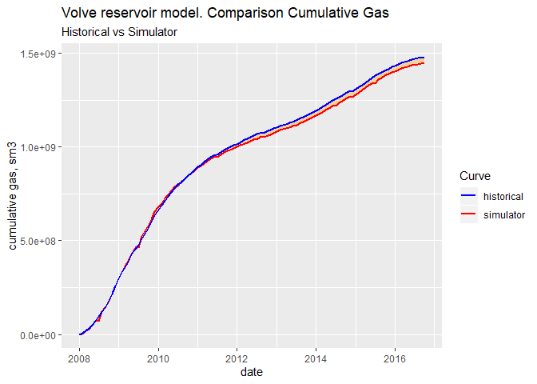

### Save historical cumulatives with fixed dates

We save the date fixed production history in CSV format file.

``` r
# save historical data with complete dates. 106 rows
data_folder <- file.path(proj_root, "data")
save(hist_cumulatives_dt, file = file.path(data_folder, "hist_cumulatives_dt.Rdata"))
write.csv(hist_cumulatives_dt, file = file.path(data_folder, "hist_cumulatives_dt.CSV"), 
          row.names = FALSE)
```

### Plot historical cumulatives of oil, gas and water

``` r
library(gridExtra)

# cumulative oil from historical production
p1 <- ggplot(hist_cumulatives_dt, aes(x = date, y = cum_oil)) +
    geom_line() +
    geom_col(color = "dark green", fill = "dark green", alpha = 0.35) +
    ggtitle("Cumulative Oil, sm3", subtitle = "Historical Production")

# cumulative gas from historical production
p2 <- ggplot(hist_cumulatives_dt, aes(x = date, y = cum_gas)) +
    geom_line() +
    geom_col(color = "orange", fill = "orange", alpha = 0.35) +
    ggtitle("Cumulative Gas, sm3", subtitle = "Historical Production")

# cumulative water from historical production
p3 <- ggplot(hist_cumulatives_dt, aes(x = date, y = cum_wat)) +
    geom_line() +
    geom_col(color = "blue", fill = "blue", alpha = 0.35) +
    ggtitle("Cumulative Water, sm3", subtitle = "Historical Production")

grid.arrange(p1, p2, p3, ncol =1)
```


### Rename the variables according to source

Finally, because we want to combine the simulation results with the
measured production for each fluid, on the same plot, we will rename the
variables to something is directly recognizable as the source: simulator
or historical.

These are the data transformations:

  - rename the variables in the *sim\_cumulatives\_dt* dataframe
  - rename the variables in the *hist\_cumulatives\_dt* dataframe
  - join the resulting dataframe by the common variable *date*

<!-- end list -->

``` r
# rename the simulation cumulatives
sim_cumulatives_src <- 
sim_cumulatives_dt %>% 
    select(date, cum_oil, cum_gas, cum_wat) %>% 
    rename(cum_oil_sim = cum_oil, cum_gas_sim = cum_gas, cum_wat_sim = cum_wat)
    

# rename historical cumulatives according to source
hist_cumulatives_src <- 
hist_cumulatives_dt %>% 
    select(date, cum_oil, cum_gas, cum_wat) %>% 
    rename(cum_oil_hist = cum_oil, cum_gas_hist = cum_gas, cum_wat_hist = cum_wat) 

# combine simulator and historical dataframes. common variable is "date"
cumulatives_all <- full_join(hist_cumulatives_src, sim_cumulatives_src, by = "date")
cumulatives_all
#> # A tibble: 106 x 7
#>    date       cum_oil_hist cum_gas_hist cum_wat_hist cum_oil_sim
#>    <date>            <dbl>        <dbl>        <dbl>       <dbl>
#>  1 2008-01-01           0            0            0            0
#>  2 2008-02-01       49091.     7068009.         413.       30840
#>  3 2008-03-01      132452.    19259180.         440.      120869
#>  4 2008-04-01      206985.    30765621.         922.      194702
#>  5 2008-05-01      332463.    49857492.       17202.      318898
#>  6 2008-06-01      476250.    71369826.       17677.      456145
#>  7 2008-07-01      642530.    96025129.       18093.      611809
#>  8 2008-08-01      807974.   119948670.       18669.      781866
#>  9 2008-09-01     1000237.   147475129.       19134.      944881
#> 10 2008-10-01     1237411.   181232829.       19859.     1166111
#> # ... with 96 more rows, and 2 more variables: cum_gas_sim <dbl>,
#> #   cum_wat_sim <dbl>
```

That’s it. Our final comparison dataframe with 106 rows and 7 columns.

## Observations

In order to observe how close was the history matching, we plot the
cumulative production from the simulator versus that of the historical
production. Additionally, we want to shade the are between the two
curves to show the difference.

## How close cumulative productions are

### Cumulative oil. Historical vs simulator

``` r
# Volve reservoir model dataset
# plot historical vs simulator cum_oil

# manual assignment of colors in the legend
cols <- c("simulator"="red", "historical"="blue") # legend: colors and names
ggplot(cumulatives_all) +
    # shade the area between the curves
    geom_ribbon(aes(x = date, ymin= cum_oil_sim, ymax= cum_oil_hist), 
                fill = "dark green", alpha = 0.35) + 
    geom_line(aes(x = date, y = cum_oil_sim, color = "simulator")) +
    geom_line(aes(x = date, y = cum_oil_hist, color = "historical")) +
    labs(title = "Volve reservoir model. Comparison Cumulative Oil", 
         subtitle = "Historical vs Simulator", 
         y = "cumulative oil, sm3") +
    scale_color_manual(name = "Curve", values = cols)  # manual legend
```

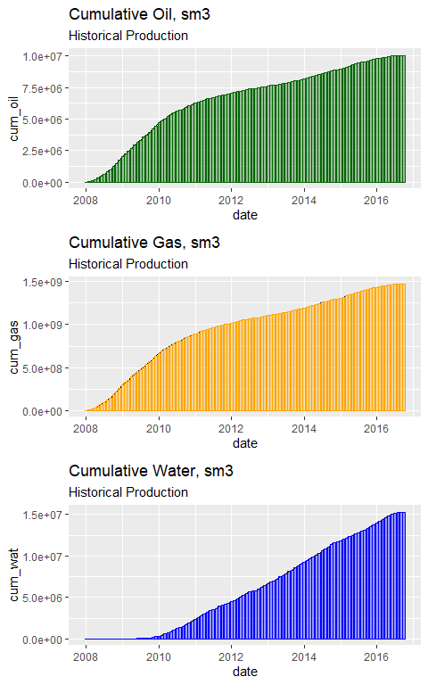

### Cumulative gas. Historical vs simulator

``` r
# Volve reservoir model dataset
# plot historical vs simulator cum_gas
cols <- c("simulator"="red", "historical"="blue") # legend: colors and names
ggplot(cumulatives_all) +
    # shade the area between the curves
    geom_ribbon(aes(x = date, ymin= cum_gas_sim, ymax= cum_gas_hist), 
                fill = "orange", alpha = 0.35) + 
    geom_line(aes(x = date, y = cum_gas_sim, color = "simulator"), size = 1) +
    geom_line(aes(x = date, y = cum_gas_hist, color = "historical"), size = 1) +
    labs(title = "Volve reservoir model. Comparison Cumulative Gas", 
         subtitle = "Historical vs Simulator", 
         y = "cumulative gas, sm3") +
    scale_color_manual(name = "Curve", values = cols)  # manual legend
```

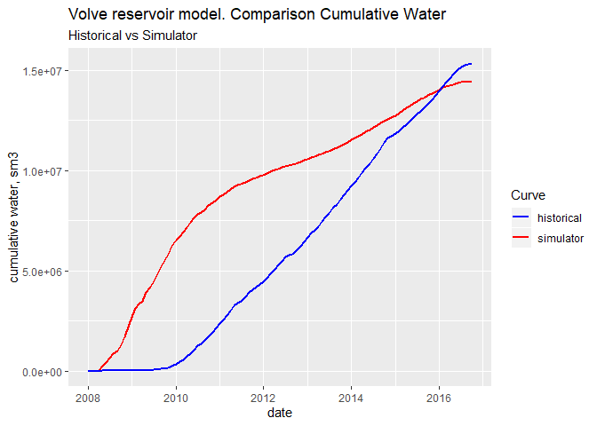

### Cumulative water. Historical vs simulator

``` r
# Volve reservoir model dataset
# plot historical vs simulator cumulative water variable
cols <- c("simulator"="red", "historical"="blue") # legend: colors and names
ggplot(cumulatives_all) +
    # shade the area between the curves
    geom_ribbon(aes(x = date, ymin= cum_wat_sim, ymax= cum_wat_hist),
                fill = "cyan", alpha = 0.35) +
    geom_line(aes(x = date, y = cum_wat_sim, color = "simulator"), size = 1) +
    geom_line(aes(x = date, y = cum_wat_hist, color = "historical"), size = 1) +
    labs(title = "Volve reservoir model. Comparison Cumulative Water", 
         subtitle = "Historical vs Simulator", 
         y = "cumulative water, sm3") +
    scale_color_manual(name = "Curve", values = cols)  # manual legend
```

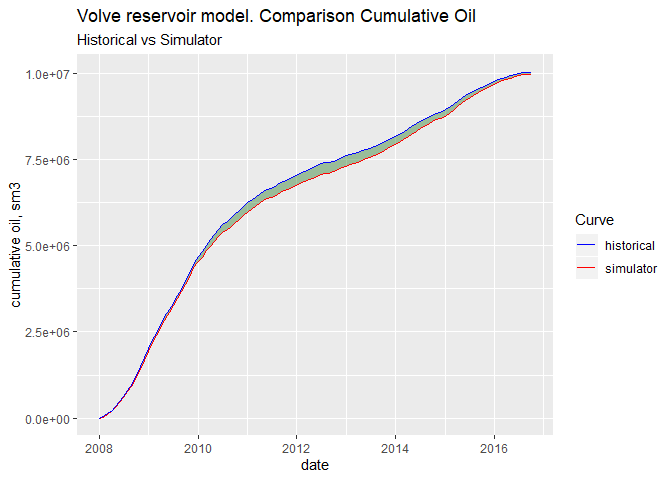

**Note.** This last plot for the cumulative water has been observed
different when another reservoir engineer [Konstantin
Sermyagin](https://www.linkedin.com/in/konstantin-sermyagin/?lipi=urn%3Ali%3Apage%3Ad_flagship3_messaging%3BMkGp%2FisTS7ehrKLYwnd%2Frw%3D%3D&licu=urn%3Ali%3Acontrol%3Ad_flagship3_messaging-view_profile)
was able to read directly from the Eclipse **binary** files. I have
checked the cumulative water from the simulator and it has been properly
extracted and transformed. Still, I have some doubts about the
extraction of the cumulative water because the outflow doesn’t seem to
originate from connate water but from injection water as well. If you
download the Eclipse **PRT** file, please, take a look at the **BALANCE
AT** blocks. Try to identify the variable corresponding to connate water
only. I am not sure why Eclipse does not make a distinction between the
two sources of water.

## Datasets

  - [Volve 2016 dataset for reservoir simulation model. Compressed PRT
    output as zip file](https://zenodo.org/record/2586212). Zenodo

  - [Volve 2016 reservoir simulation PRT output
    file](https://zenodo.org/record/2586209). Zenodo.
