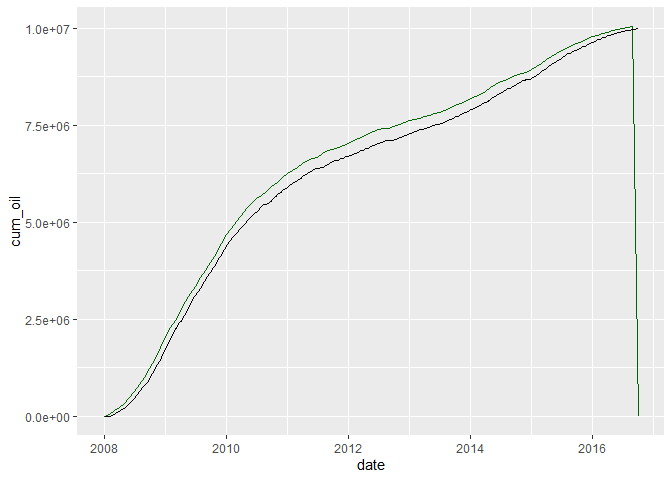

<!-- README.md is generated from README.Rmd. Please edit that file -->

# volve-reservoir-model-evolution

``` r
library(dplyr)
library(ggplot2)

# read the Eclipse PRT output report
proj_root <- rprojroot::find_rstudio_root_file()
# had to zip the PRT file because it's 225 MB and too big for Github
volve_2016_zip <- file.path(proj_root, "inst/rawdata", "VOLVE_2016.zip")
temp <- tempdir()

volve_2016_txt <- readLines(unzip(volve_2016_zip, exdir = temp))
```

``` r
# get a list of rows from " STEP" 

# find the rows where we find the word " STEP"
step_rows <- grep("^ STEP", volve_2016_txt)

# add rows ahead to where the keyword was found
step_info_range <- lapply(seq_along(step_rows), function(x) 
    c(step_rows[x], step_rows[x]+1:2))               # add two extra row indices

step_info_range[[1]]   # sample for report page 1 only
#> [1] 1548178 1548179 1548180
```

These extra row indices are lines of text where the report keep more
information of the evolution of the simulation. Here is a couple of
screenhots.

Step at day
`1`:


Step at day
`3,197`:


Now, knowing the row indices for the text we need from the `PRT` file,
we can proceed to extracting those lines of text and putting them in a
list, one page, or one step, per list element. We do this to later
iterate through all the steps and extract the data we want.

``` r
# get the text from all pages and put them in a list
steps_info_txt_pages <- lapply(seq_along(step_info_range), function(x) 
    volve_2016_txt[step_info_range[[x]]])
```

## Extracting step data from the text file

### Extract the days

Although we could extract all the data we require from the text file in
one go, it is better to see one or two examples of seeing **regular
expressions** or **regex** at work. Regular expressions are practically
available to all programming languages: C++, Java, JavaScript, Python,
Perl, etc.

In this first example, we will extract the number of days at the current
simulation step. If this is the first step
page:

``` 
 STEP    1 TIME=      1.00  DAYS (    +1.0  DAYS INIT  5 ITS) (1-JAN-2008)       
  PAV=   329.6  BARSA  WCT= 0.00 GOR= 0.00000   SM3/SM3 WGR= 0.00000   SM3/SM3
```

to extract the days we have to provide a regex pattern that detects a
real number like `1.00`, which is `".*?(\\d+.\\d.)+.*"`.

**Explanation**

  - `.*?` will match any characters. lazy matching.
  - `(\\d+.\\d.)` capturing group.
  - `\\d+` matches any number of digits
  - `\\d.` matches a digit and then any character

<!-- end list -->

``` r
# iterate through the list of STEP pages
days_dfs <- lapply(seq_along(steps_info_txt_pages), function(x) {
    page <- steps_info_txt_pages[[x]]   # put all pages text in a list
    days_row_txt <- page[1]                                # get 1st row of page
    days_value <- sub(".*?(\\d+.\\d.)+.*", "\\1", days_row_txt,
                      perl = TRUE) # extract the days
    
    # dataframe; days as double; no factors.
    data.frame(days = as.double(days_value), stringsAsFactors = FALSE) 
})

days_df <- do.call("rbind", days_dfs)
rbind(head(days_df, 10), tail(days_df, 10))   # show the first 10 and last 10 rows
#>         days
#> 1       1.00
#> 2       1.63
#> 3       2.32
#> 4       3.50
#> 5       5.45
#> 6       8.22
#> 7      11.00
#> 8      14.61
#> 9      17.80
#> 10     21.00
#> 1601 1601.00
#> 1602 1602.00
#> 1603 1603.00
#> 1604 1604.00
#> 1605 1605.00
#> 1606 1606.00
#> 1607 1607.00
#> 1608 1608.00
#> 1609 1609.00
#> 1610 1610.00
```

### Extract the date

This regular expresion pattern extracts the date from the current text
line.

**Explanation**  
\* `.*?(\\d{1,2}-[A-Z]{3}-\\d{4}).` entire regex pattern  
\* `(\\d{1,2}-[A-Z]{3}-\\d{4})` parenthesis indicate a group to extract
the date  
\* `.*?` match any character  
\* `\\d{1,2}` match one or two digits (day)  
\* `-[A-Z]{3}` match a dash followed by three letters (month)  
\* `-\\d{4}` match four digits (year)

``` r
# iterate through the list of pages: dates
date_dfs <- lapply(seq_along(steps_info_txt_pages), function(x) {
    page <- steps_info_txt_pages[[x]]  # put all pages text in a list
    date_row_txt <- grep(" STEP", page)  # get row index at word STEP
    date_value <- sub(".*?(\\d{1,2}-[A-Z]{3}-\\d{4}).", "\\1", page[date_row_txt])
    
    # dataframe; no factors
    data.frame(date = date_value, stringsAsFactors = FALSE) 
})

date_df <- do.call("rbind", date_dfs)

# size of the dataframe: rows by columns
dim(date_df)
#> [1] 1610    1

rbind(head(date_df, 10), tail(date_df, 10))   # show the first 10 and last 10 rows
#>                   date
#> 1    1-JAN-2008       
#> 2    1-JAN-2008       
#> 3    2-JAN-2008       
#> 4    3-JAN-2008       
#> 5    5-JAN-2008       
#> 6    8-JAN-2008       
#> 7    11-JAN-2008      
#> 8    14-JAN-2008      
#> 9    17-JAN-2008      
#> 10   21-JAN-2008      
#> 1601 17-SEP-2016      
#> 1602 20-SEP-2016      
#> 1603 20-SEP-2016      
#> 1604 20-SEP-2016      
#> 1605 20-SEP-2016      
#> 1606 21-SEP-2016      
#> 1607 23-SEP-2016      
#> 1608 25-SEP-2016      
#> 1609 28-SEP-2016      
#> 1610 1-OCT-2016
```

## Extract values from the **STEP** block

After show this pair of example we continue with the extraction of the
rest of the values. These are variables to be extracted:

  - `STEP` simulation step number
  - `TIME` number of days elpased at the simulation step
  - `date` current date at the simulation run
  - `PAV` average pressure
  - `WCT` watercut
  - `GOR` gas oil ratio
  - `WGR` water gas ratio

The mission here is to extract all the variables that are made available
by the simulator in the STEP block. As shown above, they are seven
variables.

``` r
library(lubridate)

# get the row indices where we find the keyword " STEP"
step_rows <- grep("^ STEP", volve_2016_txt)

# get rows ahead range. by block of text or per page
# in the case of the STEP block we are only interested in the next two rows
step_info_range <- lapply(seq_along(step_rows), function(x) 
    c(step_rows[x], step_rows[x]+1:2))

# get the text from all STEP pages and store each in a list element
steps_info_txt_pages <- lapply(seq_along(step_info_range), function(x) 
    volve_2016_txt[step_info_range[[x]]])

# iterate through the list of pages for the STEP blocks in the report
step_info_dfs <- lapply(seq_along(steps_info_txt_pages), function(x) {
    page <- steps_info_txt_pages[[x]]             # load a STEP block/page
    
    # this is line 1
    row_txt <- grep(" STEP", page)  # line 1 starts with STEP
    # pattern extraction for 1st line of text: STEP, TIME, date
    line_1_pattern <- ".*?(\\d+)+.*?(\\d+.\\d+)+.*?(\\d+)+.*?(\\d{1,2}-[A-Z]{3}-\\d{4})+.*"
    step_value <- sub(line_1_pattern, "\\1", page[row_txt], perl = TRUE) # extract step
    days_value <- sub(line_1_pattern, "\\2", page[row_txt], perl = TRUE) # extract days
    date_value <- sub(line_1_pattern, "\\4", page[row_txt], perl = TRUE) # extract date
    
    
    # this is line 2
    row_txt <- grep(" PAV", page) # line 2 starts with PAV=
    # pattern extraction for 2nd line of text: PAV, WCT, GOR, WGR
    line_2_pattern <- ".*?(\\d+.\\d+)+.*?(\\d+.\\d+)+.*?(\\d+.\\d+)+.*?(\\d+.\\d+).*"
    pav_value <- sub(line_2_pattern, "\\1", page[row_txt], perl = TRUE) # Get avg pres
    wct_value <- sub(line_2_pattern, "\\2", page[row_txt], perl = TRUE) # get WCT
    gor_value <- sub(line_2_pattern, "\\3", page[row_txt], perl = TRUE) # get GOR
    wgr_value <- sub(line_2_pattern, "\\4", page[row_txt], perl = TRUE) # get WGR
    
    # dataframe; 
    data.frame(step = as.integer(step_value), 
               date = dmy(date_value), 
               time_days = as.double(days_value), 
               pav_bar   = as.double(pav_value),
               wct_pct   = as.double(wct_value),
               gor_m3m3  = as.double(gor_value), 
               wgr_m3m3  = as.double(wgr_value),
               stringsAsFactors = FALSE) 
})

step_info <- do.call("rbind", step_info_dfs) # put together all dataframes in list

# show a summary of the dataframe
glimpse(step_info)
#> Observations: 1,610
#> Variables: 7
#> $ step      <int> 1, 2, 3, 4, 5, 6, 7, 8, 9, 10, 11, 12, 13, 14, 15, 1...
#> $ date      <date> 2008-01-01, 2008-01-01, 2008-01-02, 2008-01-03, 200...
#> $ time_days <dbl> 1.00, 1.63, 2.32, 3.50, 5.45, 8.22, 11.00, 14.61, 17...
#> $ pav_bar   <dbl> 329.6, 329.6, 329.6, 329.6, 329.6, 329.6, 329.6, 329...
#> $ wct_pct   <dbl> 0, 0, 0, 0, 0, 0, 0, 0, 0, 0, 0, 0, 0, 0, 0, 0, 0, 0...
#> $ gor_m3m3  <dbl> 0.00, 0.00, 0.00, 0.00, 0.00, 0.00, 0.00, 0.00, 0.00...
#> $ wgr_m3m3  <dbl> 0, 0, 0, 0, 0, 0, 0, 0, 0, 0, 0, 0, 0, 0, 0, 0, 0, 0...
```

``` r
# first ten rows
as_tibble(step_info)
#> # A tibble: 1,610 x 7
#>     step date       time_days pav_bar wct_pct gor_m3m3 wgr_m3m3
#>    <int> <date>         <dbl>   <dbl>   <dbl>    <dbl>    <dbl>
#>  1     1 2008-01-01      1       330.       0        0        0
#>  2     2 2008-01-01      1.63    330.       0        0        0
#>  3     3 2008-01-02      2.32    330.       0        0        0
#>  4     4 2008-01-03      3.5     330.       0        0        0
#>  5     5 2008-01-05      5.45    330.       0        0        0
#>  6     6 2008-01-08      8.22    330.       0        0        0
#>  7     7 2008-01-11     11       330.       0        0        0
#>  8     8 2008-01-14     14.6     330.       0        0        0
#>  9     9 2008-01-17     17.8     330.       0        0        0
#> 10    10 2008-01-21     21       330.       0        0        0
#> # ... with 1,600 more rows
```

Let’s test the first day and last day of the simulation:

``` r
tail(step_info$date,1) - head(step_info$date,1)
#> Time difference of 3196 days
```

### Plot pressure vs time

``` r
ggplot(step_info, aes(x =date, y = pav_bar)) +
    geom_line()
```


## Merge cumulative oil wth simulator steps

``` r
library(dplyr)
library(lubridate)

# find the rows where we find the word "BALANCE  AT"
balance_rows <- grep("^.*BALANCE  AT", volve_2016_txt)

# add rows ahead to where the word BALANCE AT was found
field_totals_range <- lapply(seq_along(balance_rows), function(x) 
    c(balance_rows[x], balance_rows[x]+1:21))

# try different strategy
# iterating through the report pages in FIELD TOTALS
# get:
#    days, oil currently in place, oil originally in place, 
#    oil outflow through wells

# get the text from all pages and put them in a list
field_totals_report_txt <- lapply(seq_along(field_totals_range), function(x) 
    volve_2016_txt[field_totals_range[[x]]])

# iterate through the list of pages
field_totals_dfs <- lapply(seq_along(field_totals_report_txt), function(x) {
    page <- field_totals_report_txt[[x]]  # put all pages text in a list
    days_row_txt <- page[1] # get 1st row of page
    days_value <- sub(".*?(\\d+.\\d.)+.*", "\\1", days_row_txt) # extract the days
    
    # get the date
    date_row_txt <- grep("^.*REPORT", page)
    date_value <- sub(".*?(\\d{1,2} [A-Z]{3} \\d{4})+.*", "\\1", page[date_row_txt])
    date_value <- sub("JLY", "JUL", date_value)  # change JLY by JUL
    
    # get oil currently in place
    ocip_row_txt <- grep("^.*:CURRENTLY IN PLACE", page)
    ocip_value <- sub(".*?(\\d+.)+.*", "\\1", page[ocip_row_txt])
    
    # get OOIP
    ooip_row_txt <- grep("^.*:ORIGINALLY IN PLACE", page)
    ooip_value <- sub(".*?(\\d+.)+.*", "\\1", page[ooip_row_txt])
    
    # get total fluid outflow through wells
    otw_row_txt <- grep("^.*:OUTFLOW THROUGH WELLS", page) # row index at this line
    otw_group_pattern <- ".*?(\\d+.)+.*?(\\d+.)+.*?(\\d+.)+.*"  # groups
    oil_otw_value <- sub(otw_group_pattern, "\\1", page[otw_row_txt]) # get oil outflow
    wat_otw_value <- sub(otw_group_pattern, "\\2", page[otw_row_txt]) # get gas outflow
    gas_otw_value <- sub(otw_group_pattern, "\\3", page[otw_row_txt]) # get water
    
    # get pressure
    pav_row_txt <- grep("PAV =", page)
    pav_value <- sub(".*?(\\d+.\\d.)+.*", "\\1", page[pav_row_txt])
    
    # dataframe
    data.frame(
               date = dmy(date_value), 
               days = as.integer(days_value), 
               ocip = as.double(ocip_value), 
               ooip = as.double(ooip_value), 
               oil_otw = as.double(oil_otw_value),
               wat_otw = as.double(wat_otw_value),
               gas_otw = as.double(gas_otw_value), 
               pav = as.double(pav_value),
               stringsAsFactors = FALSE
               ) 
})

(field_totals <- do.call("rbind", field_totals_dfs))
#>           date days     ocip     ooip oil_otw  wat_otw    gas_otw    pav
#> 1   2007-12-31    0 21967455 21967455       0        0          0 329.61
#> 2   2008-01-11   11 21967456 21967455       0        0          0 329.61
#> 3   2008-01-21   21 21967455 21967455       0        0          0 329.62
#> 4   2008-01-31   31 21967454 21967455       0        0          0 329.63
#> 5   2008-02-10   41 21967454 21967455       0        0          0 329.64
#> 6   2008-02-20   51 21948189 21967455   19265        0    3055593 325.21
#> 7   2008-02-26   57 21936614 21967455   30840        0    4884638 322.63
#> 8   2008-03-01   61 21925419 21967455   42035        0    6650055 320.17
#> 9   2008-03-11   71 21897024 21967455   70430        0   11113293 314.17
#> 10  2008-03-21   81 21867231 21967455  100223        1   15777548 308.19
#> 11  2008-03-31   91 21846585 21967455  120869        1   19001704 304.49
#> 12  2008-04-10  101 21817273 21967455  150181        1   23563796 298.99
#> 13  2008-04-20  111 21795112 21967455  172342        1   27005099 295.18
#> 14  2008-04-30  121 21772752 21967455  194702    22293   30471061 294.70
#> 15  2008-05-10  131 21741263 21967455  226192    89687   35337576 298.77
#> 16  2008-05-20  141 21698683 21967455  268771   161434   41894741 300.71
#> 17  2008-05-30  151 21648557 21967455  318898   234843   49587013 301.08
#> 18  2008-06-09  161 21610378 21967455  357076   288185   55430780 300.98
#> 19  2008-06-14  166 21585522 21967455  381932   320326   59229491 300.51
#> 20  2008-06-19  171 21560660 21967455  406794   352466   63026777 300.03
#> 21  2008-06-29  181 21511310 21967455  456145   427804   70554340 300.82
#> 22  2008-07-09  191 21462418 21967455  505037   511342   78000727 302.86
#> 23  2008-07-10  192 21457523 21967455  509931   515528   78754160 302.42
#> 24  2008-07-19  201 21413504 21967455  553951   553201   85540590 298.55
#> 25  2008-07-29  211 21355646 21967455  611809   640543   94559725 299.25
#> 26  2008-08-08  221 21306747 21967455  660707   712585  102203150 299.58
#> 27  2008-08-18  231 21231589 21967455  735865   789986  113894828 294.94
#> 28  2008-08-28  241 21185589 21967455  781866   868196  120979880 296.96
#> 29  2008-09-07  251 21165052 21967455  802402   918119  124172860 300.15
#> 30  2008-09-17  261 21101690 21967455  865765   958407  134059767 292.10
#> 31  2008-09-27  271 21022572 21967455  944881  1005365  146185764 282.90
#> 32  2008-10-07  281 20943696 21967455 1023758  1094847  158143375 280.43
#> 33  2008-10-17  291 20875714 21967455 1091740  1192314  168448408 280.72
#> 34  2008-10-27  301 20801343 21967455 1166111  1323101  179756599 283.88
#> 35  2008-11-06  311 20719726 21967455 1247728  1449994  192181042 285.04
#> 36  2008-11-16  321 20636358 21967455 1331096  1590655  204851856 287.78
#> 37  2008-11-26  331 20553570 21967455 1413884  1725664  217460512 289.82
#> 38  2008-12-06  341 20471952 21967455 1495501  1892955  229909795 297.08
#> 39  2008-12-16  351 20384837 21967455 1582616  2054024  243210336 302.04
#> 40  2008-12-19  354 20358286 21967455 1609167  2103848  247239641 303.67
#> 41  2008-12-20  355 20349432 21967455 1618021  2120455  248582186 304.21
#> 42  2008-12-26  361 20296243 21967455 1671211  2220102  256624865 307.45
#> 43  2009-01-05  371 20208488 21967455 1758964  2379364  269833572 311.98
#> 44  2009-01-15  381 20121699 21967455 1845753  2538125  282862053 316.67
#> 45  2009-01-25  391 20034683 21967455 1932770  2702082  295948053 322.17
#> 46  2009-02-04  401 19952076 21967455 2015376  2844760  308314318 325.19
#> 47  2009-02-14  411 19871095 21967455 2096356  2989830  320415692 329.10
#> 48  2009-02-24  421 19786086 21967455 2181366  3149880  333084470 334.63
#> 49  2009-03-04  429 19720512 21967455 2246939  3273203  342824677 338.83
#> 50  2009-03-06  431 19704107 21967455 2263345  3304034  345257516 339.87
#> 51  2009-03-16  441 19638888 21967455 2328564  3345731  354869109 329.84
#> 52  2009-03-26  451 19566297 21967455 2401155  3345730  365685621 311.43
#> 53  2009-04-05  461 19522375 21967455 2445076  3399247  372205886 309.59
#> 54  2009-04-15  471 19451980 21967455 2515470  3442210  382647083 299.87
#> 55  2009-04-25  481 19376859 21967455 2590591  3504470  393775976 292.55
#> 56  2009-05-05  491 19298421 21967455 2669029  3611594  405357871 291.67
#> 57  2009-05-15  501 19222644 21967455 2744806  3750615  416506442 296.58
#> 58  2009-05-25  511 19133513 21967455 2833938  3911941  429610576 301.97
#> 59  2009-06-04  521 19044780 21967455 2922671  4045486  442683936 302.77
#> 60  2009-06-14  531 18964661 21967455 3002789  4117051  454501365 295.39
#> 61  2009-06-24  541 18890437 21967455 3077013  4195002  465451990 290.72
#> 62  2009-07-04  551 18827980 21967455 3139470  4281305  474481295 290.39
#> 63  2009-07-14  561 18766826 21967455 3200624  4367789  483387870 290.17
#> 64  2009-07-24  571 18708930 21967455 3258520  4492112  491867538 296.92
#> 65  2009-08-03  581 18651253 21967455 3316196  4642447  500316250 308.36
#> 66  2009-08-13  591 18583189 21967455 3384260  4727553  510277368 306.02
#> 67  2009-08-23  601 18491852 21967455 3475598  4861248  523669884 306.23
#> 68  2009-09-02  611 18430274 21967455 3537176  4978934  532673037 311.06
#> 69  2009-09-12  621 18380627 21967455 3586822  5076865  539939591 315.54
#> 70  2009-09-22  631 18291688 21967455 3675761  5220270  552985579 317.79
#> 71  2009-10-02  641 18249624 21967455 3717826  5289897  559158188 319.15
#> 72  2009-10-12  651 18172246 21967455 3795204  5413924  570545153 320.95
#> 73  2009-10-22  661 18103711 21967455 3863739  5502228  580637999 318.67
#> 74  2009-11-01  671 18038461 21967455 3928989  5613253  590249151 321.35
#> 75  2009-11-11  681 17965288 21967455 4002162  5719757  601036574 321.09
#> 76  2009-11-21  691 17892198 21967455 4075252  5827172  611814877 321.02
#> 77  2009-12-01  701 17821871 21967455 4145579  5936912  622181233 322.08
#> 78  2009-12-11  711 17745736 21967455 4221710  6050288  633385976 322.20
#> 79  2009-12-21  721 17678593 21967455 4288851  6134219  643265274 319.42
#> 80  2009-12-31  731 17606728 21967455 4360717  6230111  653859336 317.65
#> 81  2010-01-10  741 17539853 21967455 4427591  6324696  663714646 316.97
#> 82  2010-01-20  751 17474037 21967455 4493407  6428788  673403507 318.30
#> 83  2010-01-30  761 17413212 21967455 4554231  6532304  682345761 320.83
#> 84  2010-02-09  771 17353738 21967455 4613706  6632673  691081780 323.16
#> 85  2010-02-19  781 17304485 21967455 4662959  6710851  698305116 324.21
#> 86  2010-03-01  791 17258309 21967455 4709133  6788968  705070718 326.05
#> 87  2010-03-11  801 17223926 21967455 4743516  6803116  710110305 319.40
#> 88  2010-03-21  811 17170826 21967455 4796612  6864455  717890228 316.57
#> 89  2010-03-31  821 17117410 21967455 4850029  6948462  725709075 317.75
#> 90  2010-04-10  831 17071231 21967455 4896208  7034779  732461906 321.31
#> 91  2010-04-20  841 17021416 21967455 4946023  7058123  739745080 312.40
#> 92  2010-04-30  851 16976112 21967455 4991327  7137638  746358488 315.15
#> 93  2010-05-10  861 16927451 21967455 5039988  7231873  753444816 319.61
#> 94  2010-05-20  871 16880401 21967455 5087037  7330479  760292579 325.16
#> 95  2010-05-30  881 16835336 21967455 5132101  7424553  766839769 330.29
#> 96  2010-06-09  891 16794122 21967455 5173315  7509389  772820493 334.70
#> 97  2010-06-19  901 16750034 21967455 5217403  7578454  779217090 335.33
#> 98  2010-06-29  911 16707305 21967455 5260132  7640189  785417396 334.98
#> 99  2010-07-09  921 16666642 21967455 5300795  7700884  791324836 335.03
#> 100 2010-07-19  931 16627200 21967455 5340237  7763476  797039973 335.78
#> 101 2010-07-29  941 16586666 21967455 5380771  7822061  802911970 335.49
#> 102 2010-08-08  951 16547653 21967455 5419784  7880026  808562546 335.55
#> 103 2010-08-18  961 16516046 21967455 5451392  7931954  813134967 336.61
#> 104 2010-08-28  971 16516047 21967455 5451392  7931954  813134967 336.88
#> 105 2010-09-07  981 16485793 21967455 5481645  7974723  817509881 336.77
#> 106 2010-09-08  982 16482622 21967455 5484816  7979869  817970414 336.88
#> 107 2010-09-17  991 16455353 21967455 5512085  8024351  821926985 337.77
#> 108 2010-09-20  994 16446483 21967455 5520955  8033387  823206437 336.99
#> 109 2010-09-24  998 16433760 21967455 5533677  8046768  825053621 335.96
#> 110 2010-09-27 1001 16424218 21967455 5543219  8056798  826437490 335.20
#> 111 2010-10-07 1011 16384263 21967455 5583175  8133581  832228249 338.52
#> 112 2010-10-17 1021 16344407 21967455 5623030  8191445  838006453 338.25
#> 113 2010-10-27 1031 16305245 21967455 5662192  8249809  843686342 338.32
#> 114 2010-11-06 1041 16266937 21967455 5700500  8288531  849245428 334.81
#> 115 2010-11-16 1051 16234402 21967455 5733035  8340784  853968463 335.67
#> 116 2010-11-26 1061 16199656 21967455 5767781  8380701  859011678 333.61
#> 117 2010-12-06 1071 16163763 21967455 5803674  8452360  864220794 337.29
#> 118 2010-12-16 1081 16129732 21967455 5837705  8499994  869156022 336.86
#> 119 2010-12-26 1091 16095851 21967455 5871586  8550276  874068999 336.99
#> 120 2011-01-05 1101 16063132 21967455 5904304  8598263  878812337 337.04
#> 121 2011-01-15 1111 16030840 21967455 5936597  8645199  883494229 336.97
#> 122 2011-01-25 1121 15998878 21967455 5968558  8690315  888125887 336.67
#> 123 2011-02-04 1131 15975127 21967455 5992309  8726433  891564427 337.19
#> 124 2011-02-14 1141 15949125 21967455 6018312  8731420  895330702 330.88
#> 125 2011-02-24 1151 15921196 21967455 6046241  8796270  899372774 335.67
#> 126 2011-03-06 1161 15891443 21967455 6075994  8849158  903673145 337.58
#> 127 2011-03-16 1171 15861737 21967455 6105700  8891348  907964105 337.43
#> 128 2011-03-26 1181 15833424 21967455 6134013  8934304  912053482 337.84
#> 129 2011-04-05 1191 15804125 21967455 6163312  8975856  916283806 337.64
#> 130 2011-04-15 1201 15775191 21967455 6192246  9017968  920460405 337.61
#> 131 2011-04-25 1211 15746845 21967455 6220592  9059225  924551822 337.60
#> 132 2011-05-05 1221 15718939 21967455 6248498  9098882  928578057 337.44
#> 133 2011-05-15 1231 15691430 21967455 6276006  9137334  932544995 337.19
#> 134 2011-05-25 1241 15664328 21967455 6303108  9173724  936452594 336.66
#> 135 2011-06-04 1251 15638583 21967455 6328853  9212999  940163435 337.11
#> 136 2011-06-14 1261 15612040 21967455 6355396  9249107  943987622 336.71
#> 137 2011-06-24 1271 15595177 21967455 6372259  9271971  946414388 336.59
#> 138 2011-07-04 1281 15591515 21967455 6375921  9278319  946939611 337.38
#> 139 2011-07-14 1291 15582060 21967455 6385377  9291561  948298119 337.72
#> 140 2011-07-24 1301 15573210 21967455 6394227  9306517  949569482 338.51
#> 141 2011-08-03 1311 15563143 21967455 6404295  9320558  951014190 338.72
#> 142 2011-08-13 1321 15535282 21967455 6432155  9360800  955015781 338.68
#> 143 2011-08-23 1331 15506121 21967455 6461316  9401866  959203424 338.35
#> 144 2011-09-02 1341 15479118 21967455 6488319  9437763  963079045 337.68
#> 145 2011-09-12 1351 15452115 21967455 6515322  9473819  966954365 337.05
#> 146 2011-09-22 1361 15425823 21967455 6541614  9509218  970727391 336.45
#> 147 2011-10-02 1371 15400674 21967455 6566763  9543779  974336192 336.08
#> 148 2011-10-12 1381 15379001 21967455 6588436  9576399  977446530 336.45
#> 149 2011-10-22 1391 15370969 21967455 6596467  9588162  978596871 336.80
#> 150 2011-11-01 1401 15370969 21967455 6596467  9588162  978596871 337.53
#> 151 2011-11-11 1411 15355537 21967455 6611899  9609016  980810120 337.41
#> 152 2011-11-21 1421 15330403 21967455 6637034  9643335  984415743 336.94
#> 153 2011-12-01 1431 15317857 21967455 6649579  9662638  986211213 337.31
#> 154 2011-12-11 1441 15308468 21967455 6658968  9675793  987552189 337.52
#> 155 2011-12-21 1451 15286605 21967455 6680831  9706615  990681223 337.39
#> 156 2011-12-31 1461 15270805 21967455 6696631  9729876  992939668 337.59
#> 157 2012-01-10 1471 15262721 21967455 6704714  9740042  994094373 337.56
#> 158 2012-01-20 1481 15247777 21967455 6719658  9756656  996230752 336.66
#> 159 2012-01-30 1491 15228567 21967455 6738867  9791142  998977428 338.02
#> 160 2012-02-09 1501 15209160 21967455 6758274  9821005 1001778632 338.44
#> 161 2012-02-19 1511 15188464 21967455 6778970  9851370 1004766540 338.46
#> 162 2012-02-29 1521 15168768 21967455 6798666  9877997 1007609429 338.08
#> 163 2012-03-10 1531 15149312 21967455 6818122  9903667 1010417204 337.62
#> 164 2012-03-20 1541 15130550 21967455 6836884  9927296 1013124844 336.97
#> 165 2012-03-30 1551 15114940 21967455 6852494  9950124 1015379542 337.15
#> 166 2012-04-09 1561 15095143 21967455 6872291  9976419 1018234182 336.66
#> 167 2012-04-19 1571 15075959 21967455 6891475 10002438 1021000358 336.32
#> 168 2012-04-29 1581 15057145 21967455 6910290 10026862 1023712595 335.80
#> 169 2012-05-09 1591 15038497 21967455 6928937 10047585 1026401022 334.58
#> 170 2012-05-19 1601 15019464 21967455 6947970 10074989 1029144511 334.59
#> 171 2012-05-29 1611 15001252 21967455 6966182 10098610 1031769274 334.11
#> 172 2012-06-08 1621 14982771 21967455 6984663 10121354 1034432705 333.35
#> 173 2012-06-18 1631 14964762 21967455 7002672 10145176 1037028328 332.97
#> 174 2012-06-28 1641 14947641 21967455 7019793 10167380 1039495383 332.52
#> 175 2012-07-08 1651 14929718 21967455 7037716 10191215 1042076815 332.16
#> 176 2012-07-18 1661 14912147 21967455 7055287 10216680 1044607470 332.24
#> 177 2012-07-28 1671 14894642 21967455 7072793 10235529 1047128023 330.98
#> 178 2012-08-07 1681 14877333 21967455 7090102 10264767 1049619463 331.91
#> 179 2012-08-17 1691 14866819 21967455 7100616 10280078 1051131661 332.14
#> 180 2012-08-27 1701 14866814 21967455 7100616 10280078 1051131661 333.01
#> 181 2012-09-06 1711 14866814 21967455 7100616 10280078 1051131661 333.86
#> 182 2012-09-16 1721 14866814 21967455 7100616 10282680 1051131661 335.06
#> 183 2012-09-26 1731 14866814 21967455 7100616 10282680 1051131661 335.65
#> 184 2012-10-06 1741 14849999 21967455 7117430 10308375 1053545079 335.92
#> 185 2012-10-16 1751 14831450 21967455 7135978 10331222 1056198623 335.05
#> 186 2012-10-26 1761 14818248 21967455 7149181 10339855 1058087946 332.96
#> 187 2012-11-05 1771 14796381 21967455 7171048 10344581 1061215588 327.25
#> 188 2012-11-15 1781 14776211 21967455 7191218 10400608 1064101533 332.57
#> 189 2012-11-25 1791 14757266 21967455 7210162 10428738 1066812933 332.74
#> 190 2012-12-05 1801 14739141 21967455 7228288 10454856 1069408179 332.75
#> 191 2012-12-15 1811 14723335 21967455 7244093 10476293 1071671254 332.59
#> 192 2012-12-25 1821 14706601 21967455 7260828 10504023 1074067384 333.39
#> 193 2013-01-04 1831 14688776 21967455 7278653 10526434 1076619465 332.74
#> 194 2013-01-14 1841 14671355 21967455 7296074 10544272 1079115193 331.29
#> 195 2013-01-24 1851 14654821 21967455 7312608 10577834 1081483351 333.28
#> 196 2013-02-03 1861 14638763 21967455 7328666 10603435 1083782599 333.83
#> 197 2013-02-13 1871 14622505 21967455 7344924 10628295 1086109608 334.13
#> 198 2013-02-23 1881 14606589 21967455 7360839 10652716 1088386768 334.44
#> 199 2013-03-05 1891 14590554 21967455 7376875 10676039 1090680284 334.49
#> 200 2013-03-15 1901 14584533 21967455 7382896 10683012 1091540093 334.47
#> 201 2013-03-25 1911 14577204 21967455 7390225 10700179 1092580577 336.15
#> 202 2013-04-04 1921 14563913 21967455 7403514 10728779 1094477839 338.25
#> 203 2013-04-14 1931 14556197 21967455 7411231 10747119 1095577454 339.95
#> 204 2013-04-24 1941 14538122 21967455 7429306 10774276 1098153591 339.97
#> 205 2013-05-04 1951 14521189 21967455 7446238 10796643 1100566814 339.28
#> 206 2013-05-14 1961 14504739 21967455 7462688 10822347 1102911822 339.43
#> 207 2013-05-24 1971 14488956 21967455 7478471 10816677 1105162817 333.53
#> 208 2013-06-03 1981 14473429 21967455 7493997 10861886 1107377410 338.02
#> 209 2013-06-13 1991 14458504 21967455 7508923 10883647 1109504621 338.02
#> 210 2013-06-23 2001 14445081 21967455 7522345 10905098 1111417065 338.48
#> 211 2013-07-03 2011 14435923 21967455 7531503 10925421 1112719676 340.17
#> 212 2013-07-13 2021 14421824 21967455 7545602 10947100 1114725679 340.43
#> 213 2013-07-23 2031 14409230 21967455 7558196 10970079 1116517616 341.41
#> 214 2013-08-02 2041 14398540 21967455 7568886 10982296 1117993338 340.80
#> 215 2013-08-12 2051 14377030 21967455 7590396 11014315 1120929754 340.58
#> 216 2013-08-22 2061 14352572 21967455 7614853 11050477 1124264551 340.20
#> 217 2013-09-01 2071 14333451 21967455 7633973 11082913 1126907268 340.94
#> 218 2013-09-11 2081 14313503 21967455 7653922 11106402 1129635433 339.67
#> 219 2013-09-21 2091 14300561 21967455 7666864 11125886 1131406461 340.16
#> 220 2013-10-01 2101 14280114 21967455 7687310 11158492 1134188263 340.64
#> 221 2013-10-11 2111 14255950 21967455 7711475 11189067 1137452702 339.55
#> 222 2013-10-21 2121 14235879 21967455 7731545 11218855 1140156082 339.63
#> 223 2013-10-31 2131 14217584 21967455 7749841 11237983 1142613854 338.26
#> 224 2013-11-10 2141 14197865 21967455 7769559 11269740 1145245299 339.02
#> 225 2013-11-20 2151 14175339 21967455 7792086 11304215 1148260478 339.34
#> 226 2013-11-30 2161 14152282 21967455 7815142 11336934 1151341074 339.09
#> 227 2013-12-10 2171 14131588 21967455 7835836 11364889 1154103143 338.74
#> 228 2013-12-20 2181 14114659 21967455 7852765 11394940 1156359686 340.11
#> 229 2013-12-30 2191 14093570 21967455 7873854 11431479 1159169486 341.44
#> 230 2014-01-09 2201 14074061 21967455 7893363 11462215 1161769324 342.47
#> 231 2014-01-16 2208 14058164 21967455 7909260 11488939 1163881784 343.20
#> 232 2014-01-17 2209 14055453 21967455 7911971 11492754 1164238654 343.14
#> 233 2014-01-19 2211 14050185 21967455 7917239 11500379 1164933267 343.10
#> 234 2014-01-29 2221 14025976 21967455 7941447 11542150 1168092627 344.72
#> 235 2014-02-08 2231 14008560 21967455 7958863 11556095 1170383066 342.85
#> 236 2014-02-18 2241 13987521 21967455 7979903 11586371 1173129791 343.25
#> 237 2014-02-28 2251 13961899 21967455 8005524 11612886 1176474406 341.15
#> 238 2014-03-10 2261 13936170 21967455 8031253 11644226 1179828863 339.99
#> 239 2014-03-20 2271 13910488 21967455 8056935 11675563 1183173590 338.87
#> 240 2014-03-30 2281 13895884 21967455 8071539 11706069 1185085485 341.18
#> 241 2014-04-09 2291 13873370 21967455 8094053 11742707 1188023839 342.12
#> 242 2014-04-19 2301 13848705 21967455 8118718 11780546 1191234290 342.59
#> 243 2014-04-22 2304 13841396 21967455 8126027 11791625 1192182541 342.71
#> 244 2014-04-23 2305 13838255 21967455 8129169 11795309 1192603281 342.50
#> 245 2014-04-24 2306 13834768 21967455 8132655 11798986 1193075171 342.17
#> 246 2014-04-25 2307 13831016 21967455 8136407 11802650 1193586523 341.74
#> 247 2014-04-27 2309 13823883 21967455 8143540 11809920 1194554145 341.04
#> 248 2014-04-29 2311 13816929 21967455 8150494 11817055 1195495233 340.38
#> 249 2014-05-09 2321 13783844 21967455 8183580 11861198 1199927202 339.57
#> 250 2014-05-19 2331 13759772 21967455 8207651 11852612 1203138401 330.81
#> 251 2014-05-29 2341 13733184 21967455 8234238 11930464 1206675583 339.30
#> 252 2014-06-08 2351 13704361 21967455 8263060 11977687 1210514081 340.51
#> 253 2014-06-18 2361 13675071 21967455 8292350 12017199 1214416129 339.94
#> 254 2014-06-28 2371 13648413 21967455 8319008 12050238 1217964199 338.96
#> 255 2014-07-08 2381 13621366 21967455 8346055 12092715 1221567634 339.81
#> 256 2014-07-18 2391 13594736 21967455 8372685 12121002 1225114223 337.89
#> 257 2014-07-28 2401 13569496 21967455 8397925 12164977 1228472552 339.78
#> 258 2014-08-07 2411 13543294 21967455 8424128 12202706 1231965858 340.02
#> 259 2014-08-17 2421 13517407 21967455 8450014 12240960 1235418427 340.41
#> 260 2014-08-27 2431 13510721 21967455 8456701 12256453 1236305660 342.14
#> 261 2014-09-06 2441 13494438 21967455 8472982 12293018 1238470038 344.96
#> 262 2014-09-16 2451 13467341 21967455 8500079 12333172 1242066580 344.93
#> 263 2014-09-26 2461 13441452 21967455 8525968 12371640 1245500050 345.09
#> 264 2014-10-06 2471 13420486 21967455 8546934 12402411 1248268050 345.37
#> 265 2014-10-16 2481 13396088 21967455 8571331 12438326 1251515249 345.51
#> 266 2014-10-26 2491 13372618 21967455 8594801 12477640 1254638088 346.66
#> 267 2014-11-05 2501 13349670 21967455 8617749 12514547 1257691977 347.49
#> 268 2014-11-15 2511 13326642 21967455 8640777 12551602 1260757981 348.32
#> 269 2014-11-25 2521 13304735 21967455 8662683 12569596 1263668628 345.44
#> 270 2014-11-28 2524 13302834 21967455 8664585 12577168 1263922730 346.56
#> 271 2014-12-05 2531 13298273 21967455 8669146 12595015 1264532502 349.35
#> 272 2014-12-15 2541 13291800 21967455 8675619 12616675 1265410792 352.52
#> 273 2014-12-25 2551 13283998 21967455 8683421 12641863 1266459669 355.74
#> 274 2015-01-01 2558 13277077 21967455 8690341 12652182 1267380892 355.77
#> 275 2015-01-04 2561 13274092 21967455 8693326 12656631 1267778294 355.83
#> 276 2015-01-14 2571 13240048 21967455 8727370 12687819 1272612621 351.12
#> 277 2015-01-24 2581 13208457 21967455 8758961 12719249 1277068048 347.91
#> 278 2015-02-03 2591 13180148 21967455 8787270 12746384 1281049356 345.03
#> 279 2015-02-13 2601 13155108 21967455 8812309 12797197 1284576495 348.51
#> 280 2015-02-23 2611 13120750 21967455 8846665 12859900 1289418094 351.21
#> 281 2015-03-05 2621 13090801 21967455 8876615 12900572 1293607763 350.69
#> 282 2015-03-15 2631 13063152 21967455 8904263 12942597 1297413150 351.34
#> 283 2015-03-25 2641 13031743 21967455 8935673 12984390 1301707789 350.21
#> 284 2015-04-04 2651 12995940 21967455 8971476 13022401 1306616932 346.79
#> 285 2015-04-14 2661 12966458 21967455 9000957 13066538 1310589718 347.32
#> 286 2015-04-24 2671 12934850 21967455 9032565 13129006 1314882414 350.88
#> 287 2015-05-04 2681 12898794 21967455 9068621 13162686 1319839748 346.32
#> 288 2015-05-14 2691 12871526 21967455 9095890 13199274 1323509653 346.01
#> 289 2015-05-24 2701 12844931 21967455 9122484 13233587 1327099279 345.34
#> 290 2015-06-03 2711 12816728 21967455 9150687 13263378 1330939295 343.02
#> 291 2015-06-13 2721 12791276 21967455 9176140 13297226 1334397657 342.67
#> 292 2015-06-23 2731 12762295 21967455 9205121 13350230 1338406291 345.19
#> 293 2015-07-03 2741 12731760 21967455 9235655 13401785 1342632830 346.79
#> 294 2015-07-13 2751 12707121 21967455 9260294 13431551 1345974425 345.94
#> 295 2015-07-23 2761 12684002 21967455 9283412 13466788 1349104218 346.64
#> 296 2015-08-02 2771 12656265 21967455 9311149 13498615 1352933117 344.52
#> 297 2015-08-12 2781 12632236 21967455 9335178 13528184 1356233028 343.54
#> 298 2015-08-15 2784 12625860 21967455 9341554 13538483 1357097918 343.98
#> 299 2015-08-22 2791 12610607 21967455 9356807 13563103 1359182912 344.87
#> 300 2015-09-01 2801 12600441 21967455 9366973 13575749 1360603813 345.25
#> 301 2015-09-11 2811 12574345 21967455 9393069 13611745 1364229439 344.68
#> 302 2015-09-21 2821 12548351 21967455 9419063 13640745 1367860156 342.65
#> 303 2015-10-01 2831 12529806 21967455 9437608 13672222 1370390795 344.16
#> 304 2015-10-11 2841 12510002 21967455 9457412 13705381 1373083693 345.48
#> 305 2015-10-21 2851 12487017 21967455 9480397 13725353 1376250981 342.37
#> 306 2015-10-31 2861 12468197 21967455 9499217 13754076 1378919647 342.99
#> 307 2015-11-10 2871 12451331 21967455 9516083 13788834 1381227245 345.77
#> 308 2015-11-20 2881 12428397 21967455 9539017 13833016 1384310042 348.14
#> 309 2015-11-30 2891 12403286 21967455 9564129 13852684 1387757934 343.89
#> 310 2015-12-10 2901 12381107 21967455 9586307 13903003 1390793297 347.94
#> 311 2015-12-20 2911 12361542 21967455 9605872 13921193 1393428990 345.86
#> 312 2015-12-30 2921 12343800 21967455 9623615 13942666 1395816616 345.24
#> 313 2016-01-09 2931 12325781 21967455 9641634 13980796 1398272598 348.10
#> 314 2016-01-19 2941 12304724 21967455 9662691 14012498 1401156775 348.14
#> 315 2016-01-29 2951 12287299 21967455 9680116 14028250 1403505464 346.19
#> 316 2016-02-08 2961 12270443 21967455 9696972 14049150 1405773143 345.66
#> 317 2016-02-18 2971 12249902 21967455 9717514 14072352 1408605786 343.97
#> 318 2016-02-28 2981 12231705 21967455 9735711 14133988 1411097057 352.03
#> 319 2016-03-09 2991 12215508 21967455 9751907 14159197 1413270795 352.50
#> 320 2016-03-19 3001 12200126 21967455 9767289 14179658 1415343981 352.16
#> 321 2016-03-29 3011 12181421 21967455 9785994 14198114 1417928545 349.91
#> 322 2016-04-08 3021 12164717 21967455 9802698 14217140 1420232722 348.84
#> 323 2016-04-18 3031 12153329 21967455 9814086 14234562 1421789915 349.92
#> 324 2016-04-28 3041 12142007 21967455 9825409 14246722 1423322825 350.02
#> 325 2016-05-08 3051 12127765 21967455 9839651 14268714 1425224327 351.06
#> 326 2016-05-18 3061 12114127 21967455 9853289 14288573 1427051569 351.74
#> 327 2016-05-28 3071 12101342 21967455 9866074 14307475 1428768955 352.40
#> 328 2016-06-07 3081 12088900 21967455 9878516 14328689 1430440619 353.67
#> 329 2016-06-17 3091 12076650 21967455 9890766 14345647 1432084650 353.93
#> 330 2016-06-27 3101 12063894 21967455 9903522 14364372 1433799645 354.38
#> 331 2016-07-07 3111 12051464 21967455 9915952 14383013 1435470706 354.87
#> 332 2016-07-17 3121 12041291 21967455 9926125 14394426 1436827839 354.47
#> 333 2016-07-27 3131 12032706 21967455 9934710 14414844 1437967246 356.80
#> 334 2016-08-06 3141 12023387 21967455 9944030 14419367 1439202780 355.01
#> 335 2016-08-16 3151 12014776 21967455 9952640 14436777 1440336643 356.54
#> 336 2016-08-26 3161 12007032 21967455 9960384 14451239 1441338719 357.65
#> 337 2016-09-05 3171 11999150 21967455 9968267 14440062 1442360056 352.55
#> 338 2016-09-15 3181 11990860 21967455 9976556 14413503 1443430344 343.93
#> 339 2016-09-20 3186 11986597 21967455 9980819 14400379 1443979050 339.76
#> 340 2016-10-01 3197 11986597 21967455 9980819 14400379 1443979050 341.68
```

Now, we know that the STEP dataframe has more rows than the BALANCE-AT
dataframe. What we want is to correlate the step with the oil
cumulatives.

``` r
step_totals <- 
left_join(step_info, field_totals, by = "date") %>% 
    na.omit() %>% 
    select(date, time_days, days, everything()) %>% 
    print
#>            date time_days days step pav_bar wct_pct gor_m3m3 wgr_m3m3
#> 7    2008-01-11     11.00   11    7   329.6   0.000     0.00   0.0000
#> 10   2008-01-21     21.00   21   10   329.6   0.000     0.00   0.0000
#> 13   2008-01-31     31.00   31   13   329.6   0.000     0.00   0.0000
#> 15   2008-02-10     41.00   41   15   329.6   0.000     0.00   0.0000
#> 17   2008-02-20     51.00   51   17   325.2   0.000   158.40   0.0000
#> 18   2008-02-26     57.00   57   18   322.6   0.000   158.01   0.0000
#> 19   2008-03-01     61.00   61   19   320.2   0.000   157.70   0.0000
#> 21   2008-03-11     71.00   71   21   314.2   0.000   157.03   0.0000
#> 23   2008-03-21     81.00   81   23   308.2   0.000   156.40   0.0000
#> 24   2008-03-21     81.50   81   24   308.0   0.000   156.38   0.0000
#> 30   2008-03-31     91.00   91   30   304.5   0.000   156.01   0.0000
#> 32   2008-04-10    101.00  101   32   299.0   0.000   155.52   0.0000
#> 34   2008-04-20    111.00  111   34   295.2   0.000   155.21   0.0000
#> 35   2008-04-20    111.50  111   35   295.2   0.000   155.19   0.0000
#> 42   2008-04-30    121.00  121   42   294.7   0.000   154.87   0.0000
#> 46   2008-05-10    131.00  131   46   298.8   0.000   154.36   0.0000
#> 50   2008-05-20    141.00  141   50   300.7   0.000   153.79   0.0000
#> 54   2008-05-30    151.00  151   54   301.1   0.000   153.27   0.0000
#> 57   2008-06-09    161.00  161   57   301.0   0.000   152.97   0.0000
#> 58   2008-06-14    166.00  166   58   300.5   0.000   152.83   0.0000
#> 60   2008-06-19    171.00  171   60   300.0   0.000   152.70   0.0000
#> 63   2008-06-29    181.00  181   63   300.8   0.000   152.46   0.0000
#> 73   2008-08-08    221.00  221   73   299.6   0.000   156.28   0.0000
#> 75   2008-08-18    231.00  231   75   294.9   0.000   155.48   0.0000
#> 78   2008-08-28    241.00  241   78   297.0   0.000   153.96   0.0000
#> 79   2008-08-28    241.45  241   79   297.1   0.000   155.58   0.0000
#> 80   2008-08-28    241.75  241   80   297.2   0.000   155.58   0.0000
#> 88   2008-09-07    251.00  251   88   300.1   0.000   155.41   0.0000
#> 91   2008-09-17    261.00  261   91   292.1   0.000   155.71   0.0000
#> 97   2008-09-27    271.00  271   97   282.9   0.000   152.38   0.0000
#> 100  2008-10-07    281.00  281  100   280.4   0.000   151.29   0.0000
#> 102  2008-10-17    291.00  291  102   280.7   0.000   151.62   0.0000
#> 105  2008-10-27    301.00  301  105   283.9   0.000   152.34   0.0000
#> 108  2008-11-06    311.00  311  108   285.0   0.000   152.27   0.0000
#> 111  2008-11-16    321.00  321  111   287.8   0.000   152.12   0.0000
#> 114  2008-11-26    331.00  331  114   289.8   0.000   152.33   0.0000
#> 115  2008-11-26    331.42  331  115   290.1   0.000   152.30   0.0000
#> 116  2008-11-26    331.94  331  116   290.5   0.000   152.33   0.0000
#> 121  2008-12-06    341.00  341  121   297.1   0.000   152.65   0.0000
#> 124  2008-12-16    351.00  351  124   302.0   0.000   152.42   0.0000
#> 125  2008-12-19    354.00  354  125   303.7   0.000   151.76   0.0000
#> 126  2008-12-20    355.00  355  126   304.2   0.000   151.63   0.0000
#> 128  2008-12-26    361.00  361  128   307.5   0.000   151.07   0.0000
#> 136  2009-01-05    371.00  371  136   312.0   0.000   150.33   0.0000
#> 143  2009-01-15    381.00  381  143   316.7   0.000   149.99   0.0000
#> 151  2009-01-25    391.00  391  151   322.2   0.000   150.18   0.0000
#> 158  2009-02-04    401.00  401  158   325.2   0.000   149.57   0.0000
#> 159  2009-02-04    401.28  401  159   325.3   0.000   149.66   0.0000
#> 160  2009-02-04    401.62  401  160   325.4   0.000   149.65   0.0000
#> 166  2009-02-14    411.00  411  166   329.1   0.000   149.26   0.0000
#> 167  2009-02-14    411.45  411  167   329.4   0.000   149.34   0.0000
#> 173  2009-02-24    421.00  421  173   334.6   0.000   148.81   0.0000
#> 174  2009-02-24    421.40  421  174   334.8   0.000   148.74   0.0000
#> 175  2009-02-24    421.90  421  175   335.1   0.000   148.72   0.0000
#> 180  2009-03-04    429.00  429  180   338.8   0.000   148.38   0.0000
#> 181  2009-03-06    431.00  431  181   339.9   0.000   148.30   0.0000
#> 182  2009-03-06    431.49  431  182   339.4   0.037   146.98   0.0003
#> 188  2009-03-16    441.00  441  188   329.8   0.035   147.50   0.0002
#> 190  2009-03-26    451.00  451  190   311.4   0.000   149.07   0.0000
#> 191  2009-03-26    451.50  451  191   311.3   0.000   148.86   0.0000
#> 197  2009-04-05    461.00  461  197   309.6   0.000   148.25   0.0000
#> 198  2009-04-05    461.50  461  198   309.1   0.000   148.37   0.0000
#> 204  2009-04-15    471.00  471  204   299.9   0.000   148.30   0.0000
#> 205  2009-04-15    471.40  471  205   299.6   0.000   148.29   0.0000
#> 206  2009-04-15    471.90  471  206   299.2   0.000   148.28   0.0000
#> 211  2009-04-25    481.00  481  211   292.5   0.000   148.05   0.0000
#> 214  2009-05-05    491.00  491  214   291.7   0.000   147.52   0.0000
#> 217  2009-05-15    501.00  501  217   296.6   0.001   147.00   0.0000
#> 218  2009-05-15    501.42  501  218   296.8   0.001   147.12   0.0000
#> 219  2009-05-15    501.94  501  219   297.1   0.001   147.09   0.0000
#> 224  2009-05-25    511.00  511  224   302.0   0.003   147.07   0.0000
#> 225  2009-05-25    511.33  511  225   302.0   0.003   147.14   0.0000
#> 226  2009-05-25    511.75  511  226   302.0   0.004   147.16   0.0000
#> 231  2009-06-04    521.00  521  231   302.8   0.012   147.39   0.0001
#> 232  2009-06-04    521.46  521  232   302.4   0.012   147.36   0.0001
#> 238  2009-06-14    531.00  531  238   295.4   0.014   147.57   0.0001
#> 239  2009-06-14    531.49  531  239   295.2   0.015   147.54   0.0001
#> 245  2009-06-24    541.00  541  245   290.7   0.017   147.51   0.0001
#> 246  2009-06-24    541.43  541  246   290.7   0.214   145.38   0.0019
#> 247  2009-06-24    541.85  541  247   290.7   0.196   145.12   0.0017
#> 288  2009-08-03    581.00  581  288   308.4   0.034   146.36   0.0002
#> 291  2009-08-13    591.00  591  291   306.0   0.038   146.46   0.0003
#> 292  2009-08-13    591.43  591  292   306.0   0.035   146.65   0.0002
#> 293  2009-08-13    591.96  591  293   306.0   0.036   146.65   0.0003
#> 298  2009-08-23    601.00  601  298   306.2   0.049   146.62   0.0004
#> 299  2009-08-23    601.34  601  299   306.4   0.059   146.11   0.0004
#> 300  2009-08-23    601.76  601  300   306.6   0.059   146.12   0.0004
#> 305  2009-09-02    611.00  611  305   311.1   0.071   146.25   0.0005
#> 306  2009-09-02    611.44  611  306   311.3   0.070   146.37   0.0005
#> 307  2009-09-02    612.00  611  307   311.5   0.070   146.38   0.0005
#> 312  2009-09-12    621.00  621  312   315.5   0.078   146.36   0.0006
#> 313  2009-09-12    621.50  621  313   315.6   0.073   146.52   0.0005
#> 319  2009-09-22    631.00  631  319   317.8   0.100   146.82   0.0008
#> 320  2009-09-22    631.39  631  320   317.8   0.114   146.51   0.0009
#> 321  2009-09-22    631.87  631  321   317.9   0.112   146.58   0.0009
#> 326  2009-10-02    641.00  641  326   319.2   0.109   146.82   0.0008
#> 327  2009-10-02    641.50  641  327   319.2   0.098   147.12   0.0007
#> 333  2009-10-12    651.00  651  333   321.0   0.135   147.22   0.0011
#> 336  2009-10-22    661.00  661  336   318.7   0.164   147.33   0.0013
#> 337  2009-10-22    661.49  661  337   318.8   0.166   147.29   0.0013
#> 343  2009-11-01    671.00  671  343   321.3   0.197   147.30   0.0017
#> 344  2009-11-01    671.47  671  344   321.3   0.195   147.39   0.0016
#> 350  2009-11-11    681.00  681  350   321.1   0.226   147.45   0.0020
#> 353  2009-11-21    691.00  691  353   321.0   0.257   147.46   0.0023
#> 354  2009-11-21    691.41  691  354   321.1   0.274   147.48   0.0026
#> 355  2009-11-21    691.92  691  355   321.1   0.275   147.47   0.0026
#> 360  2009-12-01    701.00  701  360   322.1   0.303   147.35   0.0030
#> 361  2009-12-01    701.40  701  361   322.1   0.330   147.25   0.0034
#> 362  2009-12-01    701.89  701  362   322.1   0.332   147.24   0.0034
#> 367  2009-12-11    711.00  711  367   322.2   0.363   147.14   0.0039
#> 368  2009-12-11    711.42  711  368   322.1   0.359   147.10   0.0038
#> 369  2009-12-11    711.94  711  369   321.9   0.360   147.11   0.0038
#> 374  2009-12-21    721.00  721  374   319.4   0.373   147.16   0.0040
#> 375  2009-12-21    721.40  721  375   319.3   0.341   147.41   0.0035
#> 376  2009-12-21    721.90  721  376   319.3   0.343   147.41   0.0035
#> 381  2009-12-31    731.00  731  381   317.6   0.368   147.41   0.0040
#> 384  2010-01-10    741.00  741  384   317.0   0.394   147.33   0.0044
#> 390  2010-01-20    751.00  751  390   318.3   0.422   147.16   0.0050
#> 393  2010-01-30    761.00  761  393   320.8   0.449   146.96   0.0056
#> 394  2010-01-30    761.50  761  394   320.9   0.450   146.96   0.0056
#> 400  2010-02-09    771.00  771  400   323.2   0.475   146.82   0.0062
#> 401  2010-02-09    771.39  771  401   323.2   0.481   146.71   0.0063
#> 402  2010-02-09    771.87  771  402   323.3   0.481   146.71   0.0063
#> 407  2010-02-19    781.00  781  407   324.2   0.490   146.61   0.0065
#> 408  2010-02-19    781.44  781  408   324.3   0.492   146.61   0.0066
#> 409  2010-02-19    781.98  781  409   324.4   0.493   146.60   0.0066
#> 414  2010-03-01    791.00  791  414   326.1   0.505   146.46   0.0070
#> 415  2010-03-01    791.50  791  415   325.7   0.517   146.41   0.0073
#> 421  2010-03-11    801.00  801  421   319.4   0.483   146.63   0.0064
#> 422  2010-03-11    801.42  801  422   319.3   0.473   146.58   0.0061
#> 423  2010-03-11    801.94  801  423   319.1   0.475   146.57   0.0062
#> 433  2010-03-21    811.00  811  433   316.6   0.498   146.49   0.0068
#> 434  2010-03-21    811.30  811  434   316.6   0.496   146.47   0.0067
#> 435  2010-03-21    811.67  811  435   316.6   0.497   146.47   0.0068
#> 441  2010-03-31    821.00  821  441   317.7   0.522   146.30   0.0075
#> 442  2010-03-31    821.50  821  442   317.9   0.529   146.35   0.0077
#> 448  2010-04-10    831.00  831  448   321.3   0.546   146.15   0.0082
#> 449  2010-04-10    831.50  831  449   320.8   0.542   146.04   0.0081
#> 455  2010-04-20    841.00  841  455   312.4   0.522   146.31   0.0075
#> 456  2010-04-20    841.49  841  456   312.5   0.520   146.11   0.0074
#> 462  2010-04-30    851.00  851  462   315.2   0.538   145.88   0.0080
#> 463  2010-04-30    851.50  851  463   315.4   0.532   145.76   0.0078
#> 469  2010-05-10    861.00  861  469   319.6   0.554   145.53   0.0085
#> 470  2010-05-10    861.50  861  470   319.9   0.559   145.68   0.0087
#> 476  2010-05-20    871.00  871  476   325.2   0.579   145.44   0.0095
#> 477  2010-05-20    871.44  871  477   325.4   0.579   145.38   0.0095
#> 478  2010-05-20    871.99  871  478   325.7   0.580   145.37   0.0095
#> 483  2010-05-30    881.00  881  483   330.3   0.593   145.22   0.0100
#> 484  2010-05-30    881.50  881  484   330.5   0.596   145.18   0.0102
#> 490  2010-06-09    891.00  891  490   334.7   0.606   145.06   0.0106
#> 491  2010-06-09    891.46  891  491   334.7   0.603   145.09   0.0105
#> 497  2010-06-19    901.00  901  497   335.3   0.609   145.09   0.0107
#> 498  2010-06-19    901.41  901  498   335.3   0.610   145.10   0.0108
#> 499  2010-06-19    901.93  901  499   335.3   0.610   145.10   0.0108
#> 504  2010-06-29    911.00  911  504   335.0   0.614   145.11   0.0110
#> 505  2010-06-29    911.41  911  505   335.0   0.623   145.33   0.0114
#> 506  2010-06-29    911.92  911  506   335.0   0.623   145.33   0.0114
#> 532  2010-08-08    951.00  951  532   335.5   0.638   144.80   0.0122
#> 533  2010-08-08    951.50  951  533   335.6   0.644   144.70   0.0125
#> 539  2010-08-18    961.00  961  539   336.6   0.643   144.62   0.0125
#> 542  2010-08-28    971.00  971  542   336.9   0.000     0.00   0.0000
#> 543  2010-08-28    971.48  971  543   336.9   0.607   144.65   0.0107
#> 544  2010-08-28    971.90  971  544   336.9   0.597   144.63   0.0102
#> 554  2010-09-07    981.00  981  554   336.8   0.615   144.57   0.0110
#> 555  2010-09-08    982.00  982  555   336.9   0.637   145.26   0.0121
#> 558  2010-09-17    991.00  991  558   337.8   0.662   145.03   0.0135
#> 559  2010-09-17    991.30  991  559   337.7   0.640   144.22   0.0123
#> 560  2010-09-17    991.68  991  560   337.6   0.640   144.22   0.0123
#> 563  2010-09-20    994.00  994  563   337.0   0.637   144.27   0.0121
#> 564  2010-09-20    994.20  994  564   336.9   0.605   145.17   0.0106
#> 565  2010-09-20    994.45  994  565   336.9   0.606   145.17   0.0106
#> 566  2010-09-20    994.84  994  566   336.8   0.606   145.18   0.0106
#> 570  2010-09-24    998.00  998  570   336.0   0.605   145.20   0.0105
#> 572  2010-09-27   1001.00 1001  572   335.2   0.607   145.03   0.0106
#> 573  2010-09-27   1001.20 1001  573   335.3   0.591   144.93   0.0100
#> 574  2010-09-27   1001.44 1001  574   335.3   0.592   144.93   0.0100
#> 575  2010-09-27   1001.83 1001  575   335.5   0.593   144.93   0.0101
#> 581  2010-10-07   1011.00 1011  581   338.5   0.619   144.92   0.0112
#> 582  2010-10-07   1011.37 1011  582   338.5   0.623   144.98   0.0114
#> 583  2010-10-07   1011.84 1011  583   338.5   0.624   144.98   0.0114
#> 588  2010-10-17   1021.00 1021  588   338.3   0.636   144.98   0.0121
#> 591  2010-10-27   1031.00 1031  591   338.3   0.651   145.05   0.0128
#> 592  2010-10-27   1031.40 1031  592   338.2   0.651   145.05   0.0129
#> 593  2010-10-27   1031.89 1031  593   338.0   0.652   145.05   0.0129
#> 598  2010-11-06   1041.00 1041  598   334.8   0.654   145.16   0.0130
#> 599  2010-11-06   1041.50 1041  599   334.8   0.662   145.19   0.0135
#> 605  2010-11-16   1051.00 1051  605   335.7   0.666   145.15   0.0138
#> 606  2010-11-16   1051.50 1051  606   335.6   0.663   145.14   0.0136
#> 612  2010-11-26   1061.00 1061  612   333.6   0.663   145.15   0.0136
#> 613  2010-11-26   1061.50 1061  613   333.8   0.664   145.19   0.0136
#> 619  2010-12-06   1071.00 1071  619   337.3   0.683   145.08   0.0149
#> 620  2010-12-06   1071.44 1071  620   337.3   0.683   145.04   0.0148
#> 621  2010-12-06   1071.98 1071  621   337.2   0.683   145.03   0.0149
#> 626  2010-12-16   1081.00 1081  626   336.9   0.687   145.01   0.0151
#> 627  2010-12-16   1081.49 1081  627   336.9   0.687   145.02   0.0151
#> 633  2010-12-26   1091.00 1091  633   337.0   0.693   145.00   0.0156
#> 634  2010-12-26   1091.50 1091  634   337.0   0.694   144.99   0.0156
#> 640  2011-01-05   1101.00 1101  640   337.0   0.699   144.96   0.0160
#> 641  2011-01-05   1101.42 1101  641   337.0   0.702   145.01   0.0163
#> 642  2011-01-05   1101.95 1101  642   337.0   0.703   145.01   0.0163
#> 647  2011-01-15   1111.00 1111  647   337.0   0.709   144.96   0.0168
#> 648  2011-01-15   1111.48 1111  648   336.9   0.708   144.94   0.0167
#> 654  2011-01-25   1121.00 1121  654   336.7   0.712   144.89   0.0171
#> 655  2011-01-25   1121.50 1121  655   336.7   0.719   144.80   0.0177
#> 661  2011-02-04   1131.00 1131  661   337.2   0.712   144.75   0.0171
#> 662  2011-02-04   1131.50 1131  662   336.9   0.713   144.80   0.0171
#> 668  2011-02-14   1141.00 1141  668   330.9   0.698   144.88   0.0159
#> 669  2011-02-14   1141.50 1141  669   331.1   0.693   144.84   0.0156
#> 675  2011-02-24   1151.00 1151  675   335.7   0.714   144.64   0.0173
#> 676  2011-02-24   1151.47 1151  676   335.8   0.710   144.61   0.0169
#> 682  2011-03-06   1161.00 1161  682   337.6   0.720   144.48   0.0178
#> 683  2011-03-06   1161.50 1161  683   337.6   0.720   144.48   0.0178
#> 689  2011-03-16   1171.00 1171  689   337.4   0.724   144.43   0.0182
#> 690  2011-03-16   1171.50 1171  690   337.5   0.727   144.47   0.0185
#> 696  2011-03-26   1181.00 1181  696   337.8   0.732   144.41   0.0190
#> 697  2011-03-26   1181.45 1181  697   337.8   0.731   144.41   0.0188
#> 703  2011-04-05   1191.00 1191  703   337.6   0.736   144.37   0.0193
#> 704  2011-04-05   1191.47 1191  704   337.6   0.736   144.37   0.0193
#> 710  2011-04-15   1201.00 1201  710   337.6   0.741   144.33   0.0198
#> 711  2011-04-15   1201.49 1201  711   337.6   0.743   144.36   0.0200
#> 717  2011-04-25   1211.00 1211  717   337.6   0.748   144.32   0.0205
#> 718  2011-04-25   1211.50 1211  718   337.6   0.747   144.30   0.0205
#> 724  2011-05-05   1221.00 1221  724   337.4   0.751   144.26   0.0209
#> 725  2011-05-05   1221.48 1221  725   337.4   0.749   144.22   0.0207
#> 731  2011-05-15   1231.00 1231  731   337.2   0.752   144.19   0.0210
#> 734  2011-05-25   1241.00 1241  734   336.7   0.756   144.17   0.0215
#> 735  2011-05-25   1241.50 1241  735   336.7   0.758   144.17   0.0217
#> 741  2011-06-04   1251.00 1251  741   337.1   0.761   144.11   0.0221
#> 742  2011-06-04   1251.50 1251  742   337.1   0.760   144.10   0.0220
#> 748  2011-06-14   1261.00 1261  748   336.7   0.763   144.06   0.0223
#> 749  2011-06-14   1261.50 1261  749   336.7   0.774   143.87   0.0238
#> 755  2011-06-24   1271.00 1271  755   336.6   0.759   143.92   0.0219
#> 756  2011-06-24   1271.50 1271  756   336.6   0.813   142.45   0.0305
#> 783  2011-08-03   1311.00 1311  783   338.7   0.677   143.47   0.0146
#> 784  2011-08-03   1311.50 1311  784   338.7   0.673   143.74   0.0143
#> 790  2011-08-13   1321.00 1321  790   338.7   0.714   143.55   0.0174
#> 791  2011-08-13   1321.43 1321  791   338.7   0.719   143.68   0.0178
#> 792  2011-08-13   1321.97 1321  792   338.7   0.721   143.67   0.0180
#> 797  2011-08-23   1331.00 1331  797   338.4   0.743   143.57   0.0201
#> 798  2011-08-23   1331.50 1331  798   338.3   0.742   143.52   0.0200
#> 804  2011-09-02   1341.00 1341  804   337.7   0.754   143.54   0.0213
#> 805  2011-09-02   1341.50 1341  805   337.6   0.750   143.49   0.0209
#> 811  2011-09-12   1351.00 1351  811   337.0   0.760   143.53   0.0220
#> 812  2011-09-12   1351.50 1351  812   337.0   0.757   143.49   0.0218
#> 818  2011-09-22   1361.00 1361  818   336.4   0.766   143.52   0.0228
#> 820  2011-10-02   1371.00 1371  820   336.1   0.770   143.49   0.0234
#> 821  2011-10-02   1371.50 1371  821   336.1   0.778   143.53   0.0244
#> 827  2011-10-12   1381.00 1381  827   336.5   0.781   143.50   0.0248
#> 828  2011-10-12   1381.50 1381  828   336.5   0.808   142.84   0.0294
#> 834  2011-10-22   1391.00 1391  834   336.8   0.769   143.34   0.0232
#> 837  2011-11-01   1401.00 1401  837   337.5   0.000     0.00   0.0000
#> 838  2011-11-01   1401.50 1401  838   337.5   0.720   143.54   0.0179
#> 839  2011-11-01   1401.93 1401  839   337.5   0.716   143.50   0.0176
#> 845  2011-11-11   1411.00 1411  845   337.4   0.736   143.41   0.0195
#> 846  2011-11-11   1411.50 1411  846   337.4   0.730   143.53   0.0189
#> 852  2011-11-21   1421.00 1421  852   336.9   0.758   143.38   0.0219
#> 853  2011-11-21   1421.50 1421  853   337.0   0.773   143.07   0.0238
#> 859  2011-12-01   1431.00 1431  859   337.3   0.756   143.13   0.0216
#> 860  2011-12-01   1431.50 1431  860   337.3   0.748   142.71   0.0208
#> 866  2011-12-11   1441.00 1441  866   337.5   0.721   142.85   0.0181
#> 867  2011-12-11   1441.50 1441  867   337.5   0.722   143.21   0.0181
#> 873  2011-12-21   1451.00 1451  873   337.4   0.747   143.06   0.0207
#> 874  2011-12-21   1451.50 1451  874   337.4   0.754   142.96   0.0215
#> 880  2011-12-31   1461.00 1461  880   337.6   0.754   142.93   0.0214
#> 881  2011-12-31   1461.50 1461  881   337.6   0.773   142.63   0.0239
#> 887  2012-01-10   1471.00 1471  887   337.6   0.741   142.90   0.0200
#> 888  2012-01-10   1471.50 1471  888   337.5   0.731   143.01   0.0190
#> 894  2012-01-20   1481.00 1481  894   336.7   0.740   142.96   0.0199
#> 895  2012-01-20   1481.50 1481  895   336.7   0.739   143.09   0.0198
#> 901  2012-01-30   1491.00 1491  901   338.0   0.759   142.93   0.0220
#> 902  2012-01-30   1491.50 1491  902   338.0   0.757   143.75   0.0217
#> 903  2012-01-30   1491.91 1491  903   338.1   0.761   144.03   0.0221
#> 909  2012-02-09   1501.00 1501  909   338.4   0.771   144.45   0.0234
#> 911  2012-02-19   1511.00 1511  911   338.5   0.775   144.36   0.0239
#> 913  2012-02-29   1521.00 1521  913   338.1   0.781   144.33   0.0248
#> 915  2012-03-10   1531.00 1531  915   337.6   0.785   144.32   0.0254
#> 917  2012-03-20   1541.00 1541  917   337.0   0.789   144.31   0.0259
#> 919  2012-03-30   1551.00 1551  919   337.2   0.808   144.43   0.0292
#> 924  2012-04-09   1561.00 1561  924   336.7   0.788   144.20   0.0258
#> 926  2012-04-19   1571.00 1571  926   336.3   0.794   144.19   0.0268
#> 928  2012-04-29   1581.00 1581  928   335.8   0.794   144.16   0.0268
#> 930  2012-05-09   1591.00 1591  930   334.6   0.796   144.17   0.0271
#> 932  2012-05-19   1601.00 1601  932   334.6   0.796   144.14   0.0271
#> 934  2012-05-29   1611.00 1611  934   334.1   0.797   144.12   0.0273
#> 936  2012-06-08   1621.00 1621  936   333.4   0.799   144.12   0.0276
#> 938  2012-06-18   1631.00 1631  938   333.0   0.803   144.12   0.0282
#> 943  2012-06-28   1641.00 1641  943   332.5   0.804   144.08   0.0284
#> 957  2012-08-07   1681.00 1681  957   331.9   0.812   143.91   0.0300
#> 959  2012-08-17   1691.00 1691  959   332.1   0.810   143.81   0.0297
#> 962  2012-08-27   1701.00 1701  962   333.0   0.000     0.00   0.0000
#> 965  2012-09-06   1711.00 1711  965   333.9   0.000     0.00   0.0000
#> 968  2012-09-16   1721.00 1721  968   335.1   0.000     0.00   0.0000
#> 971  2012-09-26   1731.00 1731  971   335.7   0.000     0.00   0.0000
#> 972  2012-09-26   1731.44 1731  972   335.7   0.627   144.75   0.0116
#> 973  2012-09-26   1731.76 1731  973   335.7   0.657   144.74   0.0133
#> 980  2012-10-06   1741.00 1741  980   335.9   0.716   143.12   0.0176
#> 983  2012-10-16   1751.00 1751  983   335.0   0.762   143.01   0.0223
#> 985  2012-10-26   1761.00 1761  985   333.0   0.778   143.11   0.0245
#> 988  2012-11-05   1771.00 1771  988   327.3   0.766   143.09   0.0229
#> 991  2012-11-15   1781.00 1781  991   332.6   0.788   143.08   0.0260
#> 994  2012-11-25   1791.00 1791  994   332.7   0.800   143.15   0.0279
#> 996  2012-12-05   1801.00 1801  996   332.7   0.806   143.19   0.0291
#> 998  2012-12-15   1811.00 1811  998   332.6   0.808   143.19   0.0294
#> 1000 2012-12-25   1821.00 1821 1000   333.4   0.811   143.18   0.0299
#> 1002 2013-01-04   1831.00 1831 1002   332.7   0.810   143.19   0.0299
#> 1004 2013-01-14   1841.00 1841 1004   331.3   0.817   143.27   0.0311
#> 1006 2013-01-24   1851.00 1851 1006   333.3   0.822   143.21   0.0322
#> 1008 2013-02-03   1861.00 1861 1008   333.8   0.826   143.17   0.0331
#> 1013 2013-02-13   1871.00 1871 1013   334.1   0.827   143.11   0.0334
#> 1015 2013-02-23   1881.00 1881 1015   334.4   0.830   143.07   0.0341
#> 1020 2013-03-05   1891.00 1891 1020   334.5   0.831   143.01   0.0345
#> 1021 2013-03-05   1891.50 1891 1021   334.5   0.833   142.60   0.0351
#> 1027 2013-03-15   1901.00 1901 1027   334.5   0.809   142.82   0.0296
#> 1029 2013-03-25   1911.00 1911 1029   336.1   0.715   141.95   0.0177
#> 1032 2013-04-04   1921.00 1921 1032   338.3   0.803   142.64   0.0286
#> 1034 2013-04-14   1931.00 1931 1034   340.0   0.799   142.48   0.0279
#> 1037 2013-04-24   1941.00 1941 1037   340.0   0.823   142.50   0.0327
#> 1039 2013-05-04   1951.00 1951 1039   339.3   0.831   142.53   0.0345
#> 1044 2013-05-14   1961.00 1961 1044   339.4   0.837   142.58   0.0361
#> 1047 2013-05-24   1971.00 1971 1047   333.5   0.833   142.65   0.0349
#> 1050 2013-06-03   1981.00 1981 1050   338.0   0.844   142.60   0.0380
#> 1052 2013-06-13   1991.00 1991 1052   338.0   0.846   142.51   0.0385
#> 1057 2013-06-23   2001.00 2001 1057   338.5   0.849   142.46   0.0394
#> 1070 2013-08-02   2041.00 2041 1070   340.8   0.777   138.22   0.0252
#> 1073 2013-08-12   2051.00 2051 1073   340.6   0.775   136.58   0.0252
#> 1075 2013-08-22   2061.00 2061 1075   340.2   0.780   136.37   0.0260
#> 1077 2013-09-01   2071.00 2071 1077   340.9   0.820   138.17   0.0330
#> 1079 2013-09-11   2081.00 2081 1079   339.7   0.798   136.75   0.0289
#> 1081 2013-09-21   2091.00 2091 1081   340.2   0.784   136.82   0.0265
#> 1082 2013-09-21   2091.50 2091 1082   340.2   0.779   136.28   0.0258
#> 1088 2013-10-01   2101.00 2101 1088   340.6   0.783   135.98   0.0265
#> 1091 2013-10-11   2111.00 2111 1091   339.5   0.782   134.86   0.0266
#> 1093 2013-10-21   2121.00 2121 1093   339.6   0.786   134.62   0.0273
#> 1095 2013-10-31   2131.00 2131 1095   338.3   0.786   134.30   0.0273
#> 1097 2013-11-10   2141.00 2141 1097   339.0   0.758   133.43   0.0235
#> 1099 2013-11-20   2151.00 2151 1099   339.3   0.786   133.79   0.0274
#> 1101 2013-11-30   2161.00 2161 1101   339.1   0.789   133.58   0.0279
#> 1103 2013-12-10   2171.00 2171 1103   338.7   0.788   133.45   0.0278
#> 1105 2013-12-20   2181.00 2181 1105   340.1   0.789   133.28   0.0281
#> 1108 2013-12-30   2191.00 2191 1108   341.4   0.789   133.20   0.0282
#> 1112 2014-01-09   2201.00 2201 1112   342.5   0.790   133.28   0.0283
#> 1115 2014-01-16   2208.00 2208 1115   343.2   0.779   132.91   0.0265
#> 1116 2014-01-17   2209.00 2209 1116   343.1   0.747   131.65   0.0224
#> 1117 2014-01-19   2211.00 2211 1117   343.1   0.752   131.86   0.0230
#> 1120 2014-01-29   2221.00 2221 1120   344.7   0.672   129.99   0.0158
#> 1123 2014-02-08   2231.00 2231 1123   342.8   0.760   131.38   0.0241
#> 1125 2014-02-18   2241.00 2241 1125   343.3   0.758   130.32   0.0240
#> 1127 2014-02-28   2251.00 2251 1127   341.1   0.765   130.45   0.0250
#> 1129 2014-03-10   2261.00 2261 1129   340.0   0.766   130.32   0.0252
#> 1131 2014-03-20   2271.00 2271 1131   338.9   0.768   130.19   0.0254
#> 1133 2014-03-30   2281.00 2281 1133   341.2   0.780   130.95   0.0271
#> 1135 2014-04-09   2291.00 2291 1135   342.1   0.776   130.46   0.0265
#> 1137 2014-04-19   2301.00 2301 1137   342.6   0.779   130.11   0.0270
#> 1138 2014-04-22   2304.00 2304 1138   342.7   0.770   129.74   0.0258
#> 1139 2014-04-23   2305.00 2305 1139   342.5   0.722   133.93   0.0194
#> 1140 2014-04-24   2306.00 2306 1140   342.2   0.701   135.36   0.0173
#> 1141 2014-04-25   2307.00 2307 1141   341.7   0.686   136.28   0.0160
#> 1143 2014-04-27   2309.00 2309 1143   341.0   0.698   135.62   0.0171
#> 1144 2014-04-29   2311.00 2311 1144   340.4   0.705   135.33   0.0176
#> 1147 2014-05-09   2321.00 2321 1147   339.6   0.729   133.86   0.0201
#> 1150 2014-05-19   2331.00 2331 1150   330.8   0.656   133.46   0.0143
#> 1153 2014-05-29   2341.00 2341 1153   339.3   0.658   133.02   0.0144
#> 1156 2014-06-08   2351.00 2351 1156   340.5   0.758   133.08   0.0235
#> 1158 2014-06-18   2361.00 2361 1158   339.9   0.754   133.23   0.0230
#> 1160 2014-06-28   2371.00 2371 1160   339.0   0.757   133.17   0.0235
#> 1172 2014-08-07   2411.00 2411 1172   340.0   0.773   133.33   0.0255
#> 1175 2014-08-17   2421.00 2421 1175   340.4   0.778   133.36   0.0263
#> 1178 2014-08-27   2431.00 2431 1178   342.1   0.834   132.69   0.0378
#> 1179 2014-08-27   2431.50 2431 1179   342.3   0.837   132.95   0.0388
#> 1185 2014-09-06   2441.00 2441 1185   345.0   0.833   132.99   0.0375
#> 1188 2014-09-16   2451.00 2451 1188   344.9   0.766   132.70   0.0246
#> 1189 2014-09-16   2451.50 2451 1189   344.9   0.775   132.54   0.0260
#> 1195 2014-09-26   2461.00 2461 1195   345.1   0.780   132.78   0.0268
#> 1196 2014-09-26   2461.50 2461 1196   345.1   0.793   132.11   0.0289
#> 1202 2014-10-06   2471.00 2471 1202   345.4   0.794   132.05   0.0291
#> 1203 2014-10-06   2471.50 2471 1203   345.4   0.783   132.85   0.0272
#> 1209 2014-10-16   2481.00 2481 1209   345.5   0.785   133.15   0.0275
#> 1210 2014-10-16   2481.50 2481 1210   345.6   0.786   133.16   0.0275
#> 1216 2014-10-26   2491.00 2491 1216   346.7   0.789   133.04   0.0282
#> 1217 2014-10-26   2491.50 2491 1217   346.7   0.789   132.97   0.0281
#> 1223 2014-11-05   2501.00 2501 1223   347.5   0.791   133.10   0.0285
#> 1224 2014-11-05   2501.50 2501 1224   347.5   0.797   133.08   0.0295
#> 1230 2014-11-15   2511.00 2511 1230   348.3   0.799   133.16   0.0298
#> 1231 2014-11-15   2511.50 2511 1231   348.2   0.800   132.88   0.0301
#> 1237 2014-11-25   2521.00 2521 1237   345.4   0.797   132.88   0.0296
#> 1238 2014-11-28   2524.00 2524 1238   346.6   0.828   133.66   0.0359
#> 1241 2014-12-05   2531.00 2531 1241   349.4   0.819   133.64   0.0338
#> 1244 2014-12-15   2541.00 2541 1244   352.5   0.827   135.61   0.0352
#> 1247 2014-12-25   2551.00 2551 1247   355.7   0.807   134.39   0.0312
#> 1249 2015-01-01   2558.00 2558 1249   355.8   0.778   133.13   0.0264
#> 1250 2015-01-04   2561.00 2561 1250   355.8   0.778   133.16   0.0262
#> 1251 2015-01-04   2561.38 2561 1251   355.6   0.500   142.21   0.0070
#> 1252 2015-01-04   2561.86 2561 1252   355.4   0.502   142.20   0.0071
#> 1257 2015-01-14   2571.00 2571 1257   351.1   0.517   141.78   0.0075
#> 1260 2015-01-24   2581.00 2581 1260   347.9   0.532   140.86   0.0081
#> 1264 2015-02-03   2591.00 2591 1264   345.0   0.524   140.47   0.0078
#> 1267 2015-02-13   2601.00 2601 1267   348.5   0.581   140.80   0.0099
#> 1268 2015-02-13   2601.50 2601 1268   348.6   0.537   141.04   0.0082
#> 1274 2015-02-23   2611.00 2611 1274   351.2   0.563   140.87   0.0091
#> 1280 2015-03-05   2621.00 2621 1280   350.7   0.600   139.76   0.0107
#> 1284 2015-03-15   2631.00 2631 1284   351.3   0.620   137.41   0.0119
#> 1285 2015-03-15   2631.50 2631 1285   351.3   0.578   136.65   0.0100
#> 1291 2015-03-25   2641.00 2641 1291   350.2   0.598   136.71   0.0109
#> 1292 2015-03-25   2641.50 2641 1292   350.0   0.567   137.24   0.0095
#> 1298 2015-04-04   2651.00 2651 1298   346.8   0.587   137.03   0.0104
#> 1302 2015-04-14   2661.00 2661 1302   347.3   0.617   134.73   0.0120
#> 1305 2015-04-24   2671.00 2671 1305   350.9   0.631   135.91   0.0126
#> 1306 2015-04-24   2671.50 2671 1306   350.6   0.594   137.49   0.0106
#> 1312 2015-05-04   2681.00 2681 1312   346.3   0.607   137.44   0.0112
#> 1316 2015-05-14   2691.00 2691 1316   346.0   0.651   134.57   0.0139
#> 1319 2015-05-24   2701.00 2701 1319   345.3   0.659   135.00   0.0143
#> 1321 2015-06-03   2711.00 2711 1321   343.0   0.662   136.12   0.0144
#> 1323 2015-06-13   2721.00 2721 1323   342.7   0.677   135.90   0.0154
#> 1326 2015-06-23   2731.00 2731 1326   345.2   0.670   138.24   0.0147
#> 1348 2015-08-02   2771.00 2771 1348   344.5   0.685   138.01   0.0157
#> 1353 2015-08-12   2781.00 2781 1353   343.5   0.710   137.33   0.0178
#> 1357 2015-08-15   2784.00 2784 1357   344.0   0.725   135.54   0.0194
#> 1362 2015-08-22   2791.00 2791 1362   344.9   0.722   136.52   0.0190
#> 1365 2015-09-01   2801.00 2801 1365   345.3   0.750   139.18   0.0216
#> 1366 2015-09-01   2801.50 2801 1366   345.2   0.673   139.16   0.0148
#> 1372 2015-09-11   2811.00 2811 1372   344.7   0.691   138.87   0.0161
#> 1374 2015-09-21   2821.00 2821 1374   342.6   0.697   139.66   0.0165
#> 1378 2015-10-01   2831.00 2831 1378   344.2   0.743   136.47   0.0212
#> 1381 2015-10-11   2841.00 2841 1381   345.5   0.752   136.01   0.0223
#> 1382 2015-10-11   2841.50 2841 1382   345.3   0.731   137.67   0.0197
#> 1388 2015-10-21   2851.00 2851 1388   342.4   0.736   137.84   0.0202
#> 1389 2015-10-21   2851.50 2851 1389   342.4   0.762   142.06   0.0225
#> 1395 2015-10-31   2861.00 2861 1395   343.0   0.763   141.63   0.0227
#> 1396 2015-10-31   2861.50 2861 1396   343.1   0.774   136.82   0.0251
#> 1402 2015-11-10   2871.00 2871 1402   345.8   0.784   136.84   0.0265
#> 1403 2015-11-10   2871.50 2871 1403   345.9   0.743   134.74   0.0214
#> 1409 2015-11-20   2881.00 2881 1409   348.1   0.759   134.32   0.0235
#> 1410 2015-11-20   2881.45 2881 1410   347.9   0.728   137.38   0.0195
#> 1416 2015-11-30   2891.00 2891 1416   343.9   0.737   137.27   0.0204
#> 1417 2015-11-30   2891.47 2891 1417   344.1   0.745   136.84   0.0214
#> 1423 2015-12-10   2901.00 2901 1423   347.9   0.759   136.88   0.0230
#> 1431 2015-12-20   2911.00 2911 1431   345.9   0.781   134.61   0.0266
#> 1438 2015-12-30   2921.00 2921 1438   345.2   0.791   134.52   0.0281
#> 1447 2016-01-09   2931.00 2931 1447   348.1   0.787   136.38   0.0271
#> 1448 2016-01-09   2931.44 2931 1448   348.1   0.771   137.07   0.0246
#> 1449 2016-01-09   2931.99 2931 1449   348.1   0.773   137.05   0.0249
#> 1454 2016-01-19   2941.00 2941 1454   348.1   0.781   136.91   0.0260
#> 1455 2016-01-19   2941.50 2941 1455   348.0   0.807   133.97   0.0311
#> 1465 2016-01-29   2951.00 2951 1465   346.2   0.800   134.82   0.0297
#> 1472 2016-02-08   2961.00 2961 1472   345.7   0.803   134.48   0.0303
#> 1473 2016-02-08   2961.28 2961 1473   345.6   0.768   138.11   0.0239
#> 1474 2016-02-08   2961.63 2961 1474   345.6   0.769   138.03   0.0241
#> 1480 2016-02-18   2971.00 2971 1480   344.0   0.777   137.79   0.0253
#> 1481 2016-02-18   2971.50 2971 1481   344.4   0.790   136.92   0.0275
#> 1487 2016-02-28   2981.00 2981 1487   352.0   0.804   136.93   0.0300
#> 1488 2016-02-28   2981.50 2981 1488   352.1   0.818   134.24   0.0335
#> 1494 2016-03-09   2991.00 2991 1494   352.5   0.821   134.19   0.0341
#> 1495 2016-03-09   2991.50 2991 1495   352.5   0.823   134.60   0.0346
#> 1501 2016-03-19   3001.00 3001 1501   352.2   0.822   134.88   0.0342
#> 1502 2016-03-19   3001.47 3001 1502   352.0   0.797   138.16   0.0284
#> 1508 2016-03-29   3011.00 3011 1508   349.9   0.798   138.14   0.0286
#> 1509 2016-03-29   3011.50 3011 1509   349.8   0.804   137.96   0.0298
#> 1515 2016-04-08   3021.00 3021 1515   348.8   0.806   137.91   0.0302
#> 1516 2016-04-08   3021.50 3021 1516   348.9   0.856   136.27   0.0435
#> 1526 2016-04-18   3031.00 3031 1526   349.9   0.849   136.74   0.0412
#> 1529 2016-04-28   3041.00 3041 1529   350.0   0.845   135.38   0.0402
#> 1535 2016-05-08   3051.00 3051 1535   351.1   0.828   133.62   0.0361
#> 1536 2016-05-08   3051.37 3051 1536   351.1   0.829   133.76   0.0362
#> 1537 2016-05-08   3051.84 3051 1537   351.1   0.829   133.82   0.0362
#> 1542 2016-05-18   3061.00 3061 1542   351.7   0.836   134.09   0.0380
#> 1544 2016-05-28   3071.00 3071 1544   352.4   0.841   134.36   0.0394
#> 1545 2016-05-28   3071.50 3071 1545   352.5   0.841   134.33   0.0394
#> 1551 2016-06-07   3081.00 3081 1551   353.7   0.844   134.38   0.0402
#> 1552 2016-06-07   3081.50 3081 1552   353.7   0.844   134.18   0.0402
#> 1558 2016-06-17   3091.00 3091 1558   353.9   0.845   134.24   0.0407
#> 1559 2016-06-17   3091.50 3091 1559   354.0   0.844   134.41   0.0403
#> 1565 2016-06-27   3101.00 3101 1565   354.4   0.847   134.45   0.0411
#> 1566 2016-06-27   3101.50 3101 1566   354.4   0.847   134.45   0.0412
#> 1584 2016-08-06   3141.00 3141 1584   355.0   0.809   132.54   0.0319
#> 1588 2016-08-16   3151.00 3151 1588   356.5   0.806   131.76   0.0315
#> 1592 2016-08-26   3161.00 3161 1592   357.6   0.802   129.42   0.0313
#> 1596 2016-09-05   3171.00 3171 1596   352.6   0.772   129.44   0.0261
#> 1600 2016-09-15   3181.00 3181 1600   343.9   0.758   128.92   0.0244
#> 1602 2016-09-20   3186.00 3186 1602   339.8   0.754   128.65   0.0238
#> 1603 2016-09-20   3186.10 3186 1603   339.8   0.000     0.00   0.0000
#> 1604 2016-09-20   3186.31 3186 1604   339.8   0.000     0.00   0.0000
#> 1605 2016-09-20   3186.65 3186 1605   339.8   0.000     0.00   0.0000
#> 1610 2016-10-01   3197.00 3197 1610   341.7   0.000     0.00   0.0000
#>          ocip     ooip oil_otw  wat_otw    gas_otw    pav
#> 7    21967456 21967455       0        0          0 329.61
#> 10   21967455 21967455       0        0          0 329.62
#> 13   21967454 21967455       0        0          0 329.63
#> 15   21967454 21967455       0        0          0 329.64
#> 17   21948189 21967455   19265        0    3055593 325.21
#> 18   21936614 21967455   30840        0    4884638 322.63
#> 19   21925419 21967455   42035        0    6650055 320.17
#> 21   21897024 21967455   70430        0   11113293 314.17
#> 23   21867231 21967455  100223        1   15777548 308.19
#> 24   21867231 21967455  100223        1   15777548 308.19
#> 30   21846585 21967455  120869        1   19001704 304.49
#> 32   21817273 21967455  150181        1   23563796 298.99
#> 34   21795112 21967455  172342        1   27005099 295.18
#> 35   21795112 21967455  172342        1   27005099 295.18
#> 42   21772752 21967455  194702    22293   30471061 294.70
#> 46   21741263 21967455  226192    89687   35337576 298.77
#> 50   21698683 21967455  268771   161434   41894741 300.71
#> 54   21648557 21967455  318898   234843   49587013 301.08
#> 57   21610378 21967455  357076   288185   55430780 300.98
#> 58   21585522 21967455  381932   320326   59229491 300.51
#> 60   21560660 21967455  406794   352466   63026777 300.03
#> 63   21511310 21967455  456145   427804   70554340 300.82
#> 73   21306747 21967455  660707   712585  102203150 299.58
#> 75   21231589 21967455  735865   789986  113894828 294.94
#> 78   21185589 21967455  781866   868196  120979880 296.96
#> 79   21185589 21967455  781866   868196  120979880 296.96
#> 80   21185589 21967455  781866   868196  120979880 296.96
#> 88   21165052 21967455  802402   918119  124172860 300.15
#> 91   21101690 21967455  865765   958407  134059767 292.10
#> 97   21022572 21967455  944881  1005365  146185764 282.90
#> 100  20943696 21967455 1023758  1094847  158143375 280.43
#> 102  20875714 21967455 1091740  1192314  168448408 280.72
#> 105  20801343 21967455 1166111  1323101  179756599 283.88
#> 108  20719726 21967455 1247728  1449994  192181042 285.04
#> 111  20636358 21967455 1331096  1590655  204851856 287.78
#> 114  20553570 21967455 1413884  1725664  217460512 289.82
#> 115  20553570 21967455 1413884  1725664  217460512 289.82
#> 116  20553570 21967455 1413884  1725664  217460512 289.82
#> 121  20471952 21967455 1495501  1892955  229909795 297.08
#> 124  20384837 21967455 1582616  2054024  243210336 302.04
#> 125  20358286 21967455 1609167  2103848  247239641 303.67
#> 126  20349432 21967455 1618021  2120455  248582186 304.21
#> 128  20296243 21967455 1671211  2220102  256624865 307.45
#> 136  20208488 21967455 1758964  2379364  269833572 311.98
#> 143  20121699 21967455 1845753  2538125  282862053 316.67
#> 151  20034683 21967455 1932770  2702082  295948053 322.17
#> 158  19952076 21967455 2015376  2844760  308314318 325.19
#> 159  19952076 21967455 2015376  2844760  308314318 325.19
#> 160  19952076 21967455 2015376  2844760  308314318 325.19
#> 166  19871095 21967455 2096356  2989830  320415692 329.10
#> 167  19871095 21967455 2096356  2989830  320415692 329.10
#> 173  19786086 21967455 2181366  3149880  333084470 334.63
#> 174  19786086 21967455 2181366  3149880  333084470 334.63
#> 175  19786086 21967455 2181366  3149880  333084470 334.63
#> 180  19720512 21967455 2246939  3273203  342824677 338.83
#> 181  19704107 21967455 2263345  3304034  345257516 339.87
#> 182  19704107 21967455 2263345  3304034  345257516 339.87
#> 188  19638888 21967455 2328564  3345731  354869109 329.84
#> 190  19566297 21967455 2401155  3345730  365685621 311.43
#> 191  19566297 21967455 2401155  3345730  365685621 311.43
#> 197  19522375 21967455 2445076  3399247  372205886 309.59
#> 198  19522375 21967455 2445076  3399247  372205886 309.59
#> 204  19451980 21967455 2515470  3442210  382647083 299.87
#> 205  19451980 21967455 2515470  3442210  382647083 299.87
#> 206  19451980 21967455 2515470  3442210  382647083 299.87
#> 211  19376859 21967455 2590591  3504470  393775976 292.55
#> 214  19298421 21967455 2669029  3611594  405357871 291.67
#> 217  19222644 21967455 2744806  3750615  416506442 296.58
#> 218  19222644 21967455 2744806  3750615  416506442 296.58
#> 219  19222644 21967455 2744806  3750615  416506442 296.58
#> 224  19133513 21967455 2833938  3911941  429610576 301.97
#> 225  19133513 21967455 2833938  3911941  429610576 301.97
#> 226  19133513 21967455 2833938  3911941  429610576 301.97
#> 231  19044780 21967455 2922671  4045486  442683936 302.77
#> 232  19044780 21967455 2922671  4045486  442683936 302.77
#> 238  18964661 21967455 3002789  4117051  454501365 295.39
#> 239  18964661 21967455 3002789  4117051  454501365 295.39
#> 245  18890437 21967455 3077013  4195002  465451990 290.72
#> 246  18890437 21967455 3077013  4195002  465451990 290.72
#> 247  18890437 21967455 3077013  4195002  465451990 290.72
#> 288  18651253 21967455 3316196  4642447  500316250 308.36
#> 291  18583189 21967455 3384260  4727553  510277368 306.02
#> 292  18583189 21967455 3384260  4727553  510277368 306.02
#> 293  18583189 21967455 3384260  4727553  510277368 306.02
#> 298  18491852 21967455 3475598  4861248  523669884 306.23
#> 299  18491852 21967455 3475598  4861248  523669884 306.23
#> 300  18491852 21967455 3475598  4861248  523669884 306.23
#> 305  18430274 21967455 3537176  4978934  532673037 311.06
#> 306  18430274 21967455 3537176  4978934  532673037 311.06
#> 307  18430274 21967455 3537176  4978934  532673037 311.06
#> 312  18380627 21967455 3586822  5076865  539939591 315.54
#> 313  18380627 21967455 3586822  5076865  539939591 315.54
#> 319  18291688 21967455 3675761  5220270  552985579 317.79
#> 320  18291688 21967455 3675761  5220270  552985579 317.79
#> 321  18291688 21967455 3675761  5220270  552985579 317.79
#> 326  18249624 21967455 3717826  5289897  559158188 319.15
#> 327  18249624 21967455 3717826  5289897  559158188 319.15
#> 333  18172246 21967455 3795204  5413924  570545153 320.95
#> 336  18103711 21967455 3863739  5502228  580637999 318.67
#> 337  18103711 21967455 3863739  5502228  580637999 318.67
#> 343  18038461 21967455 3928989  5613253  590249151 321.35
#> 344  18038461 21967455 3928989  5613253  590249151 321.35
#> 350  17965288 21967455 4002162  5719757  601036574 321.09
#> 353  17892198 21967455 4075252  5827172  611814877 321.02
#> 354  17892198 21967455 4075252  5827172  611814877 321.02
#> 355  17892198 21967455 4075252  5827172  611814877 321.02
#> 360  17821871 21967455 4145579  5936912  622181233 322.08
#> 361  17821871 21967455 4145579  5936912  622181233 322.08
#> 362  17821871 21967455 4145579  5936912  622181233 322.08
#> 367  17745736 21967455 4221710  6050288  633385976 322.20
#> 368  17745736 21967455 4221710  6050288  633385976 322.20
#> 369  17745736 21967455 4221710  6050288  633385976 322.20
#> 374  17678593 21967455 4288851  6134219  643265274 319.42
#> 375  17678593 21967455 4288851  6134219  643265274 319.42
#> 376  17678593 21967455 4288851  6134219  643265274 319.42
#> 381  17606728 21967455 4360717  6230111  653859336 317.65
#> 384  17539853 21967455 4427591  6324696  663714646 316.97
#> 390  17474037 21967455 4493407  6428788  673403507 318.30
#> 393  17413212 21967455 4554231  6532304  682345761 320.83
#> 394  17413212 21967455 4554231  6532304  682345761 320.83
#> 400  17353738 21967455 4613706  6632673  691081780 323.16
#> 401  17353738 21967455 4613706  6632673  691081780 323.16
#> 402  17353738 21967455 4613706  6632673  691081780 323.16
#> 407  17304485 21967455 4662959  6710851  698305116 324.21
#> 408  17304485 21967455 4662959  6710851  698305116 324.21
#> 409  17304485 21967455 4662959  6710851  698305116 324.21
#> 414  17258309 21967455 4709133  6788968  705070718 326.05
#> 415  17258309 21967455 4709133  6788968  705070718 326.05
#> 421  17223926 21967455 4743516  6803116  710110305 319.40
#> 422  17223926 21967455 4743516  6803116  710110305 319.40
#> 423  17223926 21967455 4743516  6803116  710110305 319.40
#> 433  17170826 21967455 4796612  6864455  717890228 316.57
#> 434  17170826 21967455 4796612  6864455  717890228 316.57
#> 435  17170826 21967455 4796612  6864455  717890228 316.57
#> 441  17117410 21967455 4850029  6948462  725709075 317.75
#> 442  17117410 21967455 4850029  6948462  725709075 317.75
#> 448  17071231 21967455 4896208  7034779  732461906 321.31
#> 449  17071231 21967455 4896208  7034779  732461906 321.31
#> 455  17021416 21967455 4946023  7058123  739745080 312.40
#> 456  17021416 21967455 4946023  7058123  739745080 312.40
#> 462  16976112 21967455 4991327  7137638  746358488 315.15
#> 463  16976112 21967455 4991327  7137638  746358488 315.15
#> 469  16927451 21967455 5039988  7231873  753444816 319.61
#> 470  16927451 21967455 5039988  7231873  753444816 319.61
#> 476  16880401 21967455 5087037  7330479  760292579 325.16
#> 477  16880401 21967455 5087037  7330479  760292579 325.16
#> 478  16880401 21967455 5087037  7330479  760292579 325.16
#> 483  16835336 21967455 5132101  7424553  766839769 330.29
#> 484  16835336 21967455 5132101  7424553  766839769 330.29
#> 490  16794122 21967455 5173315  7509389  772820493 334.70
#> 491  16794122 21967455 5173315  7509389  772820493 334.70
#> 497  16750034 21967455 5217403  7578454  779217090 335.33
#> 498  16750034 21967455 5217403  7578454  779217090 335.33
#> 499  16750034 21967455 5217403  7578454  779217090 335.33
#> 504  16707305 21967455 5260132  7640189  785417396 334.98
#> 505  16707305 21967455 5260132  7640189  785417396 334.98
#> 506  16707305 21967455 5260132  7640189  785417396 334.98
#> 532  16547653 21967455 5419784  7880026  808562546 335.55
#> 533  16547653 21967455 5419784  7880026  808562546 335.55
#> 539  16516046 21967455 5451392  7931954  813134967 336.61
#> 542  16516047 21967455 5451392  7931954  813134967 336.88
#> 543  16516047 21967455 5451392  7931954  813134967 336.88
#> 544  16516047 21967455 5451392  7931954  813134967 336.88
#> 554  16485793 21967455 5481645  7974723  817509881 336.77
#> 555  16482622 21967455 5484816  7979869  817970414 336.88
#> 558  16455353 21967455 5512085  8024351  821926985 337.77
#> 559  16455353 21967455 5512085  8024351  821926985 337.77
#> 560  16455353 21967455 5512085  8024351  821926985 337.77
#> 563  16446483 21967455 5520955  8033387  823206437 336.99
#> 564  16446483 21967455 5520955  8033387  823206437 336.99
#> 565  16446483 21967455 5520955  8033387  823206437 336.99
#> 566  16446483 21967455 5520955  8033387  823206437 336.99
#> 570  16433760 21967455 5533677  8046768  825053621 335.96
#> 572  16424218 21967455 5543219  8056798  826437490 335.20
#> 573  16424218 21967455 5543219  8056798  826437490 335.20
#> 574  16424218 21967455 5543219  8056798  826437490 335.20
#> 575  16424218 21967455 5543219  8056798  826437490 335.20
#> 581  16384263 21967455 5583175  8133581  832228249 338.52
#> 582  16384263 21967455 5583175  8133581  832228249 338.52
#> 583  16384263 21967455 5583175  8133581  832228249 338.52
#> 588  16344407 21967455 5623030  8191445  838006453 338.25
#> 591  16305245 21967455 5662192  8249809  843686342 338.32
#> 592  16305245 21967455 5662192  8249809  843686342 338.32
#> 593  16305245 21967455 5662192  8249809  843686342 338.32
#> 598  16266937 21967455 5700500  8288531  849245428 334.81
#> 599  16266937 21967455 5700500  8288531  849245428 334.81
#> 605  16234402 21967455 5733035  8340784  853968463 335.67
#> 606  16234402 21967455 5733035  8340784  853968463 335.67
#> 612  16199656 21967455 5767781  8380701  859011678 333.61
#> 613  16199656 21967455 5767781  8380701  859011678 333.61
#> 619  16163763 21967455 5803674  8452360  864220794 337.29
#> 620  16163763 21967455 5803674  8452360  864220794 337.29
#> 621  16163763 21967455 5803674  8452360  864220794 337.29
#> 626  16129732 21967455 5837705  8499994  869156022 336.86
#> 627  16129732 21967455 5837705  8499994  869156022 336.86
#> 633  16095851 21967455 5871586  8550276  874068999 336.99
#> 634  16095851 21967455 5871586  8550276  874068999 336.99
#> 640  16063132 21967455 5904304  8598263  878812337 337.04
#> 641  16063132 21967455 5904304  8598263  878812337 337.04
#> 642  16063132 21967455 5904304  8598263  878812337 337.04
#> 647  16030840 21967455 5936597  8645199  883494229 336.97
#> 648  16030840 21967455 5936597  8645199  883494229 336.97
#> 654  15998878 21967455 5968558  8690315  888125887 336.67
#> 655  15998878 21967455 5968558  8690315  888125887 336.67
#> 661  15975127 21967455 5992309  8726433  891564427 337.19
#> 662  15975127 21967455 5992309  8726433  891564427 337.19
#> 668  15949125 21967455 6018312  8731420  895330702 330.88
#> 669  15949125 21967455 6018312  8731420  895330702 330.88
#> 675  15921196 21967455 6046241  8796270  899372774 335.67
#> 676  15921196 21967455 6046241  8796270  899372774 335.67
#> 682  15891443 21967455 6075994  8849158  903673145 337.58
#> 683  15891443 21967455 6075994  8849158  903673145 337.58
#> 689  15861737 21967455 6105700  8891348  907964105 337.43
#> 690  15861737 21967455 6105700  8891348  907964105 337.43
#> 696  15833424 21967455 6134013  8934304  912053482 337.84
#> 697  15833424 21967455 6134013  8934304  912053482 337.84
#> 703  15804125 21967455 6163312  8975856  916283806 337.64
#> 704  15804125 21967455 6163312  8975856  916283806 337.64
#> 710  15775191 21967455 6192246  9017968  920460405 337.61
#> 711  15775191 21967455 6192246  9017968  920460405 337.61
#> 717  15746845 21967455 6220592  9059225  924551822 337.60
#> 718  15746845 21967455 6220592  9059225  924551822 337.60
#> 724  15718939 21967455 6248498  9098882  928578057 337.44
#> 725  15718939 21967455 6248498  9098882  928578057 337.44
#> 731  15691430 21967455 6276006  9137334  932544995 337.19
#> 734  15664328 21967455 6303108  9173724  936452594 336.66
#> 735  15664328 21967455 6303108  9173724  936452594 336.66
#> 741  15638583 21967455 6328853  9212999  940163435 337.11
#> 742  15638583 21967455 6328853  9212999  940163435 337.11
#> 748  15612040 21967455 6355396  9249107  943987622 336.71
#> 749  15612040 21967455 6355396  9249107  943987622 336.71
#> 755  15595177 21967455 6372259  9271971  946414388 336.59
#> 756  15595177 21967455 6372259  9271971  946414388 336.59
#> 783  15563143 21967455 6404295  9320558  951014190 338.72
#> 784  15563143 21967455 6404295  9320558  951014190 338.72
#> 790  15535282 21967455 6432155  9360800  955015781 338.68
#> 791  15535282 21967455 6432155  9360800  955015781 338.68
#> 792  15535282 21967455 6432155  9360800  955015781 338.68
#> 797  15506121 21967455 6461316  9401866  959203424 338.35
#> 798  15506121 21967455 6461316  9401866  959203424 338.35
#> 804  15479118 21967455 6488319  9437763  963079045 337.68
#> 805  15479118 21967455 6488319  9437763  963079045 337.68
#> 811  15452115 21967455 6515322  9473819  966954365 337.05
#> 812  15452115 21967455 6515322  9473819  966954365 337.05
#> 818  15425823 21967455 6541614  9509218  970727391 336.45
#> 820  15400674 21967455 6566763  9543779  974336192 336.08
#> 821  15400674 21967455 6566763  9543779  974336192 336.08
#> 827  15379001 21967455 6588436  9576399  977446530 336.45
#> 828  15379001 21967455 6588436  9576399  977446530 336.45
#> 834  15370969 21967455 6596467  9588162  978596871 336.80
#> 837  15370969 21967455 6596467  9588162  978596871 337.53
#> 838  15370969 21967455 6596467  9588162  978596871 337.53
#> 839  15370969 21967455 6596467  9588162  978596871 337.53
#> 845  15355537 21967455 6611899  9609016  980810120 337.41
#> 846  15355537 21967455 6611899  9609016  980810120 337.41
#> 852  15330403 21967455 6637034  9643335  984415743 336.94
#> 853  15330403 21967455 6637034  9643335  984415743 336.94
#> 859  15317857 21967455 6649579  9662638  986211213 337.31
#> 860  15317857 21967455 6649579  9662638  986211213 337.31
#> 866  15308468 21967455 6658968  9675793  987552189 337.52
#> 867  15308468 21967455 6658968  9675793  987552189 337.52
#> 873  15286605 21967455 6680831  9706615  990681223 337.39
#> 874  15286605 21967455 6680831  9706615  990681223 337.39
#> 880  15270805 21967455 6696631  9729876  992939668 337.59
#> 881  15270805 21967455 6696631  9729876  992939668 337.59
#> 887  15262721 21967455 6704714  9740042  994094373 337.56
#> 888  15262721 21967455 6704714  9740042  994094373 337.56
#> 894  15247777 21967455 6719658  9756656  996230752 336.66
#> 895  15247777 21967455 6719658  9756656  996230752 336.66
#> 901  15228567 21967455 6738867  9791142  998977428 338.02
#> 902  15228567 21967455 6738867  9791142  998977428 338.02
#> 903  15228567 21967455 6738867  9791142  998977428 338.02
#> 909  15209160 21967455 6758274  9821005 1001778632 338.44
#> 911  15188464 21967455 6778970  9851370 1004766540 338.46
#> 913  15168768 21967455 6798666  9877997 1007609429 338.08
#> 915  15149312 21967455 6818122  9903667 1010417204 337.62
#> 917  15130550 21967455 6836884  9927296 1013124844 336.97
#> 919  15114940 21967455 6852494  9950124 1015379542 337.15
#> 924  15095143 21967455 6872291  9976419 1018234182 336.66
#> 926  15075959 21967455 6891475 10002438 1021000358 336.32
#> 928  15057145 21967455 6910290 10026862 1023712595 335.80
#> 930  15038497 21967455 6928937 10047585 1026401022 334.58
#> 932  15019464 21967455 6947970 10074989 1029144511 334.59
#> 934  15001252 21967455 6966182 10098610 1031769274 334.11
#> 936  14982771 21967455 6984663 10121354 1034432705 333.35
#> 938  14964762 21967455 7002672 10145176 1037028328 332.97
#> 943  14947641 21967455 7019793 10167380 1039495383 332.52
#> 957  14877333 21967455 7090102 10264767 1049619463 331.91
#> 959  14866819 21967455 7100616 10280078 1051131661 332.14
#> 962  14866814 21967455 7100616 10280078 1051131661 333.01
#> 965  14866814 21967455 7100616 10280078 1051131661 333.86
#> 968  14866814 21967455 7100616 10282680 1051131661 335.06
#> 971  14866814 21967455 7100616 10282680 1051131661 335.65
#> 972  14866814 21967455 7100616 10282680 1051131661 335.65
#> 973  14866814 21967455 7100616 10282680 1051131661 335.65
#> 980  14849999 21967455 7117430 10308375 1053545079 335.92
#> 983  14831450 21967455 7135978 10331222 1056198623 335.05
#> 985  14818248 21967455 7149181 10339855 1058087946 332.96
#> 988  14796381 21967455 7171048 10344581 1061215588 327.25
#> 991  14776211 21967455 7191218 10400608 1064101533 332.57
#> 994  14757266 21967455 7210162 10428738 1066812933 332.74
#> 996  14739141 21967455 7228288 10454856 1069408179 332.75
#> 998  14723335 21967455 7244093 10476293 1071671254 332.59
#> 1000 14706601 21967455 7260828 10504023 1074067384 333.39
#> 1002 14688776 21967455 7278653 10526434 1076619465 332.74
#> 1004 14671355 21967455 7296074 10544272 1079115193 331.29
#> 1006 14654821 21967455 7312608 10577834 1081483351 333.28
#> 1008 14638763 21967455 7328666 10603435 1083782599 333.83
#> 1013 14622505 21967455 7344924 10628295 1086109608 334.13
#> 1015 14606589 21967455 7360839 10652716 1088386768 334.44
#> 1020 14590554 21967455 7376875 10676039 1090680284 334.49
#> 1021 14590554 21967455 7376875 10676039 1090680284 334.49
#> 1027 14584533 21967455 7382896 10683012 1091540093 334.47
#> 1029 14577204 21967455 7390225 10700179 1092580577 336.15
#> 1032 14563913 21967455 7403514 10728779 1094477839 338.25
#> 1034 14556197 21967455 7411231 10747119 1095577454 339.95
#> 1037 14538122 21967455 7429306 10774276 1098153591 339.97
#> 1039 14521189 21967455 7446238 10796643 1100566814 339.28
#> 1044 14504739 21967455 7462688 10822347 1102911822 339.43
#> 1047 14488956 21967455 7478471 10816677 1105162817 333.53
#> 1050 14473429 21967455 7493997 10861886 1107377410 338.02
#> 1052 14458504 21967455 7508923 10883647 1109504621 338.02
#> 1057 14445081 21967455 7522345 10905098 1111417065 338.48
#> 1070 14398540 21967455 7568886 10982296 1117993338 340.80
#> 1073 14377030 21967455 7590396 11014315 1120929754 340.58
#> 1075 14352572 21967455 7614853 11050477 1124264551 340.20
#> 1077 14333451 21967455 7633973 11082913 1126907268 340.94
#> 1079 14313503 21967455 7653922 11106402 1129635433 339.67
#> 1081 14300561 21967455 7666864 11125886 1131406461 340.16
#> 1082 14300561 21967455 7666864 11125886 1131406461 340.16
#> 1088 14280114 21967455 7687310 11158492 1134188263 340.64
#> 1091 14255950 21967455 7711475 11189067 1137452702 339.55
#> 1093 14235879 21967455 7731545 11218855 1140156082 339.63
#> 1095 14217584 21967455 7749841 11237983 1142613854 338.26
#> 1097 14197865 21967455 7769559 11269740 1145245299 339.02
#> 1099 14175339 21967455 7792086 11304215 1148260478 339.34
#> 1101 14152282 21967455 7815142 11336934 1151341074 339.09
#> 1103 14131588 21967455 7835836 11364889 1154103143 338.74
#> 1105 14114659 21967455 7852765 11394940 1156359686 340.11
#> 1108 14093570 21967455 7873854 11431479 1159169486 341.44
#> 1112 14074061 21967455 7893363 11462215 1161769324 342.47
#> 1115 14058164 21967455 7909260 11488939 1163881784 343.20
#> 1116 14055453 21967455 7911971 11492754 1164238654 343.14
#> 1117 14050185 21967455 7917239 11500379 1164933267 343.10
#> 1120 14025976 21967455 7941447 11542150 1168092627 344.72
#> 1123 14008560 21967455 7958863 11556095 1170383066 342.85
#> 1125 13987521 21967455 7979903 11586371 1173129791 343.25
#> 1127 13961899 21967455 8005524 11612886 1176474406 341.15
#> 1129 13936170 21967455 8031253 11644226 1179828863 339.99
#> 1131 13910488 21967455 8056935 11675563 1183173590 338.87
#> 1133 13895884 21967455 8071539 11706069 1185085485 341.18
#> 1135 13873370 21967455 8094053 11742707 1188023839 342.12
#> 1137 13848705 21967455 8118718 11780546 1191234290 342.59
#> 1138 13841396 21967455 8126027 11791625 1192182541 342.71
#> 1139 13838255 21967455 8129169 11795309 1192603281 342.50
#> 1140 13834768 21967455 8132655 11798986 1193075171 342.17
#> 1141 13831016 21967455 8136407 11802650 1193586523 341.74
#> 1143 13823883 21967455 8143540 11809920 1194554145 341.04
#> 1144 13816929 21967455 8150494 11817055 1195495233 340.38
#> 1147 13783844 21967455 8183580 11861198 1199927202 339.57
#> 1150 13759772 21967455 8207651 11852612 1203138401 330.81
#> 1153 13733184 21967455 8234238 11930464 1206675583 339.30
#> 1156 13704361 21967455 8263060 11977687 1210514081 340.51
#> 1158 13675071 21967455 8292350 12017199 1214416129 339.94
#> 1160 13648413 21967455 8319008 12050238 1217964199 338.96
#> 1172 13543294 21967455 8424128 12202706 1231965858 340.02
#> 1175 13517407 21967455 8450014 12240960 1235418427 340.41
#> 1178 13510721 21967455 8456701 12256453 1236305660 342.14
#> 1179 13510721 21967455 8456701 12256453 1236305660 342.14
#> 1185 13494438 21967455 8472982 12293018 1238470038 344.96
#> 1188 13467341 21967455 8500079 12333172 1242066580 344.93
#> 1189 13467341 21967455 8500079 12333172 1242066580 344.93
#> 1195 13441452 21967455 8525968 12371640 1245500050 345.09
#> 1196 13441452 21967455 8525968 12371640 1245500050 345.09
#> 1202 13420486 21967455 8546934 12402411 1248268050 345.37
#> 1203 13420486 21967455 8546934 12402411 1248268050 345.37
#> 1209 13396088 21967455 8571331 12438326 1251515249 345.51
#> 1210 13396088 21967455 8571331 12438326 1251515249 345.51
#> 1216 13372618 21967455 8594801 12477640 1254638088 346.66
#> 1217 13372618 21967455 8594801 12477640 1254638088 346.66
#> 1223 13349670 21967455 8617749 12514547 1257691977 347.49
#> 1224 13349670 21967455 8617749 12514547 1257691977 347.49
#> 1230 13326642 21967455 8640777 12551602 1260757981 348.32
#> 1231 13326642 21967455 8640777 12551602 1260757981 348.32
#> 1237 13304735 21967455 8662683 12569596 1263668628 345.44
#> 1238 13302834 21967455 8664585 12577168 1263922730 346.56
#> 1241 13298273 21967455 8669146 12595015 1264532502 349.35
#> 1244 13291800 21967455 8675619 12616675 1265410792 352.52
#> 1247 13283998 21967455 8683421 12641863 1266459669 355.74
#> 1249 13277077 21967455 8690341 12652182 1267380892 355.77
#> 1250 13274092 21967455 8693326 12656631 1267778294 355.83
#> 1251 13274092 21967455 8693326 12656631 1267778294 355.83
#> 1252 13274092 21967455 8693326 12656631 1267778294 355.83
#> 1257 13240048 21967455 8727370 12687819 1272612621 351.12
#> 1260 13208457 21967455 8758961 12719249 1277068048 347.91
#> 1264 13180148 21967455 8787270 12746384 1281049356 345.03
#> 1267 13155108 21967455 8812309 12797197 1284576495 348.51
#> 1268 13155108 21967455 8812309 12797197 1284576495 348.51
#> 1274 13120750 21967455 8846665 12859900 1289418094 351.21
#> 1280 13090801 21967455 8876615 12900572 1293607763 350.69
#> 1284 13063152 21967455 8904263 12942597 1297413150 351.34
#> 1285 13063152 21967455 8904263 12942597 1297413150 351.34
#> 1291 13031743 21967455 8935673 12984390 1301707789 350.21
#> 1292 13031743 21967455 8935673 12984390 1301707789 350.21
#> 1298 12995940 21967455 8971476 13022401 1306616932 346.79
#> 1302 12966458 21967455 9000957 13066538 1310589718 347.32
#> 1305 12934850 21967455 9032565 13129006 1314882414 350.88
#> 1306 12934850 21967455 9032565 13129006 1314882414 350.88
#> 1312 12898794 21967455 9068621 13162686 1319839748 346.32
#> 1316 12871526 21967455 9095890 13199274 1323509653 346.01
#> 1319 12844931 21967455 9122484 13233587 1327099279 345.34
#> 1321 12816728 21967455 9150687 13263378 1330939295 343.02
#> 1323 12791276 21967455 9176140 13297226 1334397657 342.67
#> 1326 12762295 21967455 9205121 13350230 1338406291 345.19
#> 1348 12656265 21967455 9311149 13498615 1352933117 344.52
#> 1353 12632236 21967455 9335178 13528184 1356233028 343.54
#> 1357 12625860 21967455 9341554 13538483 1357097918 343.98
#> 1362 12610607 21967455 9356807 13563103 1359182912 344.87
#> 1365 12600441 21967455 9366973 13575749 1360603813 345.25
#> 1366 12600441 21967455 9366973 13575749 1360603813 345.25
#> 1372 12574345 21967455 9393069 13611745 1364229439 344.68
#> 1374 12548351 21967455 9419063 13640745 1367860156 342.65
#> 1378 12529806 21967455 9437608 13672222 1370390795 344.16
#> 1381 12510002 21967455 9457412 13705381 1373083693 345.48
#> 1382 12510002 21967455 9457412 13705381 1373083693 345.48
#> 1388 12487017 21967455 9480397 13725353 1376250981 342.37
#> 1389 12487017 21967455 9480397 13725353 1376250981 342.37
#> 1395 12468197 21967455 9499217 13754076 1378919647 342.99
#> 1396 12468197 21967455 9499217 13754076 1378919647 342.99
#> 1402 12451331 21967455 9516083 13788834 1381227245 345.77
#> 1403 12451331 21967455 9516083 13788834 1381227245 345.77
#> 1409 12428397 21967455 9539017 13833016 1384310042 348.14
#> 1410 12428397 21967455 9539017 13833016 1384310042 348.14
#> 1416 12403286 21967455 9564129 13852684 1387757934 343.89
#> 1417 12403286 21967455 9564129 13852684 1387757934 343.89
#> 1423 12381107 21967455 9586307 13903003 1390793297 347.94
#> 1431 12361542 21967455 9605872 13921193 1393428990 345.86
#> 1438 12343800 21967455 9623615 13942666 1395816616 345.24
#> 1447 12325781 21967455 9641634 13980796 1398272598 348.10
#> 1448 12325781 21967455 9641634 13980796 1398272598 348.10
#> 1449 12325781 21967455 9641634 13980796 1398272598 348.10
#> 1454 12304724 21967455 9662691 14012498 1401156775 348.14
#> 1455 12304724 21967455 9662691 14012498 1401156775 348.14
#> 1465 12287299 21967455 9680116 14028250 1403505464 346.19
#> 1472 12270443 21967455 9696972 14049150 1405773143 345.66
#> 1473 12270443 21967455 9696972 14049150 1405773143 345.66
#> 1474 12270443 21967455 9696972 14049150 1405773143 345.66
#> 1480 12249902 21967455 9717514 14072352 1408605786 343.97
#> 1481 12249902 21967455 9717514 14072352 1408605786 343.97
#> 1487 12231705 21967455 9735711 14133988 1411097057 352.03
#> 1488 12231705 21967455 9735711 14133988 1411097057 352.03
#> 1494 12215508 21967455 9751907 14159197 1413270795 352.50
#> 1495 12215508 21967455 9751907 14159197 1413270795 352.50
#> 1501 12200126 21967455 9767289 14179658 1415343981 352.16
#> 1502 12200126 21967455 9767289 14179658 1415343981 352.16
#> 1508 12181421 21967455 9785994 14198114 1417928545 349.91
#> 1509 12181421 21967455 9785994 14198114 1417928545 349.91
#> 1515 12164717 21967455 9802698 14217140 1420232722 348.84
#> 1516 12164717 21967455 9802698 14217140 1420232722 348.84
#> 1526 12153329 21967455 9814086 14234562 1421789915 349.92
#> 1529 12142007 21967455 9825409 14246722 1423322825 350.02
#> 1535 12127765 21967455 9839651 14268714 1425224327 351.06
#> 1536 12127765 21967455 9839651 14268714 1425224327 351.06
#> 1537 12127765 21967455 9839651 14268714 1425224327 351.06
#> 1542 12114127 21967455 9853289 14288573 1427051569 351.74
#> 1544 12101342 21967455 9866074 14307475 1428768955 352.40
#> 1545 12101342 21967455 9866074 14307475 1428768955 352.40
#> 1551 12088900 21967455 9878516 14328689 1430440619 353.67
#> 1552 12088900 21967455 9878516 14328689 1430440619 353.67
#> 1558 12076650 21967455 9890766 14345647 1432084650 353.93
#> 1559 12076650 21967455 9890766 14345647 1432084650 353.93
#> 1565 12063894 21967455 9903522 14364372 1433799645 354.38
#> 1566 12063894 21967455 9903522 14364372 1433799645 354.38
#> 1584 12023387 21967455 9944030 14419367 1439202780 355.01
#> 1588 12014776 21967455 9952640 14436777 1440336643 356.54
#> 1592 12007032 21967455 9960384 14451239 1441338719 357.65
#> 1596 11999150 21967455 9968267 14440062 1442360056 352.55
#> 1600 11990860 21967455 9976556 14413503 1443430344 343.93
#> 1602 11986597 21967455 9980819 14400379 1443979050 339.76
#> 1603 11986597 21967455 9980819 14400379 1443979050 339.76
#> 1604 11986597 21967455 9980819 14400379 1443979050 339.76
#> 1605 11986597 21967455 9980819 14400379 1443979050 339.76
#> 1610 11986597 21967455 9980819 14400379 1443979050 341.68
```

``` r
ggplot(step_totals, aes(x = date, y = oil_otw)) +
    geom_line() +
    ggtitle("Cumulative Oil, sm3", subtitle = "Simulator")
```


## Difference with historical production

``` r
library(xlsx)   # library to read Excel files in R

# read the Excel file
proj_root <- rprojroot::find_rstudio_root_file()   # get the project root folder
xl_file <- file.path(proj_root, "inst/rawdata", "Volve production data.xlsx")
# read only the monthly production
prod_hist <- read.xlsx(xl_file, sheetName = "Monthly Production Data")
prod_hist
#>     Wellbore.name NPDCode Year Month      On.Stream         Oil
#> 1        15/9-F-4    5693 2007     9           NULL        NULL
#> 2        15/9-F-5    5769 2007     9           NULL        NULL
#> 3        15/9-F-4    5693 2007    10           NULL        NULL
#> 4        15/9-F-5    5769 2007    10           NULL        NULL
#> 5        15/9-F-4    5693 2007    11           NULL        NULL
#> 6        15/9-F-5    5769 2007    11           NULL        NULL
#> 7        15/9-F-4    5693 2007    12           NULL        NULL
#> 8        15/9-F-5    5769 2007    12           NULL        NULL
#> 9        15/9-F-4    5693 2008     1              0        NULL
#> 10       15/9-F-5    5769 2008     1              0        NULL
#> 11      15/9-F-12    5599 2008     2      406.62499    49091.06
#> 12      15/9-F-14    5351 2008     2              0           0
#> 13       15/9-F-4    5693 2008     2              0        NULL
#> 14       15/9-F-5    5769 2008     2              0        NULL
#> 15      15/9-F-12    5599 2008     3      655.10834    83361.26
#> 16      15/9-F-14    5351 2008     3              0           0
#> 17       15/9-F-4    5693 2008     3              0        NULL
#> 18       15/9-F-5    5769 2008     3              0        NULL
#> 19      15/9-F-12    5599 2008     4      613.64666    74532.45
#> 20      15/9-F-14    5351 2008     4              0           0
#> 21       15/9-F-4    5693 2008     4         118.65        NULL
#> 22       15/9-F-5    5769 2008     4              0        NULL
#> 23      15/9-F-12    5599 2008     5      716.19167   125478.56
#> 24      15/9-F-14    5351 2008     5              0           0
#> 25       15/9-F-4    5693 2008     5        714.005        NULL
#> 26       15/9-F-5    5769 2008     5              0        NULL
#> 27      15/9-F-12    5599 2008     6      675.91669   143786.85
#> 28      15/9-F-14    5351 2008     6              0           0
#> 29       15/9-F-4    5693 2008     6      598.81667        NULL
#> 30       15/9-F-5    5769 2008     6              0        NULL
#> 31      15/9-F-12    5599 2008     7      710.74165   114994.61
#> 32      15/9-F-14    5351 2008     7         437.57    51285.08
#> 33       15/9-F-4    5693 2008     7      620.80833        NULL
#> 34       15/9-F-5    5769 2008     7              0        NULL
#> 35      15/9-F-12    5599 2008     8      672.83334    97822.46
#> 36      15/9-F-14    5351 2008     8          458.4     67621.2
#> 37       15/9-F-4    5693 2008     8      663.07502        NULL
#> 38       15/9-F-5    5769 2008     8       98.08167        NULL
#> 39      15/9-F-12    5599 2008     9      567.97499    77666.95
#> 40      15/9-F-14    5351 2008     9      642.70833   114596.26
#> 41       15/9-F-4    5693 2008     9      558.14562        NULL
#> 42       15/9-F-5    5769 2008     9      557.88057        NULL
#> 43      15/9-F-12    5599 2008    10      737.50001    94357.23
#> 44      15/9-F-14    5351 2008    10          742.5   142817.06
#> 45       15/9-F-4    5693 2008    10      701.91667        NULL
#> 46       15/9-F-5    5769 2008    10      563.99999        NULL
#> 47      15/9-F-12    5599 2008    11      712.66667   145915.56
#> 48      15/9-F-14    5351 2008    11      717.83333   104409.61
#> 49       15/9-F-4    5693 2008    11      711.66667        NULL
#> 50       15/9-F-5    5769 2008    11      716.16667        NULL
#> 51      15/9-F-12    5599 2008    12            744   166439.67
#> 52      15/9-F-14    5351 2008    12            744   110199.28
#> 53       15/9-F-4    5693 2008    12      742.66666        NULL
#> 54       15/9-F-5    5769 2008    12         742.25        NULL
#> 55      15/9-F-12    5599 2009     1      740.83332   153677.16
#> 56      15/9-F-14    5351 2009     1      705.16665   115572.66
#> 57       15/9-F-4    5693 2009     1      699.33332        NULL
#> 58       15/9-F-5    5769 2009     1      697.49998        NULL
#> 59      15/9-F-12    5599 2009     2      656.30834   121905.01
#> 60      15/9-F-14    5351 2009     2      638.41668   113880.98
#> 61       15/9-F-4    5693 2009     2      639.66667        NULL
#> 62       15/9-F-5    5769 2009     2      635.74999        NULL
#> 63      15/9-F-12    5599 2009     3      506.33334    92958.71
#> 64      15/9-F-14    5351 2009     3      530.80333    90644.44
#> 65       15/9-F-4    5693 2009     3      191.08332        NULL
#> 66       15/9-F-5    5769 2009     3      224.58334        NULL
#> 67      15/9-F-12    5599 2009     4      719.16667   150955.68
#> 68      15/9-F-14    5351 2009     4      537.63334    86944.06
#> 69       15/9-F-4    5693 2009     4          543.8        NULL
#> 70       15/9-F-5    5769 2009     4         531.55        NULL
#> 71      15/9-F-12    5599 2009     5      695.16666   141039.01
#> 72      15/9-F-14    5351 2009     5      694.66667   116175.04
#> 73       15/9-F-4    5693 2009     5          710.5        NULL
#> 74       15/9-F-5    5769 2009     5      706.99999        NULL
#> 75      15/9-F-12    5599 2009     6      715.31666   132429.71
#> 76      15/9-F-14    5351 2009     6      691.89998    86654.03
#> 77       15/9-F-4    5693 2009     6      690.64999        NULL
#> 78       15/9-F-5    5769 2009     6      690.73332        NULL
#> 79      15/9-F-12    5599 2009     7      742.16666   106105.25
#> 80      15/9-F-14    5351 2009     7      742.16666    64871.82
#> 81       15/9-F-4    5693 2009     7      734.83333        NULL
#> 82       15/9-F-5    5769 2009     7      734.83333        NULL
#> 83      15/9-F-12    5599 2009     8        589.075   112414.27
#> 84      15/9-F-14    5351 2009     8      656.82498    112493.5
#> 85       15/9-F-4    5693 2009     8        704.825        NULL
#> 86       15/9-F-5    5769 2009     8      703.82499        NULL
#> 87      15/9-F-12    5599 2009     9         493.25    90098.89
#> 88      15/9-F-14    5351 2009     9      509.07501     90349.8
#> 89       15/9-F-4    5693 2009     9      509.66667        NULL
#> 90       15/9-F-5    5769 2009     9      509.16667        NULL
#> 91      15/9-F-12    5599 2009    10      683.74166   126939.65
#> 92      15/9-F-14    5351 2009    10      655.42499    96707.32
#> 93       15/9-F-4    5693 2009    10      683.72853        NULL
#> 94       15/9-F-5    5769 2009    10      682.25168        NULL
#> 95      15/9-F-12    5599 2009    11      705.75001   136015.68
#> 96      15/9-F-14    5351 2009    11      709.25001     98043.5
#> 97       15/9-F-4    5693 2009    11      706.24999        NULL
#> 98       15/9-F-5    5769 2009    11      705.58333        NULL
#> 99      15/9-F-12    5599 2009    12          728.5   158001.52
#> 100     15/9-F-14    5351 2009    12      726.66667    89514.35
#> 101      15/9-F-4    5693 2009    12          739.5        NULL
#> 102      15/9-F-5    5769 2009    12      738.16666        NULL
#> 103     15/9-F-12    5599 2010     1      742.16666   149658.83
#> 104     15/9-F-14    5351 2010     1      742.16666    82221.25
#> 105      15/9-F-4    5693 2010     1      735.16667        NULL
#> 106      15/9-F-5    5769 2010     1      735.66667        NULL
#> 107     15/9-F-12    5599 2010     2        608.725      103026
#> 108     15/9-F-14    5351 2010     2        610.175    62092.98
#> 109      15/9-F-4    5693 2010     2      596.16667        NULL
#> 110      15/9-F-5    5769 2010     2      595.41668        NULL
#> 111     15/9-F-12    5599 2010     3      647.66666   101571.61
#> 112     15/9-F-14    5351 2010     3      654.10832    66989.25
#> 113      15/9-F-4    5693 2010     3      622.40834        NULL
#> 114      15/9-F-5    5769 2010     3      571.00834        NULL
#> 115     15/9-F-12    5599 2010     4      705.99999    86253.61
#> 116     15/9-F-14    5351 2010     4      679.80833    73035.81
#> 117      15/9-F-4    5693 2010     4      669.83335        NULL
#> 118      15/9-F-5    5769 2010     4      449.39168        NULL
#> 119     15/9-F-12    5599 2010     5      733.16667    77113.56
#> 120     15/9-F-14    5351 2010     5      740.16667    87809.28
#> 121      15/9-F-4    5693 2010     5            744        NULL
#> 122      15/9-F-5    5769 2010     5            744        NULL
#> 123     15/9-F-12    5599 2010     6      717.16667    69617.37
#> 124     15/9-F-14    5351 2010     6         717.75    75309.82
#> 125      15/9-F-4    5693 2010     6      715.66667        NULL
#> 126      15/9-F-5    5769 2010     6      716.66667        NULL
#> 127     15/9-F-12    5599 2010     7      742.33334    64039.69
#> 128     15/9-F-14    5351 2010     7      742.41667    69600.25
#> 129      15/9-F-4    5693 2010     7          743.5        NULL
#> 130      15/9-F-5    5769 2010     7      743.16667        NULL
#> 131     15/9-F-12    5599 2010     8      427.43334    30117.36
#> 132     15/9-F-14    5351 2010     8          425.1    38413.73
#> 133      15/9-F-4    5693 2010     8      420.26666        NULL
#> 134      15/9-F-5    5769 2010     8      447.14166        NULL
#> 135     15/9-F-12    5599 2010     9      644.74999    51312.93
#> 136     15/9-F-14    5351 2010     9      566.14999    55405.21
#> 137      15/9-F-4    5693 2010     9      631.15833        NULL
#> 138      15/9-F-5    5769 2010     9      695.41667        NULL
#> 139     15/9-F-12    5599 2010    10      743.00001    51430.58
#> 140     15/9-F-14    5351 2010    10      743.16666    78755.31
#> 141      15/9-F-4    5693 2010    10      700.57499        NULL
#> 142      15/9-F-5    5769 2010    10      717.58332        NULL
#> 143     15/9-F-12    5599 2010    11      690.33333    44468.45
#> 144     15/9-F-14    5351 2010    11      683.41667    62555.48
#> 145      15/9-F-4    5693 2010    11      644.84167        NULL
#> 146      15/9-F-5    5769 2010    11      703.91667        NULL
#> 147     15/9-F-12    5599 2010    12      741.33333    45217.96
#> 148     15/9-F-14    5351 2010    12          741.5    63886.23
#> 149      15/9-F-4    5693 2010    12      716.83334        NULL
#> 150      15/9-F-5    5769 2010    12      732.66667        NULL
#> 151     15/9-F-12    5599 2011     1          743.5    44746.55
#> 152     15/9-F-14    5351 2011     1            744    61328.45
#> 153      15/9-F-4    5693 2011     1      731.08333        NULL
#> 154      15/9-F-5    5769 2011     1            744        NULL
#> 155     15/9-F-12    5599 2011     2      557.24999    29157.49
#> 156     15/9-F-14    5351 2011     2          561.5    44066.31
#> 157      15/9-F-4    5693 2011     2      536.74998        NULL
#> 158      15/9-F-5    5769 2011     2      532.74998        NULL
#> 159     15/9-F-12    5599 2011     3      729.83334    37395.05
#> 160     15/9-F-14    5351 2011     3          732.5    56709.96
#> 161      15/9-F-4    5693 2011     3      716.25001        NULL
#> 162      15/9-F-5    5769 2011     3      728.00001        NULL
#> 163     15/9-F-12    5599 2011     4      717.91667    37819.72
#> 164     15/9-F-14    5351 2011     4      717.66667    51814.24
#> 165      15/9-F-4    5693 2011     4          696.5        NULL
#> 166      15/9-F-5    5769 2011     4      700.83334        NULL
#> 167     15/9-F-12    5599 2011     5      736.04167    37204.71
#> 168     15/9-F-14    5351 2011     5         741.25    51121.62
#> 169      15/9-F-4    5693 2011     5      737.25001        NULL
#> 170      15/9-F-5    5769 2011     5      736.50001        NULL
#> 171     15/9-F-12    5599 2011     6      463.26667    22026.06
#> 172     15/9-F-14    5351 2011     6        465.175    31194.51
#> 173      15/9-F-4    5693 2011     6      436.09167        NULL
#> 174      15/9-F-5    5769 2011     6      461.67501        NULL
#> 175     15/9-F-12    5599 2011     7      245.24669    12462.42
#> 176     15/9-F-14    5351 2011     7      254.50833    20211.31
#> 177      15/9-F-4    5693 2011     7      248.09168        NULL
#> 178      15/9-F-5    5769 2011     7      242.50835        NULL
#> 179     15/9-F-12    5599 2011     8      651.49332    36380.15
#> 180     15/9-F-14    5351 2011     8        652.325    49730.28
#> 181      15/9-F-4    5693 2011     8        642.825        NULL
#> 182      15/9-F-5    5769 2011     8      644.49168        NULL
#> 183     15/9-F-12    5599 2011     9            707    29999.17
#> 184     15/9-F-14    5351 2011     9            708    51053.13
#> 185      15/9-F-4    5693 2011     9      689.16666        NULL
#> 186      15/9-F-5    5769 2011     9          688.5        NULL
#> 187     15/9-F-12    5599 2011    10      325.66166     12647.5
#> 188     15/9-F-14    5351 2011    10      327.07499    21807.23
#> 189      15/9-F-4    5693 2011    10         329.05        NULL
#> 190      15/9-F-5    5769 2011    10      328.63333        NULL
#> 191     15/9-F-12    5599 2011    11      459.33334    21789.05
#> 192     15/9-F-14    5351 2011    11      464.30833    35043.89
#> 193      15/9-F-4    5693 2011    11      475.16665        NULL
#> 194      15/9-F-5    5769 2011    11      475.41666        NULL
#> 195     15/9-F-12    5599 2011    12      424.82166     18090.2
#> 196     15/9-F-14    5351 2011    12      436.65001     34166.4
#> 197      15/9-F-4    5693 2011    12      438.68335        NULL
#> 198      15/9-F-5    5769 2011    12          438.8        NULL
#> 199     15/9-F-12    5599 2012     1      399.65834    18217.85
#> 200     15/9-F-14    5351 2012     1      363.81667    27309.23
#> 201      15/9-F-4    5693 2012     1         426.25        NULL
#> 202      15/9-F-5    5769 2012     1      423.99999        NULL
#> 203     15/9-F-12    5599 2012     2      688.75833    27362.26
#> 204     15/9-F-14    5351 2012     2      692.66666    36797.66
#> 205      15/9-F-4    5693 2012     2      691.08333        NULL
#> 206      15/9-F-5    5769 2012     2      690.91666        NULL
#> 207     15/9-F-12    5599 2012     3      740.41666    26679.88
#> 208     15/9-F-14    5351 2012     3      740.83334    34745.59
#> 209      15/9-F-4    5693 2012     3      735.08334        NULL
#> 210      15/9-F-5    5769 2012     3      737.20834        NULL
#> 211     15/9-F-12    5599 2012     4      710.29167    24088.35
#> 212     15/9-F-14    5351 2012     4            720    36509.79
#> 213      15/9-F-4    5693 2012     4            720        NULL
#> 214      15/9-F-5    5769 2012     4            720        NULL
#> 215     15/9-F-12    5599 2012     5      737.69167    22415.15
#> 216     15/9-F-14    5351 2012     5      741.08334    35051.96
#> 217      15/9-F-4    5693 2012     5      733.08334        NULL
#> 218      15/9-F-5    5769 2012     5      732.33334        NULL
#> 219     15/9-F-12    5599 2012     6      711.33334    20887.38
#> 220     15/9-F-14    5351 2012     6      711.16667    31665.55
#> 221      15/9-F-4    5693 2012     6      710.16667        NULL
#> 222      15/9-F-5    5769 2012     6      710.66667        NULL
#> 223     15/9-F-12    5599 2012     7            744    21206.94
#> 224     15/9-F-14    5351 2012     7            744     32960.7
#> 225      15/9-F-4    5693 2012     7            744        NULL
#> 226      15/9-F-5    5769 2012     7      740.33333        NULL
#> 227     15/9-F-12    5599 2012     8        288.625     8998.24
#> 228     15/9-F-14    5351 2012     8        288.625    12689.84
#> 229      15/9-F-4    5693 2012     8        292.125        NULL
#> 230      15/9-F-5    5769 2012     8      309.12499        NULL
#> 231     15/9-F-12    5599 2012     9       26.99166     1013.93
#> 232     15/9-F-14    5351 2012     9       30.78333     1655.08
#> 233      15/9-F-4    5693 2012     9       31.65833        NULL
#> 234      15/9-F-5    5769 2012     9       37.28334        NULL
#> 235     15/9-F-12    5599 2012    10        610.175    19612.85
#> 236     15/9-F-14    5351 2012    10        610.175    33944.02
#> 237      15/9-F-4    5693 2012    10      507.99165        NULL
#> 238      15/9-F-5    5769 2012    10      538.16666        NULL
#> 239     15/9-F-12    5599 2012    11            720    19018.88
#> 240     15/9-F-14    5351 2012    11            720    34931.66
#> 241      15/9-F-4    5693 2012    11            720        NULL
#> 242      15/9-F-5    5769 2012    11            720        NULL
#> 243     15/9-F-12    5599 2012    12      700.24999    16320.65
#> 244     15/9-F-14    5351 2012    12      710.99999    30122.89
#> 245      15/9-F-4    5693 2012    12      698.50001        NULL
#> 246      15/9-F-5    5769 2012    12      697.83335        NULL
#> 247     15/9-F-12    5599 2013     1            744    17408.57
#> 248     15/9-F-14    5351 2013     1            744     30184.8
#> 249      15/9-F-4    5693 2013     1      734.25001        NULL
#> 250      15/9-F-5    5769 2013     1         732.25        NULL
#> 251     15/9-F-12    5599 2013     2            672    15087.38
#> 252     15/9-F-14    5351 2013     2      667.91667    26595.53
#> 253      15/9-F-4    5693 2013     2            672        NULL
#> 254      15/9-F-5    5769 2013     2            672        NULL
#> 255     15/9-F-12    5599 2013     3      307.76833     6305.81
#> 256     15/9-F-14    5351 2013     3      508.30167    18816.52
#> 257      15/9-F-4    5693 2013     3      483.35168        NULL
#> 258      15/9-F-5    5769 2013     3      400.46668        NULL
#> 259     15/9-F-12    5599 2013     4      513.46573    12351.34
#> 260     15/9-F-14    5351 2013     4      557.33333    22875.42
#> 261      15/9-F-4    5693 2013     4      563.50333        NULL
#> 262      15/9-F-5    5769 2013     4      561.16832        NULL
#> 263     15/9-F-12    5599 2013     5      732.05834     16313.4
#> 264     15/9-F-14    5351 2013     5      733.50001    27661.53
#> 265      15/9-F-4    5693 2013     5      681.80001        NULL
#> 266      15/9-F-5    5769 2013     5          681.3        NULL
#> 267     15/9-F-12    5599 2013     6        566.675    11899.57
#> 268     15/9-F-14    5351 2013     6      630.08333    22298.26
#> 269      15/9-F-4    5693 2013     6      573.33333        NULL
#> 270      15/9-F-5    5769 2013     6      573.24999        NULL
#> 271     15/9-F-11    7078 2013     7      112.91514     3923.08
#> 272     15/9-F-12    5599 2013     7        581.275    11861.63
#> 273     15/9-F-14    5351 2013     7      660.84167    22602.78
#> 274      15/9-F-4    5693 2013     7      652.70833        NULL
#> 275      15/9-F-5    5769 2013     7      654.29167        NULL
#> 276     15/9-F-11    7078 2013     8      586.71667    25496.07
#> 277     15/9-F-12    5599 2013     8      687.97685    15147.18
#> 278     15/9-F-14    5351 2013     8        687.825     21666.9
#> 279      15/9-F-4    5693 2013     8      689.71666        NULL
#> 280      15/9-F-5    5769 2013     8         687.05        NULL
#> 281     15/9-F-11    7078 2013     9      538.91667    23775.08
#> 282     15/9-F-12    5599 2013     9        589.985     9223.53
#> 283     15/9-F-14    5351 2013     9        626.825    17870.72
#> 284      15/9-F-4    5693 2013     9      608.44167        NULL
#> 285      15/9-F-5    5769 2013     9        608.925        NULL
#> 286     15/9-F-11    7078 2013    10      678.49991     34114.5
#> 287     15/9-F-12    5599 2013    10            680     8305.01
#> 288     15/9-F-14    5351 2013    10      658.66666    18441.11
#> 289      15/9-F-4    5693 2013    10      650.41667        NULL
#> 290      15/9-F-5    5769 2013    10      654.41668        NULL
#> 291     15/9-F-11    7078 2013    11            712    35386.35
#> 292     15/9-F-12    5599 2013    11      648.64167     7170.56
#> 293     15/9-F-14    5351 2013    11         681.25    19248.66
#> 294      15/9-F-4    5693 2013    11      682.33333        NULL
#> 295      15/9-F-5    5769 2013    11      681.66667        NULL
#> 296     15/9-F-11    7078 2013    12      662.08335    33405.75
#> 297     15/9-F-12    5599 2013    12          633.4     7079.52
#> 298     15/9-F-14    5351 2013    12      630.08333    15495.97
#> 299      15/9-F-4    5693 2013    12      676.24999        NULL
#> 300      15/9-F-5    5769 2013    12         676.25        NULL
#> 301     15/9-F-11    7078 2014     1      668.08333    34552.37
#> 302     15/9-F-12    5599 2014     1      486.14168     4997.24
#> 303     15/9-F-14    5351 2014     1         673.25    16686.58
#> 304   15/9-F-15 D    7289 2014     1      339.91667     5674.63
#> 305      15/9-F-4    5693 2014     1      682.08334        NULL
#> 306      15/9-F-5    5769 2014     1      661.16667        NULL
#> 307     15/9-F-11    7078 2014     2      562.66666    28189.97
#> 308     15/9-F-12    5599 2014     2          561.9      6101.4
#> 309     15/9-F-14    5351 2014     2      598.60834    14766.13
#> 310   15/9-F-15 D    7289 2014     2      595.65001      7898.6
#> 311      15/9-F-4    5693 2014     2        579.105        NULL
#> 312      15/9-F-5    5769 2014     2      580.60833        NULL
#> 313     15/9-F-11    7078 2014     3      655.49999    33290.79
#> 314     15/9-F-12    5599 2014     3      656.72426     6835.66
#> 315     15/9-F-14    5351 2014     3      677.16666    14954.84
#> 316   15/9-F-15 D    7289 2014     3         670.75     7081.47
#> 317      15/9-F-4    5693 2014     3      685.99999        NULL
#> 318      15/9-F-5    5769 2014     3      691.41667        NULL
#> 319    15/9-F-1 C    7405 2014     4          227.5    11142.47
#> 320     15/9-F-11    7078 2014     4      691.51685    35428.73
#> 321     15/9-F-12    5599 2014     4      693.01833     5892.01
#> 322     15/9-F-14    5351 2014     4      701.45833    16572.24
#> 323   15/9-F-15 D    7289 2014     4        700.875      7163.3
#> 324      15/9-F-4    5693 2014     4      707.54167        NULL
#> 325      15/9-F-5    5769 2014     4      707.54167        NULL
#> 326    15/9-F-1 C    7405 2014     5      733.83334    24901.95
#> 327     15/9-F-11    7078 2014     5          731.5    34831.88
#> 328     15/9-F-12    5599 2014     5      427.32999      3237.7
#> 329     15/9-F-14    5351 2014     5          701.5    13637.02
#> 330   15/9-F-15 D    7289 2014     5            744     7218.61
#> 331      15/9-F-4    5693 2014     5      606.33334        NULL
#> 332      15/9-F-5    5769 2014     5      606.33334        NULL
#> 333    15/9-F-1 C    7405 2014     6      705.91666    19617.76
#> 334     15/9-F-11    7078 2014     6      709.33333    33898.64
#> 335     15/9-F-12    5599 2014     6      707.33333      5751.2
#> 336     15/9-F-14    5351 2014     6            710    13257.99
#> 337   15/9-F-15 D    7289 2014     6      709.33334     7012.55
#> 338      15/9-F-4    5693 2014     6      697.99643        NULL
#> 339      15/9-F-5    5769 2014     6      699.08333        NULL
#> 340    15/9-F-1 C    7405 2014     7      742.41666    15085.68
#> 341     15/9-F-11    7078 2014     7      742.66667    33760.33
#> 342     15/9-F-12    5599 2014     7      743.16667     5791.84
#> 343     15/9-F-14    5351 2014     7      743.08334    13495.98
#> 344   15/9-F-15 D    7289 2014     7      732.66639     6847.42
#> 345      15/9-F-4    5693 2014     7      742.16667        NULL
#> 346      15/9-F-5    5769 2014     7      742.33334        NULL
#> 347    15/9-F-1 C    7405 2014     8      432.99166     6970.43
#> 348     15/9-F-11    7078 2014     8      599.11669    26037.54
#> 349     15/9-F-12    5599 2014     8      593.36666     4448.49
#> 350     15/9-F-14    5351 2014     8      599.78333     8443.73
#> 351   15/9-F-15 D    7289 2014     8        433.325     3475.39
#> 352      15/9-F-4    5693 2014     8      607.30001        NULL
#> 353      15/9-F-5    5769 2014     8      606.37964        NULL
#> 354    15/9-F-1 C    7405 2014     9          630.3     9168.43
#> 355     15/9-F-11    7078 2014     9      690.66667    33221.64
#> 356     15/9-F-12    5599 2014     9      685.83333     5062.59
#> 357     15/9-F-14    5351 2014     9      689.66666     9622.21
#> 358   15/9-F-15 D    7289 2014     9      647.45834     5314.55
#> 359      15/9-F-4    5693 2014     9      693.33333        NULL
#> 360      15/9-F-5    5769 2014     9      691.49999        NULL
#> 361    15/9-F-1 C    7405 2014    10            745     9468.06
#> 362     15/9-F-11    7078 2014    10            745    33851.72
#> 363     15/9-F-12    5599 2014    10            745     5385.61
#> 364     15/9-F-14    5351 2014    10            745    10076.22
#> 365   15/9-F-15 D    7289 2014    10      733.33333     5732.97
#> 366      15/9-F-4    5693 2014    10      742.33334        NULL
#> 367      15/9-F-5    5769 2014    10      741.83334        NULL
#> 368    15/9-F-1 C    7405 2014    11        579.775     6710.33
#> 369     15/9-F-11    7078 2014    11      692.39181     26611.5
#> 370     15/9-F-12    5599 2014    11      580.94167     4495.06
#> 371     15/9-F-14    5351 2014    11          708.5    10386.41
#> 372   15/9-F-15 D    7289 2014    11        597.375     4716.31
#> 373      15/9-F-4    5693 2014    11      619.88333        NULL
#> 374      15/9-F-5    5769 2014    11      660.55833        NULL
#> 375    15/9-F-1 C    7405 2014    12           27.5      120.29
#> 376     15/9-F-11    7078 2014    12       733.8582     8547.92
#> 377     15/9-F-12    5599 2014    12              0           0
#> 378     15/9-F-14    5351 2014    12      740.83334     9665.11
#> 379   15/9-F-15 D    7289 2014    12              0           0
#> 380      15/9-F-4    5693 2014    12      292.05833        NULL
#> 381      15/9-F-5    5769 2014    12        394.325        NULL
#> 382    15/9-F-1 C    7405 2015     1      479.91667    10875.53
#> 383     15/9-F-11    7078 2015     1      708.33333     29561.8
#> 384     15/9-F-12    5599 2015     1      715.58333    25712.55
#> 385     15/9-F-14    5351 2015     1      718.13333     9120.98
#> 386   15/9-F-15 D    7289 2015     1      697.46666     5975.51
#> 387      15/9-F-4    5693 2015     1      675.88334        NULL
#> 388      15/9-F-5    5769 2015     1      702.63334        NULL
#> 389    15/9-F-1 C    7405 2015     2      437.41667     9586.64
#> 390     15/9-F-11    7078 2015     2      632.16667    25347.22
#> 391     15/9-F-12    5599 2015     2      622.79666    19578.55
#> 392     15/9-F-14    5351 2015     2      655.05833      7178.8
#> 393   15/9-F-15 D    7289 2015     2      649.39166     4581.29
#> 394      15/9-F-4    5693 2015     2      588.88334        NULL
#> 395      15/9-F-5    5769 2015     2      583.88333        NULL
#> 396    15/9-F-1 C    7405 2015     3      320.20833     5879.22
#> 397     15/9-F-11    7078 2015     3      743.83333    44316.19
#> 398     15/9-F-12    5599 2015     3        665.125    19341.43
#> 399     15/9-F-14    5351 2015     3            744     8069.04
#> 400   15/9-F-15 D    7289 2015     3      665.66667     4133.47
#> 401      15/9-F-4    5693 2015     3            744        NULL
#> 402      15/9-F-5    5769 2015     3            744        NULL
#> 403    15/9-F-1 C    7405 2015     4      262.83333     3924.18
#> 404     15/9-F-11    7078 2015     4            720    54555.76
#> 405     15/9-F-12    5599 2015     4            720    19796.56
#> 406     15/9-F-14    5351 2015     4            720      7687.2
#> 407   15/9-F-15 D    7289 2015     4            720     4259.92
#> 408      15/9-F-4    5693 2015     4      707.66667        NULL
#> 409      15/9-F-5    5769 2015     4      707.66667        NULL
#> 410    15/9-F-1 C    7405 2015     5      181.08333     3832.69
#> 411     15/9-F-11    7078 2015     5            744    55029.22
#> 412     15/9-F-12    5599 2015     5            744    16996.48
#> 413     15/9-F-14    5351 2015     5            744     7147.79
#> 414   15/9-F-15 D    7289 2015     5      737.16667     4057.96
#> 415      15/9-F-4    5693 2015     5            744        NULL
#> 416      15/9-F-5    5769 2015     5            744        NULL
#> 417    15/9-F-1 C    7405 2015     6      466.44986      6344.5
#> 418     15/9-F-11    7078 2015     6      718.81667     48231.1
#> 419     15/9-F-12    5599 2015     6      709.31667     19536.3
#> 420     15/9-F-14    5351 2015     6      718.81667     6069.93
#> 421   15/9-F-15 D    7289 2015     6      718.98334      3665.8
#> 422      15/9-F-4    5693 2015     6         717.45        NULL
#> 423      15/9-F-5    5769 2015     6         717.45        NULL
#> 424    15/9-F-1 C    7405 2015     7      241.66667     2093.95
#> 425     15/9-F-11    7078 2015     7            744    43784.66
#> 426     15/9-F-12    5599 2015     7            744    19157.45
#> 427     15/9-F-14    5351 2015     7      741.04194     6720.74
#> 428   15/9-F-15 D    7289 2015     7      420.18361     2238.45
#> 429      15/9-F-4    5693 2015     7        739.675        NULL
#> 430      15/9-F-5    5769 2015     7        739.675        NULL
#> 431    15/9-F-1 C    7405 2015     8      147.79167     2871.02
#> 432     15/9-F-11    7078 2015     8      632.01681    31498.15
#> 433     15/9-F-12    5599 2015     8      636.68333    13473.27
#> 434     15/9-F-14    5351 2015     8      629.39181     4876.31
#> 435   15/9-F-15 D    7289 2015     8      276.29097     3577.67
#> 436      15/9-F-4    5693 2015     8      614.66736        NULL
#> 437      15/9-F-5    5769 2015     8      606.19972        NULL
#> 438    15/9-F-1 C    7405 2015     9       384.4668     6460.27
#> 439     15/9-F-11    7078 2015     9      718.72458    31424.59
#> 440     15/9-F-12    5599 2015     9      719.32486    12494.51
#> 441     15/9-F-14    5351 2015     9      719.07486     5300.41
#> 442   15/9-F-15 D    7289 2015     9      719.15805     7417.35
#> 443      15/9-F-4    5693 2015     9      715.98376        NULL
#> 444      15/9-F-5    5769 2015     9      711.73376        NULL
#> 445    15/9-F-1 C    7405 2015    10      367.79986      4085.8
#> 446     15/9-F-11    7078 2015    10      626.89181    29724.78
#> 447     15/9-F-12    5599 2015    10      738.66667    11888.63
#> 448     15/9-F-14    5351 2015    10      741.91667     5634.86
#> 449   15/9-F-15 D    7289 2015    10      743.16667     6346.83
#> 450      15/9-F-4    5693 2015    10      728.59946        NULL
#> 451      15/9-F-5    5769 2015    10      724.40764        NULL
#> 452    15/9-F-1 C    7405 2015    11      301.25833     3332.05
#> 453     15/9-F-11    7078 2015    11       671.3082    36410.23
#> 454     15/9-F-12    5599 2015    11      719.50001    11369.48
#> 455     15/9-F-14    5351 2015    11      719.50001     5431.56
#> 456   15/9-F-15 D    7289 2015    11      438.72541     3926.01
#> 457      15/9-F-4    5693 2015    11          698.5        NULL
#> 458      15/9-F-5    5769 2015    11      642.93334        NULL
#> 459    15/9-F-1 C    7405 2015    12      197.65833     2949.42
#> 460     15/9-F-11    7078 2015    12      740.16667     35933.9
#> 461     15/9-F-12    5599 2015    12      731.33334    10855.97
#> 462     15/9-F-14    5351 2015    12          740.5     5158.09
#> 463   15/9-F-15 D    7289 2015    12        541.175     4919.04
#> 464      15/9-F-4    5693 2015    12      739.24999        NULL
#> 465      15/9-F-5    5769 2015    12      739.24999        NULL
#> 466    15/9-F-1 C    7405 2016     1      387.68334     2981.44
#> 467     15/9-F-11    7078 2016     1      736.49999    31603.26
#> 468     15/9-F-12    5599 2016     1      736.49999     9494.98
#> 469     15/9-F-14    5351 2016     1      736.33332      4606.3
#> 470   15/9-F-15 D    7289 2016     1          350.4     2890.93
#> 471      15/9-F-4    5693 2016     1      721.33333        NULL
#> 472      15/9-F-5    5769 2016     1      721.41666        NULL
#> 473    15/9-F-1 C    7405 2016     2      484.48332     4718.03
#> 474     15/9-F-11    7078 2016     2      695.58333    25954.57
#> 475     15/9-F-12    5599 2016     2      695.58333     7644.12
#> 476     15/9-F-14    5351 2016     2      695.58333     3941.77
#> 477   15/9-F-15 D    7289 2016     2         694.75     5109.33
#> 478      15/9-F-4    5693 2016     2      693.41667        NULL
#> 479      15/9-F-5    5769 2016     2      691.25002        NULL
#> 480    15/9-F-1 C    7405 2016     3      356.75833      2917.5
#> 481     15/9-F-11    7078 2016     3            743    25023.66
#> 482     15/9-F-12    5599 2016     3            743     7359.93
#> 483     15/9-F-14    5351 2016     3      737.66666      3753.8
#> 484   15/9-F-15 D    7289 2016     3      550.65832     3747.55
#> 485      15/9-F-4    5693 2016     3            743        NULL
#> 486      15/9-F-5    5769 2016     3            743        NULL
#> 487    15/9-F-1 C    7405 2016     4      140.82499     1671.69
#> 488     15/9-F-11    7078 2016     4      579.08332       13429
#> 489     15/9-F-12    5599 2016     4      718.83333     6152.17
#> 490     15/9-F-14    5351 2016     4      715.83333     3112.41
#> 491   15/9-F-15 D    7289 2016     4      576.50834     4544.16
#> 492      15/9-F-4    5693 2016     4      701.83333        NULL
#> 493      15/9-F-5    5769 2016     4      345.41668     3400.61
#> 494     15/9-F-11    7078 2016     5            744    15528.75
#> 495     15/9-F-12    5599 2016     5          740.5     5865.13
#> 496     15/9-F-14    5351 2016     5            738     3212.96
#> 497   15/9-F-15 D    7289 2016     5      677.16667     4699.01
#> 498      15/9-F-4    5693 2016     5            744        NULL
#> 499      15/9-F-5    5769 2016     5            732      9724.4
#> 500     15/9-F-11    7078 2016     6      718.41667    14590.61
#> 501     15/9-F-12    5599 2016     6      703.25833     5408.31
#> 502     15/9-F-14    5351 2016     6      716.08333     3075.03
#> 503   15/9-F-15 D    7289 2016     6      604.91666     3463.91
#> 504      15/9-F-4    5693 2016     6      708.58333        NULL
#> 505      15/9-F-5    5769 2016     6      718.41667     9121.48
#> 506     15/9-F-11    7078 2016     7      740.00101    14384.88
#> 507     15/9-F-12    5599 2016     7      703.72593     4533.82
#> 508     15/9-F-14    5351 2016     7        301.225     1326.86
#> 509   15/9-F-15 D    7289 2016     7        138.375      828.57
#> 510      15/9-F-4    5693 2016     7      608.64998        NULL
#> 511      15/9-F-5    5769 2016     7      668.64168     9985.29
#> 512     15/9-F-11    7078 2016     8      743.66667    14583.73
#> 513     15/9-F-12    5599 2016     8      285.89167     1442.03
#> 514     15/9-F-14    5351 2016     8              0           0
#> 515   15/9-F-15 D    7289 2016     8              0           0
#> 516      15/9-F-4    5693 2016     8      656.58333        NULL
#> 517      15/9-F-5    5769 2016     8        608.425      8928.9
#> 518     15/9-F-11    7078 2016     9      392.27514     8609.18
#> 519     15/9-F-12    5599 2016     9              0           0
#> 520     15/9-F-14    5351 2016     9              0           0
#> 521   15/9-F-15 D    7289 2016     9              0           0
#> 522      15/9-F-4    5693 2016     9      340.10833        NULL
#> 523      15/9-F-5    5769 2016     9              0           0
#> 524      15/9-F-4    5693 2016    10           NULL        NULL
#> 525      15/9-F-4    5693 2016    11           NULL        NULL
#> 526      15/9-F-4    5693 2016    12           NULL        NULL
#> 527          <NA>      NA   NA    NA            hrs         Sm3
#> 528          <NA>      NA   NA    NA           <NA> 10037080.61
#> 529          <NA>      NA   NA    NA From simulator     9980819
#>               Gas       Water   GI               WI
#> 1            NULL        NULL NULL             NULL
#> 2            NULL        NULL NULL             NULL
#> 3            NULL        NULL NULL             NULL
#> 4            NULL        NULL NULL             NULL
#> 5            NULL        NULL NULL             NULL
#> 6            NULL        NULL NULL             NULL
#> 7            NULL        NULL NULL             NULL
#> 8            NULL        NULL NULL             NULL
#> 9            NULL        NULL NULL             NULL
#> 10           NULL        NULL NULL             NULL
#> 11     7068009.29      412.61 NULL             NULL
#> 12              0           0 NULL             NULL
#> 13           NULL        NULL NULL             NULL
#> 14           NULL        NULL NULL             NULL
#> 15    12191170.91       27.42 NULL             NULL
#> 16              0           0 NULL             NULL
#> 17           NULL        NULL NULL                0
#> 18           NULL        NULL NULL                0
#> 19    11506440.74      482.05 NULL             NULL
#> 20              0           0 NULL             NULL
#> 21           NULL        NULL NULL 29752.6868934256
#> 22           NULL        NULL NULL             NULL
#> 23    19091871.52    16280.12 NULL             NULL
#> 24              0           0 NULL             NULL
#> 25           NULL        NULL NULL 221337.106474167
#> 26           NULL        NULL NULL             NULL
#> 27    21512333.93      474.37 NULL             NULL
#> 28              0           0 NULL             NULL
#> 29           NULL        NULL NULL 211803.653863971
#> 30           NULL        NULL NULL             NULL
#> 31    17116441.78      290.02 NULL             NULL
#> 32     7538861.07      126.17 NULL             NULL
#> 33           NULL        NULL NULL 232029.662740333
#> 34           NULL        NULL NULL             NULL
#> 35    14143008.24      354.18 NULL             NULL
#> 36     9780532.34      222.53 NULL             NULL
#> 37           NULL        NULL NULL 213913.263893971
#> 38           NULL        NULL NULL 14480.9320771154
#> 39    11185944.41      188.39 NULL             NULL
#> 40    16340514.75      275.73 NULL             NULL
#> 41           NULL        NULL NULL 98583.3012661537
#> 42           NULL        NULL NULL 64814.2865244753
#> 43    13430833.95      624.05 NULL             NULL
#> 44    20326866.32      101.25 NULL             NULL
#> 45           NULL        NULL NULL 233503.405901225
#> 46           NULL        NULL NULL 122254.371735423
#> 47    20837122.26     2390.31 NULL             NULL
#> 48    14906020.01      189.89 NULL             NULL
#> 49           NULL        NULL NULL 222126.099228406
#> 50           NULL        NULL NULL 219779.984398216
#> 51    24106361.74     1003.31 NULL             NULL
#> 52    15956253.45       66.54 NULL             NULL
#> 53           NULL        NULL NULL 263191.836677708
#> 54           NULL        NULL NULL 270199.399829583
#> 55    22255224.02      389.76 NULL             NULL
#> 56    16718455.33      977.79 NULL             NULL
#> 57           NULL        NULL NULL 246659.903594167
#> 58           NULL        NULL NULL 253655.425800708
#> 59    17427051.54           0 NULL             NULL
#> 60    16254377.44     2529.24 NULL             NULL
#> 61           NULL        NULL NULL 221133.680716042
#> 62           NULL        NULL NULL     226102.01316
#> 63    13123546.99           0 NULL             NULL
#> 64    12702463.22     1678.17 NULL             NULL
#> 65           NULL        NULL NULL 61187.9687033333
#> 66           NULL        NULL NULL         81674.35
#> 67    20931107.81     1246.29 NULL             NULL
#> 68    11926656.18      246.47 NULL             NULL
#> 69           NULL        NULL NULL    106559.345925
#> 70           NULL        NULL NULL     104818.54778
#> 71    19366853.43     3106.49 NULL             NULL
#> 72    15944548.83     3440.05 NULL             NULL
#> 73           NULL        NULL NULL 231503.095579792
#> 74           NULL        NULL NULL 232334.514448239
#> 75    17787475.65     2658.63 NULL             NULL
#> 76    12141881.11     5731.18 NULL             NULL
#> 77           NULL        NULL NULL 129987.983646667
#> 78           NULL        NULL NULL  133204.20527125
#> 79     14721967.2     3289.44 NULL             NULL
#> 80     9127860.49     6772.73 NULL             NULL
#> 81           NULL        NULL NULL  191228.27029625
#> 82           NULL        NULL NULL 205447.018688125
#> 83    15676349.96     5024.01 NULL             NULL
#> 84    15664621.81    20793.78 NULL             NULL
#> 85           NULL        NULL NULL 191924.357519375
#> 86           NULL        NULL NULL  198473.65997875
#> 87    12553421.69     2235.08 NULL             NULL
#> 88    12564633.24    15274.84 NULL             NULL
#> 89           NULL        NULL NULL 163785.321840131
#> 90           NULL        NULL NULL 171773.204862708
#> 91    17819694.28     6812.79 NULL             NULL
#> 92    13556584.82    26099.06 NULL             NULL
#> 93           NULL        NULL NULL 182104.727543237
#> 94           NULL        NULL NULL 200847.230494093
#> 95    19181583.58    11286.87 NULL             NULL
#> 96    13821883.66    39016.45 NULL             NULL
#> 97           NULL        NULL NULL 203874.347425119
#> 98           NULL        NULL NULL 208933.867881131
#> 99    22160862.45     17321.2 NULL             NULL
#> 100   12552907.78    56173.42 NULL             NULL
#> 101          NULL        NULL NULL 219529.236709671
#> 102          NULL        NULL NULL  225455.33740633
#> 103   21044604.02    30230.27 NULL             NULL
#> 104   11561301.92    70004.16 NULL             NULL
#> 105          NULL        NULL NULL 222678.958313347
#> 106          NULL        NULL NULL 251554.767873089
#> 107   14520589.94    43215.66 NULL             NULL
#> 108    8751248.29    62000.25 NULL             NULL
#> 109          NULL        NULL NULL 185785.741334561
#> 110          NULL        NULL NULL 199239.179513098
#> 111    14278518.8     53998.5 NULL             NULL
#> 112    9421805.36    64560.85 NULL             NULL
#> 113          NULL        NULL NULL 168939.051110951
#> 114          NULL        NULL NULL 159955.292046695
#> 115   12161145.93    67996.09 NULL             NULL
#> 116   10288470.42    69865.31 NULL             NULL
#> 117          NULL        NULL NULL  222633.11720427
#> 118          NULL        NULL NULL 143182.227375829
#> 119    10970381.3    74438.31 NULL             NULL
#> 120   12490295.91    85315.44 NULL             NULL
#> 121          NULL        NULL NULL 252526.346411458
#> 122          NULL        NULL NULL 252211.737628333
#> 123    9944534.27    83268.36 NULL             NULL
#> 124    10756576.8    96580.92 NULL             NULL
#> 125          NULL        NULL NULL 210363.840612934
#> 126          NULL        NULL NULL   217995.5827325
#> 127    9283376.77    95054.15 NULL             NULL
#> 128   10073534.35   101216.35 NULL             NULL
#> 129          NULL        NULL NULL 198041.396154167
#> 130          NULL        NULL NULL 213816.939547708
#> 131    4346504.25    54787.65 NULL             NULL
#> 132    5543252.28     56452.9 NULL             NULL
#> 133          NULL        NULL NULL 108631.757958946
#> 134          NULL        NULL NULL 120306.477755738
#> 135    7750210.88     89428.8 NULL             NULL
#> 136    8260552.19    66506.82 NULL             NULL
#> 137          NULL        NULL NULL 145251.245176865
#> 138          NULL        NULL NULL 163185.260243315
#> 139    7741377.24    99542.87 NULL             NULL
#> 140   11853846.58   100949.14 NULL             NULL
#> 141          NULL        NULL NULL 194727.431412784
#> 142          NULL        NULL NULL  200667.24969863
#> 143    6747077.64   102235.65 NULL             NULL
#> 144    9485348.68    96969.98 NULL             NULL
#> 145          NULL        NULL NULL 167466.128953194
#> 146          NULL        NULL NULL 188435.816567962
#> 147    6910660.46   111335.89 NULL             NULL
#> 148    9763159.53   111640.46 NULL             NULL
#> 149          NULL        NULL NULL 188426.124912775
#> 150          NULL        NULL NULL 193372.731801458
#> 151    6824000.89   116885.54 NULL             NULL
#> 152    9353204.41   111168.02 NULL             NULL
#> 153          NULL        NULL NULL 189083.650330417
#> 154          NULL        NULL NULL 189041.119518542
#> 155    4519227.07    85274.18 NULL             NULL
#> 156    6830109.59    79492.13 NULL             NULL
#> 157          NULL        NULL NULL 135389.679945627
#> 158          NULL        NULL NULL 139466.556430393
#> 159    5760219.21   113239.35 NULL             NULL
#> 160    8733754.97   117498.23 NULL             NULL
#> 161          NULL        NULL NULL 184841.172723103
#> 162          NULL        NULL NULL 184592.187690709
#> 163    5877460.87   116196.38 NULL             NULL
#> 164    8052242.88    122053.6 NULL             NULL
#> 165          NULL        NULL NULL 180529.418434508
#> 166          NULL        NULL NULL 188899.232610284
#> 167    5801740.29   119567.47 NULL             NULL
#> 168    7972927.68   129331.86 NULL             NULL
#> 169          NULL        NULL NULL  188176.55544131
#> 170          NULL        NULL NULL 191438.083542202
#> 171    3412025.77    74563.44 NULL             NULL
#> 172    4835912.15    81258.77 NULL             NULL
#> 173          NULL        NULL NULL 120235.261201162
#> 174          NULL        NULL NULL 115810.712320017
#> 175    1823751.35    31887.51 NULL             NULL
#> 176    3064565.93    42012.13 NULL             NULL
#> 177          NULL        NULL NULL 65179.6328554167
#> 178          NULL        NULL NULL   60234.67072875
#> 179    5446516.53    99004.87 NULL             NULL
#> 180    7681607.89   108934.77 NULL             NULL
#> 181          NULL        NULL NULL 173404.703851023
#> 182          NULL        NULL NULL 161568.571769613
#> 183    4566406.76   110471.84 NULL             NULL
#> 184    8021384.18   133957.61 NULL             NULL
#> 185          NULL        NULL NULL     174968.31468
#> 186          NULL        NULL NULL 185636.237525969
#> 187    1919664.23     52875.8 NULL             NULL
#> 188     3406338.4    56487.87 NULL             NULL
#> 189          NULL        NULL NULL 77827.9568327083
#> 190          NULL        NULL NULL 86121.0982520833
#> 191    3242433.68    75772.93 NULL             NULL
#> 192    5381237.58    73586.39 NULL             NULL
#> 193          NULL        NULL NULL 121602.289256042
#> 194          NULL        NULL NULL 111726.558581042
#> 195    2650493.31    64676.69 NULL             NULL
#> 196    5142969.72     74442.9 NULL             NULL
#> 197          NULL        NULL NULL 109912.560993958
#> 198          NULL        NULL NULL 106760.272394792
#> 199    2722573.45    63857.71 NULL             NULL
#> 200    4156158.72    57518.38 NULL             NULL
#> 201          NULL        NULL NULL   91244.76426375
#> 202          NULL        NULL NULL 96145.2497339583
#> 203    4289924.83   133954.93 NULL             NULL
#> 204    5598558.93    55275.84 NULL             NULL
#> 205          NULL        NULL NULL 147124.848014375
#> 206          NULL        NULL NULL  144177.13334875
#> 207    4276185.92   142184.01 NULL             NULL
#> 208    5378188.67    60225.91 NULL             NULL
#> 209          NULL        NULL NULL 149154.710562092
#> 210          NULL        NULL NULL 144901.311793813
#> 211    3866150.19   138112.43 NULL             NULL
#> 212    5673229.82    72811.24 NULL             NULL
#> 213          NULL        NULL NULL  147365.65297375
#> 214          NULL        NULL NULL 152913.710860625
#> 215    3630958.27   140203.43 NULL             NULL
#> 216    5495387.93    82877.31 NULL             NULL
#> 217          NULL        NULL NULL 149129.814314583
#> 218          NULL        NULL NULL 157759.447592917
#> 219    3394646.36   134081.24 NULL             NULL
#> 220    4980411.28     80184.2 NULL             NULL
#> 221          NULL        NULL NULL 144762.430550208
#> 222          NULL        NULL NULL 147174.916347917
#> 223    3444768.69   140164.53 NULL             NULL
#> 224    5181262.48    83969.56 NULL             NULL
#> 225          NULL        NULL NULL     150430.98628
#> 226          NULL        NULL NULL 155141.689089375
#> 227    1376155.08    54786.62 NULL             NULL
#> 228    1974233.52    33257.32 NULL             NULL
#> 229          NULL        NULL NULL 58172.3746189583
#> 230          NULL        NULL NULL 65973.9708189583
#> 231      156920.4     4513.08 NULL             NULL
#> 232     245981.03     2918.19 NULL             NULL
#> 233          NULL        NULL NULL 6025.00774333333
#> 234          NULL        NULL NULL   8067.451343125
#> 235     3067585.4   121317.43 NULL             NULL
#> 236    5155057.85    60061.38 NULL             NULL
#> 237          NULL        NULL NULL 110449.682200833
#> 238          NULL        NULL NULL 118485.321297917
#> 239    3086439.76   134909.36 NULL             NULL
#> 240    5485685.31    87226.64 NULL             NULL
#> 241          NULL        NULL NULL 162488.446784167
#> 242          NULL        NULL NULL 168629.702521667
#> 243    2717290.03   131667.43 NULL             NULL
#> 244    4854889.04    93523.46 NULL             NULL
#> 245          NULL        NULL NULL 144569.261914792
#> 246          NULL        NULL NULL 154926.221327083
#> 247    2881178.96   139783.93 NULL             NULL
#> 248     4834717.2    99784.43 NULL             NULL
#> 249          NULL        NULL NULL 155627.704288125
#> 250          NULL        NULL NULL 159939.686388875
#> 251    2461248.52   126325.44 NULL             NULL
#> 252    4196331.85    92120.59 NULL             NULL
#> 253          NULL        NULL NULL     138901.75543
#> 254          NULL        NULL NULL 147798.464818125
#> 255    1053665.62    57120.76 NULL             NULL
#> 256    2783792.79    70618.72 NULL             NULL
#> 257          NULL        NULL NULL   96659.95246625
#> 258          NULL        NULL NULL 85998.0651489583
#> 259    2055291.86   102945.43 NULL             NULL
#> 260    3676256.95    79450.26 NULL             NULL
#> 261          NULL        NULL NULL 116028.211177083
#> 262          NULL        NULL NULL 121656.595674375
#> 263    2757755.17   147164.69 NULL             NULL
#> 264    4525932.12    109553.2 NULL             NULL
#> 265          NULL        NULL NULL 156535.024062083
#> 266          NULL        NULL NULL 170935.465968125
#> 267    2037219.83   112559.07 NULL             NULL
#> 268    3652742.89    93413.24 NULL             NULL
#> 269          NULL        NULL NULL 132162.427204167
#> 270          NULL        NULL NULL 138629.205471875
#> 271     590504.52           0 NULL             NULL
#> 272    1919702.47   112172.58 NULL             NULL
#> 273    3553396.55    94589.45 NULL             NULL
#> 274          NULL        NULL NULL 133542.635932292
#> 275          NULL        NULL NULL 131248.921444167
#> 276    3871942.31      520.01 NULL             NULL
#> 277    2354241.49   152994.91 NULL             NULL
#> 278    3259563.55    91453.17 NULL             NULL
#> 279          NULL        NULL NULL 156070.855948125
#> 280          NULL        NULL NULL 185791.651601042
#> 281       3661574     1573.61 NULL             NULL
#> 282    1446819.31   104678.41 NULL             NULL
#> 283    2707856.27    92677.05 NULL             NULL
#> 284          NULL        NULL NULL 130322.732728125
#> 285          NULL        NULL NULL 141322.974441042
#> 286    5272724.29     1926.53 NULL             NULL
#> 287     1283583.5   137534.62 NULL             NULL
#> 288    2757135.18    96753.57 NULL             NULL
#> 289          NULL        NULL NULL 144742.567870833
#> 290          NULL        NULL NULL 167622.051632708
#> 291    5413486.14     3791.22 NULL             NULL
#> 292    1102962.23   122993.19 NULL             NULL
#> 293     2853579.7   103737.87 NULL             NULL
#> 294          NULL        NULL NULL  155972.70506125
#> 295          NULL        NULL NULL 167983.460903542
#> 296    5190658.82     4963.26 NULL             NULL
#> 297    1101388.53   125859.26 NULL             NULL
#> 298    2330523.99    97307.32 NULL             NULL
#> 299          NULL        NULL NULL 148594.157254167
#> 300          NULL        NULL NULL 169674.005445625
#> 301    5193353.22     4343.49 NULL             NULL
#> 302     766195.72    87030.26 NULL             NULL
#> 303    2426753.21   106725.74 NULL             NULL
#> 304     820968.96           0 NULL             NULL
#> 305          NULL        NULL NULL  147807.99611625
#> 306          NULL        NULL NULL 139161.964208125
#> 307    4255282.68     2841.37 NULL             NULL
#> 308     921967.01   110297.86 NULL             NULL
#> 309    2161271.57    96430.28 NULL             NULL
#> 310    1196183.89           0 NULL             NULL
#> 311          NULL        NULL NULL     131023.21384
#> 312          NULL        NULL NULL 139875.109217292
#> 313    5039849.75     3692.22 NULL             NULL
#> 314    1036071.18   127351.18 NULL             NULL
#> 315    2196383.02   101501.18 NULL             NULL
#> 316    1076363.95           0 NULL             NULL
#> 317          NULL        NULL NULL 154097.211248687
#> 318          NULL        NULL NULL 168354.400344828
#> 319    1597936.65           0 NULL             NULL
#> 320     5301958.8     4124.45 NULL             NULL
#> 321        883605   141144.82 NULL             NULL
#> 322    2398888.09   104862.29 NULL             NULL
#> 323    1074270.33           0 NULL             NULL
#> 324          NULL        NULL NULL 185314.470035208
#> 325          NULL        NULL NULL 170365.945108333
#> 326    3496229.65      783.48 NULL             NULL
#> 327    4902619.28     5017.47 NULL             NULL
#> 328        469664    88748.26 NULL             NULL
#> 329    1943519.37    98851.21 NULL             NULL
#> 330    1014000.02           0 NULL             NULL
#> 331          NULL        NULL NULL 156189.176303932
#> 332          NULL        NULL NULL 155443.530097708
#> 333    2886661.69     2068.48 NULL             NULL
#> 334    4990684.52     6083.59 NULL             NULL
#> 335     846733.74   152034.68 NULL             NULL
#> 336    1951326.48   103420.97 NULL             NULL
#> 337    1032224.48           0 NULL             NULL
#> 338          NULL        NULL NULL   202240.5579125
#> 339          NULL        NULL NULL 170548.081449375
#> 340    2249365.75     6243.98 NULL             NULL
#> 341    5035917.29     6800.85 NULL             NULL
#> 342     864045.93   152314.38 NULL             NULL
#> 343    2012912.64    99765.12 NULL             NULL
#> 344    1021004.31           0 NULL             NULL
#> 345          NULL        NULL NULL    226583.879235
#> 346          NULL        NULL NULL 149633.537327292
#> 347     1048190.8     4529.75 NULL             NULL
#> 348    4033770.42     6076.52 NULL             NULL
#> 349     704538.16   126629.09 NULL             NULL
#> 350    1333766.64    82815.84 NULL             NULL
#> 351     526611.07           0 NULL             NULL
#> 352          NULL        NULL NULL 184109.826053542
#> 353          NULL        NULL NULL    122109.851845
#> 354    1414099.99     8317.59 NULL             NULL
#> 355    5220328.68     8349.05 NULL             NULL
#> 356     803970.67   149375.78 NULL             NULL
#> 357    1516704.37    97941.37 NULL             NULL
#> 358     833248.65           0 NULL             NULL
#> 359          NULL        NULL NULL  199867.76395625
#> 360          NULL        NULL NULL 160662.468334167
#> 361    1462063.99    10364.87 NULL             NULL
#> 362     5237208.3     10287.9 NULL             NULL
#> 363     833120.57   155365.68 NULL             NULL
#> 364    1558794.24    104963.4 NULL             NULL
#> 365     886879.16      182.78 NULL             NULL
#> 366          NULL        NULL NULL 219621.858703883
#> 367          NULL        NULL NULL 166833.313911608
#> 368     1044188.3     7234.24 NULL             NULL
#> 369    4153116.29     9403.58 NULL             NULL
#> 370     700998.22    114660.7 NULL             NULL
#> 371    1643092.74   103384.87 NULL             NULL
#> 372     732052.12      192.87 NULL             NULL
#> 373          NULL        NULL NULL 166856.737742917
#> 374          NULL        NULL NULL 146406.909840417
#> 375      25857.08      183.44 NULL             NULL
#> 376    1413111.64     3079.05 NULL             NULL
#> 377             0           0 NULL             NULL
#> 378     1601950.3   100254.94 NULL             NULL
#> 379             0           0 NULL             NULL
#> 380          NULL        NULL NULL   66671.23168125
#> 381          NULL        NULL NULL 95714.3667791667
#> 382     1604934.6      6850.8 NULL             NULL
#> 383    4358978.95     13860.6 NULL             NULL
#> 384    3780459.43    11588.22 NULL             NULL
#> 385     1357132.6    95024.85 NULL             NULL
#> 386     878873.59      207.79 NULL             NULL
#> 387          NULL        NULL NULL 81160.8992102083
#> 388          NULL        NULL NULL 116851.662329792
#> 389    1439453.67    10744.99 NULL             NULL
#> 390    3836073.69    14061.01 NULL             NULL
#> 391    2960674.24     15115.5 NULL             NULL
#> 392    1092571.04    91844.46 NULL             NULL
#> 393     696960.15      258.99 NULL             NULL
#> 394          NULL        NULL NULL 126376.884487292
#> 395          NULL        NULL NULL 122957.754829792
#> 396     856681.45    11607.44 NULL             NULL
#> 397    6516700.49     19387.3 NULL             NULL
#> 398    2853432.83    19255.66 NULL             NULL
#> 399    1195524.25   107454.33 NULL             NULL
#> 400     610220.42      309.74 NULL             NULL
#> 401          NULL        NULL NULL 137054.803790462
#> 402          NULL        NULL NULL 127803.687132717
#> 403     566709.81     9815.16 NULL             NULL
#> 404    7956467.49    23839.72 NULL             NULL
#> 405    2889394.96    20808.06 NULL             NULL
#> 406     1121236.5   101303.06 NULL             NULL
#> 407     621371.14      318.03 NULL             NULL
#> 408          NULL        NULL NULL 143683.084076667
#> 409          NULL        NULL NULL 146997.138336042
#> 410     559060.34     6167.47 NULL             NULL
#> 411    8027510.44    24425.53 NULL             NULL
#> 412     2479620.4    25200.83 NULL             NULL
#> 413    1042506.82   102927.47 NULL             NULL
#> 414     591890.28      301.77 NULL             NULL
#> 415          NULL        NULL NULL     128648.16758
#> 416          NULL        NULL NULL  135253.88426375
#> 417     925337.48    14548.69 NULL             NULL
#> 418    7065851.59    22891.62 NULL             NULL
#> 419     2859707.1    32902.68 NULL             NULL
#> 420     889055.86   100367.07 NULL             NULL
#> 421      537022.8      291.57 NULL             NULL
#> 422          NULL        NULL NULL 161283.087375833
#> 423          NULL        NULL NULL 146025.800912917
#> 424     315178.96     8454.26 NULL             NULL
#> 425    6508853.29    36195.93 NULL             NULL
#> 426    2846820.92    36480.53 NULL             NULL
#> 427     999142.24    96224.54 NULL             NULL
#> 428     329941.91      184.75 NULL             NULL
#> 429          NULL        NULL NULL 156312.540311667
#> 430          NULL        NULL NULL 117659.770350208
#> 431     427692.59     5334.03 NULL             NULL
#> 432    4769902.18    31870.44 NULL             NULL
#> 433    2047120.71    31629.02 NULL             NULL
#> 434     737504.53    79596.64 NULL             NULL
#> 435     542285.92     1856.58 NULL             NULL
#> 436          NULL        NULL NULL 114753.050129375
#> 437          NULL        NULL NULL 113141.006224167
#> 438     961548.42    14767.12 NULL             NULL
#> 439    4748109.86    37411.85 NULL             NULL
#> 440    1888048.66    35065.36 NULL             NULL
#> 441     799234.86    84511.31 NULL             NULL
#> 442    1121246.68     3986.62 NULL             NULL
#> 443          NULL        NULL NULL 133755.403172083
#> 444          NULL        NULL NULL 128260.871127292
#> 445     631372.56    13538.71 NULL             NULL
#> 446    4501570.02    38022.56 NULL             NULL
#> 447    1821328.15    38151.12 NULL             NULL
#> 448     863230.28    97864.97 NULL             NULL
#> 449     972413.69     3628.62 NULL             NULL
#> 450          NULL        NULL NULL 135860.216532925
#> 451          NULL        NULL NULL 134374.871169767
#> 452     508384.43    11682.31 NULL             NULL
#> 453    5558573.35    57058.61 NULL             NULL
#> 454    1748311.35     37662.5 NULL             NULL
#> 455     835108.42    96061.08 NULL             NULL
#> 456     605737.54     2740.47 NULL             NULL
#> 457          NULL        NULL NULL 160504.982634792
#> 458          NULL        NULL NULL 134602.940903542
#> 459      454911.3     6231.55 NULL             NULL
#> 460    5504665.46    62976.28 NULL             NULL
#> 461    1662453.18       37288 NULL             NULL
#> 462     790131.36    94593.75 NULL             NULL
#> 463     751606.71     5075.94 NULL             NULL
#> 464          NULL        NULL NULL 152921.636901458
#> 465          NULL        NULL NULL 145383.330627292
#> 466     471675.96    14036.28 NULL             NULL
#> 467    4949940.78    67980.66 NULL             NULL
#> 468    1487340.06    38969.86 NULL             NULL
#> 469     721123.87    97147.72 NULL             NULL
#> 470     445568.02     3648.91 NULL             NULL
#> 471          NULL        NULL NULL 152129.935574583
#> 472          NULL        NULL NULL 148394.556099792
#> 473     742339.77    15945.73 NULL             NULL
#> 474    4093286.56    66610.49 NULL             NULL
#> 475     1205549.1    35253.46 NULL             NULL
#> 476     621658.73    86357.85 NULL             NULL
#> 477     805794.85     5891.02 NULL             NULL
#> 478          NULL        NULL NULL 148078.126220417
#> 479          NULL        NULL NULL 164188.597139375
#> 480     476830.19    13410.89 NULL             NULL
#> 481     4032038.1    76636.96 NULL             NULL
#> 482    1185893.56    40507.21 NULL             NULL
#> 483     604911.16    98119.24 NULL             NULL
#> 484     600593.91     5035.04 NULL             NULL
#> 485          NULL        NULL NULL 141201.785620625
#> 486          NULL        NULL NULL 139810.591270625
#> 487     274213.17     4441.13 NULL             NULL
#> 488    2194427.05    57931.66 NULL             NULL
#> 489    1015034.36    37126.04 NULL             NULL
#> 490     514414.42    91934.95 NULL             NULL
#> 491     751127.49      5688.1 NULL             NULL
#> 492          NULL        NULL NULL 220078.315135417
#> 493     538638.56     2380.78 NULL      20226.95879
#> 494    2450713.77    73445.23 NULL             NULL
#> 495     925513.84    36147.78 NULL             NULL
#> 496     506857.03    89415.55 NULL             NULL
#> 497     740192.61     6004.13 NULL             NULL
#> 498          NULL        NULL NULL 269279.176161042
#> 499    1534677.16      3949.9 NULL                0
#> 500    2349131.22    71699.35 NULL             NULL
#> 501      870533.4    34608.45 NULL             NULL
#> 502      495103.7    88380.72 NULL             NULL
#> 503     555535.97      5390.5 NULL             NULL
#> 504          NULL        NULL NULL 257281.260869792
#> 505    1468557.12     2376.93 NULL             NULL
#> 506    2309447.47    77084.72 NULL             NULL
#> 507     729319.16    29940.18 NULL             NULL
#> 508     215288.52    37892.52 NULL             NULL
#> 509     133160.33     1172.18 NULL             NULL
#> 510          NULL        NULL NULL     197975.70744
#> 511    1602674.39     2453.71 NULL                0
#> 512    2341371.55    87762.19 NULL             NULL
#> 513     232557.71    10937.14 NULL             NULL
#> 514             0           0 NULL             NULL
#> 515             0           0 NULL             NULL
#> 516          NULL        NULL NULL 132382.877395208
#> 517    1417278.51     2371.86 NULL                0
#> 518    1458816.35    46779.39 NULL             NULL
#> 519             0           0 NULL             NULL
#> 520             0           0 NULL             NULL
#> 521             0           0 NULL             NULL
#> 522          NULL        NULL NULL 61200.8759954167
#> 523             0           0 NULL                0
#> 524          NULL        NULL NULL             NULL
#> 525          NULL        NULL NULL             NULL
#> 526          NULL        NULL NULL             NULL
#> 527           Sm3         Sm3  Sm3              Sm3
#> 528 1475370435.94 15318578.35 <NA>             <NA>
#> 529    1443979050    14400379 <NA>             <NA>
```

``` r
hist_cum_oil <- 
prod_hist %>% 
    mutate(Oil = as.character(Oil)) %>% 
    mutate(Oil = as.double(Oil)) %>% 
    mutate(Year = as.integer(as.character(Year))) %>%
    mutate(Month = as.integer(as.character(Month))) %>%
    rename(year = Year, month = Month, oil = Oil) %>% 
    na.omit() %>% 
    group_by(year, month) %>% 
    summarise(vol_oil = sum(oil)) %>% 
    mutate(date = ymd(paste(year, month, "01", sep = "-"))) %>% 
    arrange(date) %>% 
    ungroup() %>% 
    select(date, vol_oil) %>% 
    mutate(cum_oil = cumsum(vol_oil)) %>% 
    
    print()
#> # A tibble: 104 x 3
#>    date       vol_oil  cum_oil
#>    <date>       <dbl>    <dbl>
#>  1 2008-02-01  49091.   49091.
#>  2 2008-03-01  83361.  132452.
#>  3 2008-04-01  74532.  206985.
#>  4 2008-05-01 125479.  332463.
#>  5 2008-06-01 143787.  476250.
#>  6 2008-07-01 166280.  642530.
#>  7 2008-08-01 165444.  807974.
#>  8 2008-09-01 192263. 1000237.
#>  9 2008-10-01 237174. 1237411.
#> 10 2008-11-01 250325. 1487736.
#> # ... with 94 more rows
```

``` r
df <- data.frame(date= seq.Date(as.Date("2008-01-01"), as.Date("2016-10-01"), 
                                by = "month"),
                 cum_oil = 0)
df
#>           date cum_oil
#> 1   2008-01-01       0
#> 2   2008-02-01       0
#> 3   2008-03-01       0
#> 4   2008-04-01       0
#> 5   2008-05-01       0
#> 6   2008-06-01       0
#> 7   2008-07-01       0
#> 8   2008-08-01       0
#> 9   2008-09-01       0
#> 10  2008-10-01       0
#> 11  2008-11-01       0
#> 12  2008-12-01       0
#> 13  2009-01-01       0
#> 14  2009-02-01       0
#> 15  2009-03-01       0
#> 16  2009-04-01       0
#> 17  2009-05-01       0
#> 18  2009-06-01       0
#> 19  2009-07-01       0
#> 20  2009-08-01       0
#> 21  2009-09-01       0
#> 22  2009-10-01       0
#> 23  2009-11-01       0
#> 24  2009-12-01       0
#> 25  2010-01-01       0
#> 26  2010-02-01       0
#> 27  2010-03-01       0
#> 28  2010-04-01       0
#> 29  2010-05-01       0
#> 30  2010-06-01       0
#> 31  2010-07-01       0
#> 32  2010-08-01       0
#> 33  2010-09-01       0
#> 34  2010-10-01       0
#> 35  2010-11-01       0
#> 36  2010-12-01       0
#> 37  2011-01-01       0
#> 38  2011-02-01       0
#> 39  2011-03-01       0
#> 40  2011-04-01       0
#> 41  2011-05-01       0
#> 42  2011-06-01       0
#> 43  2011-07-01       0
#> 44  2011-08-01       0
#> 45  2011-09-01       0
#> 46  2011-10-01       0
#> 47  2011-11-01       0
#> 48  2011-12-01       0
#> 49  2012-01-01       0
#> 50  2012-02-01       0
#> 51  2012-03-01       0
#> 52  2012-04-01       0
#> 53  2012-05-01       0
#> 54  2012-06-01       0
#> 55  2012-07-01       0
#> 56  2012-08-01       0
#> 57  2012-09-01       0
#> 58  2012-10-01       0
#> 59  2012-11-01       0
#> 60  2012-12-01       0
#> 61  2013-01-01       0
#> 62  2013-02-01       0
#> 63  2013-03-01       0
#> 64  2013-04-01       0
#> 65  2013-05-01       0
#> 66  2013-06-01       0
#> 67  2013-07-01       0
#> 68  2013-08-01       0
#> 69  2013-09-01       0
#> 70  2013-10-01       0
#> 71  2013-11-01       0
#> 72  2013-12-01       0
#> 73  2014-01-01       0
#> 74  2014-02-01       0
#> 75  2014-03-01       0
#> 76  2014-04-01       0
#> 77  2014-05-01       0
#> 78  2014-06-01       0
#> 79  2014-07-01       0
#> 80  2014-08-01       0
#> 81  2014-09-01       0
#> 82  2014-10-01       0
#> 83  2014-11-01       0
#> 84  2014-12-01       0
#> 85  2015-01-01       0
#> 86  2015-02-01       0
#> 87  2015-03-01       0
#> 88  2015-04-01       0
#> 89  2015-05-01       0
#> 90  2015-06-01       0
#> 91  2015-07-01       0
#> 92  2015-08-01       0
#> 93  2015-09-01       0
#> 94  2015-10-01       0
#> 95  2015-11-01       0
#> 96  2015-12-01       0
#> 97  2016-01-01       0
#> 98  2016-02-01       0
#> 99  2016-03-01       0
#> 100 2016-04-01       0
#> 101 2016-05-01       0
#> 102 2016-06-01       0
#> 103 2016-07-01       0
#> 104 2016-08-01       0
#> 105 2016-09-01       0
#> 106 2016-10-01       0
```

``` r
# historical production
# merge incomplete dataframe and complete with dates
hist_cum_oil <- 
left_join(df, hist_cum_oil, by = "date") %>% 
    tidyr::replace_na(list(cum_oil.y = 0)) %>%
    mutate(cum_oil = cum_oil.x + cum_oil.y) %>% 
    select(date, cum_oil) %>% 
    print
#>           date     cum_oil
#> 1   2008-01-01        0.00
#> 2   2008-02-01    49091.06
#> 3   2008-03-01   132452.32
#> 4   2008-04-01   206984.77
#> 5   2008-05-01   332463.33
#> 6   2008-06-01   476250.18
#> 7   2008-07-01   642529.87
#> 8   2008-08-01   807973.53
#> 9   2008-09-01  1000236.74
#> 10  2008-10-01  1237411.03
#> 11  2008-11-01  1487736.20
#> 12  2008-12-01  1764375.15
#> 13  2009-01-01  2033624.97
#> 14  2009-02-01  2269410.96
#> 15  2009-03-01  2453014.11
#> 16  2009-04-01  2690913.85
#> 17  2009-05-01  2948127.90
#> 18  2009-06-01  3167211.64
#> 19  2009-07-01  3338188.71
#> 20  2009-08-01  3563096.48
#> 21  2009-09-01  3743545.17
#> 22  2009-10-01  3967192.14
#> 23  2009-11-01  4201251.32
#> 24  2009-12-01  4448767.19
#> 25  2010-01-01  4680647.27
#> 26  2010-02-01  4845766.25
#> 27  2010-03-01  5014327.11
#> 28  2010-04-01  5173616.53
#> 29  2010-05-01  5338539.37
#> 30  2010-06-01  5483466.56
#> 31  2010-07-01  5617106.50
#> 32  2010-08-01  5685637.59
#> 33  2010-09-01  5792355.73
#> 34  2010-10-01  5922541.62
#> 35  2010-11-01  6029565.55
#> 36  2010-12-01  6138669.74
#> 37  2011-01-01  6244744.74
#> 38  2011-02-01  6317968.54
#> 39  2011-03-01  6412073.55
#> 40  2011-04-01  6501707.51
#> 41  2011-05-01  6590033.84
#> 42  2011-06-01  6643254.41
#> 43  2011-07-01  6675928.14
#> 44  2011-08-01  6762038.57
#> 45  2011-09-01  6843090.87
#> 46  2011-10-01  6877545.60
#> 47  2011-11-01  6934378.54
#> 48  2011-12-01  6986635.14
#> 49  2012-01-01  7032162.22
#> 50  2012-02-01  7096322.14
#> 51  2012-03-01  7157747.61
#> 52  2012-04-01  7218345.75
#> 53  2012-05-01  7275812.86
#> 54  2012-06-01  7328365.79
#> 55  2012-07-01  7382533.43
#> 56  2012-08-01  7404221.51
#> 57  2012-09-01  7406890.52
#> 58  2012-10-01  7460447.39
#> 59  2012-11-01  7514397.93
#> 60  2012-12-01  7560841.47
#> 61  2013-01-01  7608434.84
#> 62  2013-02-01  7650117.75
#> 63  2013-03-01  7675240.08
#> 64  2013-04-01  7710466.84
#> 65  2013-05-01  7754441.77
#> 66  2013-06-01  7788639.60
#> 67  2013-07-01  7827027.09
#> 68  2013-08-01  7889337.24
#> 69  2013-09-01  7940206.57
#> 70  2013-10-01  8001067.19
#> 71  2013-11-01  8062872.76
#> 72  2013-12-01  8118854.00
#> 73  2014-01-01  8180764.82
#> 74  2014-02-01  8237720.92
#> 75  2014-03-01  8299883.68
#> 76  2014-04-01  8376082.43
#> 77  2014-05-01  8459909.59
#> 78  2014-06-01  8539447.73
#> 79  2014-07-01  8614428.98
#> 80  2014-08-01  8663804.56
#> 81  2014-09-01  8726193.98
#> 82  2014-10-01  8790708.56
#> 83  2014-11-01  8843628.17
#> 84  2014-12-01  8861961.49
#> 85  2015-01-01  8943207.86
#> 86  2015-02-01  9009480.36
#> 87  2015-03-01  9091219.71
#> 88  2015-04-01  9181443.33
#> 89  2015-05-01  9268507.47
#> 90  2015-06-01  9352355.10
#> 91  2015-07-01  9426350.35
#> 92  2015-08-01  9482646.77
#> 93  2015-09-01  9545743.90
#> 94  2015-10-01  9603424.80
#> 95  2015-11-01  9663894.13
#> 96  2015-12-01  9723710.55
#> 97  2016-01-01  9775287.46
#> 98  2016-02-01  9822655.28
#> 99  2016-03-01  9865457.72
#> 100 2016-04-01  9897767.76
#> 101 2016-05-01  9936798.01
#> 102 2016-06-01  9972457.35
#> 103 2016-07-01 10003516.77
#> 104 2016-08-01 10028471.43
#> 105 2016-09-01 10037080.61
#> 106 2016-10-01        0.00
```

``` r
# cumulative oil from historical production
ggplot(hist_cum_oil, aes(x = date, y = cum_oil)) +
    geom_line() +
    geom_col(color = "dark green", fill = "dark green", alpha = 0.35) +
    ggtitle("Cumulative Oil, sm3", subtitle = "Historical Production")
```


``` r
ggplot(hist_cum_oil, aes(x = date, y = cum_oil)) +
    geom_line(color = "dark green") +
    geom_line(data = step_totals, aes(x = date, y = oil_otw))
```



``` r
# historical production
hist_cum_oil <- 
hist_cum_oil %>% 
    mutate(source = "historical") %>% 
    select(date, cum_oil, source) %>% 
    mutate(cum_oil = ifelse(cum_oil == 0, lag(cum_oil, default=0), cum_oil)) %>% 
    print()
#>           date     cum_oil     source
#> 1   2008-01-01        0.00 historical
#> 2   2008-02-01    49091.06 historical
#> 3   2008-03-01   132452.32 historical
#> 4   2008-04-01   206984.77 historical
#> 5   2008-05-01   332463.33 historical
#> 6   2008-06-01   476250.18 historical
#> 7   2008-07-01   642529.87 historical
#> 8   2008-08-01   807973.53 historical
#> 9   2008-09-01  1000236.74 historical
#> 10  2008-10-01  1237411.03 historical
#> 11  2008-11-01  1487736.20 historical
#> 12  2008-12-01  1764375.15 historical
#> 13  2009-01-01  2033624.97 historical
#> 14  2009-02-01  2269410.96 historical
#> 15  2009-03-01  2453014.11 historical
#> 16  2009-04-01  2690913.85 historical
#> 17  2009-05-01  2948127.90 historical
#> 18  2009-06-01  3167211.64 historical
#> 19  2009-07-01  3338188.71 historical
#> 20  2009-08-01  3563096.48 historical
#> 21  2009-09-01  3743545.17 historical
#> 22  2009-10-01  3967192.14 historical
#> 23  2009-11-01  4201251.32 historical
#> 24  2009-12-01  4448767.19 historical
#> 25  2010-01-01  4680647.27 historical
#> 26  2010-02-01  4845766.25 historical
#> 27  2010-03-01  5014327.11 historical
#> 28  2010-04-01  5173616.53 historical
#> 29  2010-05-01  5338539.37 historical
#> 30  2010-06-01  5483466.56 historical
#> 31  2010-07-01  5617106.50 historical
#> 32  2010-08-01  5685637.59 historical
#> 33  2010-09-01  5792355.73 historical
#> 34  2010-10-01  5922541.62 historical
#> 35  2010-11-01  6029565.55 historical
#> 36  2010-12-01  6138669.74 historical
#> 37  2011-01-01  6244744.74 historical
#> 38  2011-02-01  6317968.54 historical
#> 39  2011-03-01  6412073.55 historical
#> 40  2011-04-01  6501707.51 historical
#> 41  2011-05-01  6590033.84 historical
#> 42  2011-06-01  6643254.41 historical
#> 43  2011-07-01  6675928.14 historical
#> 44  2011-08-01  6762038.57 historical
#> 45  2011-09-01  6843090.87 historical
#> 46  2011-10-01  6877545.60 historical
#> 47  2011-11-01  6934378.54 historical
#> 48  2011-12-01  6986635.14 historical
#> 49  2012-01-01  7032162.22 historical
#> 50  2012-02-01  7096322.14 historical
#> 51  2012-03-01  7157747.61 historical
#> 52  2012-04-01  7218345.75 historical
#> 53  2012-05-01  7275812.86 historical
#> 54  2012-06-01  7328365.79 historical
#> 55  2012-07-01  7382533.43 historical
#> 56  2012-08-01  7404221.51 historical
#> 57  2012-09-01  7406890.52 historical
#> 58  2012-10-01  7460447.39 historical
#> 59  2012-11-01  7514397.93 historical
#> 60  2012-12-01  7560841.47 historical
#> 61  2013-01-01  7608434.84 historical
#> 62  2013-02-01  7650117.75 historical
#> 63  2013-03-01  7675240.08 historical
#> 64  2013-04-01  7710466.84 historical
#> 65  2013-05-01  7754441.77 historical
#> 66  2013-06-01  7788639.60 historical
#> 67  2013-07-01  7827027.09 historical
#> 68  2013-08-01  7889337.24 historical
#> 69  2013-09-01  7940206.57 historical
#> 70  2013-10-01  8001067.19 historical
#> 71  2013-11-01  8062872.76 historical
#> 72  2013-12-01  8118854.00 historical
#> 73  2014-01-01  8180764.82 historical
#> 74  2014-02-01  8237720.92 historical
#> 75  2014-03-01  8299883.68 historical
#> 76  2014-04-01  8376082.43 historical
#> 77  2014-05-01  8459909.59 historical
#> 78  2014-06-01  8539447.73 historical
#> 79  2014-07-01  8614428.98 historical
#> 80  2014-08-01  8663804.56 historical
#> 81  2014-09-01  8726193.98 historical
#> 82  2014-10-01  8790708.56 historical
#> 83  2014-11-01  8843628.17 historical
#> 84  2014-12-01  8861961.49 historical
#> 85  2015-01-01  8943207.86 historical
#> 86  2015-02-01  9009480.36 historical
#> 87  2015-03-01  9091219.71 historical
#> 88  2015-04-01  9181443.33 historical
#> 89  2015-05-01  9268507.47 historical
#> 90  2015-06-01  9352355.10 historical
#> 91  2015-07-01  9426350.35 historical
#> 92  2015-08-01  9482646.77 historical
#> 93  2015-09-01  9545743.90 historical
#> 94  2015-10-01  9603424.80 historical
#> 95  2015-11-01  9663894.13 historical
#> 96  2015-12-01  9723710.55 historical
#> 97  2016-01-01  9775287.46 historical
#> 98  2016-02-01  9822655.28 historical
#> 99  2016-03-01  9865457.72 historical
#> 100 2016-04-01  9897767.76 historical
#> 101 2016-05-01  9936798.01 historical
#> 102 2016-06-01  9972457.35 historical
#> 103 2016-07-01 10003516.77 historical
#> 104 2016-08-01 10028471.43 historical
#> 105 2016-09-01 10037080.61 historical
#> 106 2016-10-01 10037080.61 historical
```

``` r
# step field totals
sim_cum_oil <- 
step_totals %>% 
    select(date, oil_otw) %>% 
    mutate(oil_this_period = oil_otw - lag(oil_otw, default = 0)) %>% 
    mutate(year = year(date), month = month(date)) %>%
    group_by(year, month) %>%
    summarize(vol_oil = sum(oil_this_period)) %>%
    ungroup() %>%
    mutate(date = ymd(paste(year, month, "01", sep = "-"))) %>%
    mutate(source = "simulator") %>%
    mutate(cum_oil = cumsum(vol_oil)) %>%
    select(date, cum_oil, source) %>%
    print()
#> # A tibble: 97 x 3
#>    date       cum_oil source   
#>    <date>       <dbl> <chr>    
#>  1 2008-01-01       0 simulator
#>  2 2008-02-01   30840 simulator
#>  3 2008-03-01  120869 simulator
#>  4 2008-04-01  194702 simulator
#>  5 2008-05-01  318898 simulator
#>  6 2008-06-01  456145 simulator
#>  7 2008-08-01  781866 simulator
#>  8 2008-09-01  944881 simulator
#>  9 2008-10-01 1166111 simulator
#> 10 2008-11-01 1413884 simulator
#> # ... with 87 more rows
```

``` r
# simulator production
# merge incomplete dataframe and complete with dates
sim_cum_oil <-
left_join(df, sim_cum_oil, by = "date") %>% 
    tidyr::replace_na(list(cum_oil.y = 0)) %>%
    mutate(cum_oil = cum_oil.x + cum_oil.y) %>%
    select(date, cum_oil) %>%
    mutate(source = "simulator") %>% 
    mutate(cum_oil = ifelse(cum_oil == 0, lag(cum_oil, default = 0), cum_oil)) %>% 
    print
#>           date cum_oil    source
#> 1   2008-01-01       0 simulator
#> 2   2008-02-01   30840 simulator
#> 3   2008-03-01  120869 simulator
#> 4   2008-04-01  194702 simulator
#> 5   2008-05-01  318898 simulator
#> 6   2008-06-01  456145 simulator
#> 7   2008-07-01  456145 simulator
#> 8   2008-08-01  781866 simulator
#> 9   2008-09-01  944881 simulator
#> 10  2008-10-01 1166111 simulator
#> 11  2008-11-01 1413884 simulator
#> 12  2008-12-01 1671211 simulator
#> 13  2009-01-01 1932770 simulator
#> 14  2009-02-01 2181366 simulator
#> 15  2009-03-01 2401155 simulator
#> 16  2009-04-01 2590591 simulator
#> 17  2009-05-01 2833938 simulator
#> 18  2009-06-01 3077013 simulator
#> 19  2009-07-01 3077013 simulator
#> 20  2009-08-01 3475598 simulator
#> 21  2009-09-01 3675761 simulator
#> 22  2009-10-01 3863739 simulator
#> 23  2009-11-01 4075252 simulator
#> 24  2009-12-01 4360717 simulator
#> 25  2010-01-01 4554231 simulator
#> 26  2010-02-01 4662959 simulator
#> 27  2010-03-01 4850029 simulator
#> 28  2010-04-01 4991327 simulator
#> 29  2010-05-01 5132101 simulator
#> 30  2010-06-01 5260132 simulator
#> 31  2010-07-01 5260132 simulator
#> 32  2010-08-01 5451392 simulator
#> 33  2010-09-01 5543219 simulator
#> 34  2010-10-01 5662192 simulator
#> 35  2010-11-01 5767781 simulator
#> 36  2010-12-01 5871586 simulator
#> 37  2011-01-01 5968558 simulator
#> 38  2011-02-01 6046241 simulator
#> 39  2011-03-01 6134013 simulator
#> 40  2011-04-01 6220592 simulator
#> 41  2011-05-01 6303108 simulator
#> 42  2011-06-01 6372259 simulator
#> 43  2011-07-01 6372259 simulator
#> 44  2011-08-01 6461316 simulator
#> 45  2011-09-01 6541614 simulator
#> 46  2011-10-01 6596467 simulator
#> 47  2011-11-01 6637034 simulator
#> 48  2011-12-01 6696631 simulator
#> 49  2012-01-01 6738867 simulator
#> 50  2012-02-01 6798666 simulator
#> 51  2012-03-01 6852494 simulator
#> 52  2012-04-01 6910290 simulator
#> 53  2012-05-01 6966182 simulator
#> 54  2012-06-01 7019793 simulator
#> 55  2012-07-01 7019793 simulator
#> 56  2012-08-01 7100616 simulator
#> 57  2012-09-01 7100616 simulator
#> 58  2012-10-01 7149181 simulator
#> 59  2012-11-01 7210162 simulator
#> 60  2012-12-01 7260828 simulator
#> 61  2013-01-01 7312608 simulator
#> 62  2013-02-01 7360839 simulator
#> 63  2013-03-01 7390225 simulator
#> 64  2013-04-01 7429306 simulator
#> 65  2013-05-01 7478471 simulator
#> 66  2013-06-01 7522345 simulator
#> 67  2013-07-01 7522345 simulator
#> 68  2013-08-01 7614853 simulator
#> 69  2013-09-01 7666864 simulator
#> 70  2013-10-01 7749841 simulator
#> 71  2013-11-01 7815142 simulator
#> 72  2013-12-01 7873854 simulator
#> 73  2014-01-01 7941447 simulator
#> 74  2014-02-01 8005524 simulator
#> 75  2014-03-01 8071539 simulator
#> 76  2014-04-01 8150494 simulator
#> 77  2014-05-01 8234238 simulator
#> 78  2014-06-01 8319008 simulator
#> 79  2014-07-01 8319008 simulator
#> 80  2014-08-01 8456701 simulator
#> 81  2014-09-01 8525968 simulator
#> 82  2014-10-01 8594801 simulator
#> 83  2014-11-01 8664585 simulator
#> 84  2014-12-01 8683421 simulator
#> 85  2015-01-01 8758961 simulator
#> 86  2015-02-01 8846665 simulator
#> 87  2015-03-01 8935673 simulator
#> 88  2015-04-01 9032565 simulator
#> 89  2015-05-01 9122484 simulator
#> 90  2015-06-01 9205121 simulator
#> 91  2015-07-01 9205121 simulator
#> 92  2015-08-01 9356807 simulator
#> 93  2015-09-01 9419063 simulator
#> 94  2015-10-01 9499217 simulator
#> 95  2015-11-01 9564129 simulator
#> 96  2015-12-01 9623615 simulator
#> 97  2016-01-01 9680116 simulator
#> 98  2016-02-01 9735711 simulator
#> 99  2016-03-01 9785994 simulator
#> 100 2016-04-01 9825409 simulator
#> 101 2016-05-01 9866074 simulator
#> 102 2016-06-01 9903522 simulator
#> 103 2016-07-01 9903522 simulator
#> 104 2016-08-01 9960384 simulator
#> 105 2016-09-01 9980819 simulator
#> 106 2016-10-01 9980819 simulator
```

``` r
hist_cum_oil_break <- 
hist_cum_oil %>% 
    mutate(cum_oil_hist = cum_oil) %>% 
    select(date, cum_oil_hist) %>% 
    print()
#>           date cum_oil_hist
#> 1   2008-01-01         0.00
#> 2   2008-02-01     49091.06
#> 3   2008-03-01    132452.32
#> 4   2008-04-01    206984.77
#> 5   2008-05-01    332463.33
#> 6   2008-06-01    476250.18
#> 7   2008-07-01    642529.87
#> 8   2008-08-01    807973.53
#> 9   2008-09-01   1000236.74
#> 10  2008-10-01   1237411.03
#> 11  2008-11-01   1487736.20
#> 12  2008-12-01   1764375.15
#> 13  2009-01-01   2033624.97
#> 14  2009-02-01   2269410.96
#> 15  2009-03-01   2453014.11
#> 16  2009-04-01   2690913.85
#> 17  2009-05-01   2948127.90
#> 18  2009-06-01   3167211.64
#> 19  2009-07-01   3338188.71
#> 20  2009-08-01   3563096.48
#> 21  2009-09-01   3743545.17
#> 22  2009-10-01   3967192.14
#> 23  2009-11-01   4201251.32
#> 24  2009-12-01   4448767.19
#> 25  2010-01-01   4680647.27
#> 26  2010-02-01   4845766.25
#> 27  2010-03-01   5014327.11
#> 28  2010-04-01   5173616.53
#> 29  2010-05-01   5338539.37
#> 30  2010-06-01   5483466.56
#> 31  2010-07-01   5617106.50
#> 32  2010-08-01   5685637.59
#> 33  2010-09-01   5792355.73
#> 34  2010-10-01   5922541.62
#> 35  2010-11-01   6029565.55
#> 36  2010-12-01   6138669.74
#> 37  2011-01-01   6244744.74
#> 38  2011-02-01   6317968.54
#> 39  2011-03-01   6412073.55
#> 40  2011-04-01   6501707.51
#> 41  2011-05-01   6590033.84
#> 42  2011-06-01   6643254.41
#> 43  2011-07-01   6675928.14
#> 44  2011-08-01   6762038.57
#> 45  2011-09-01   6843090.87
#> 46  2011-10-01   6877545.60
#> 47  2011-11-01   6934378.54
#> 48  2011-12-01   6986635.14
#> 49  2012-01-01   7032162.22
#> 50  2012-02-01   7096322.14
#> 51  2012-03-01   7157747.61
#> 52  2012-04-01   7218345.75
#> 53  2012-05-01   7275812.86
#> 54  2012-06-01   7328365.79
#> 55  2012-07-01   7382533.43
#> 56  2012-08-01   7404221.51
#> 57  2012-09-01   7406890.52
#> 58  2012-10-01   7460447.39
#> 59  2012-11-01   7514397.93
#> 60  2012-12-01   7560841.47
#> 61  2013-01-01   7608434.84
#> 62  2013-02-01   7650117.75
#> 63  2013-03-01   7675240.08
#> 64  2013-04-01   7710466.84
#> 65  2013-05-01   7754441.77
#> 66  2013-06-01   7788639.60
#> 67  2013-07-01   7827027.09
#> 68  2013-08-01   7889337.24
#> 69  2013-09-01   7940206.57
#> 70  2013-10-01   8001067.19
#> 71  2013-11-01   8062872.76
#> 72  2013-12-01   8118854.00
#> 73  2014-01-01   8180764.82
#> 74  2014-02-01   8237720.92
#> 75  2014-03-01   8299883.68
#> 76  2014-04-01   8376082.43
#> 77  2014-05-01   8459909.59
#> 78  2014-06-01   8539447.73
#> 79  2014-07-01   8614428.98
#> 80  2014-08-01   8663804.56
#> 81  2014-09-01   8726193.98
#> 82  2014-10-01   8790708.56
#> 83  2014-11-01   8843628.17
#> 84  2014-12-01   8861961.49
#> 85  2015-01-01   8943207.86
#> 86  2015-02-01   9009480.36
#> 87  2015-03-01   9091219.71
#> 88  2015-04-01   9181443.33
#> 89  2015-05-01   9268507.47
#> 90  2015-06-01   9352355.10
#> 91  2015-07-01   9426350.35
#> 92  2015-08-01   9482646.77
#> 93  2015-09-01   9545743.90
#> 94  2015-10-01   9603424.80
#> 95  2015-11-01   9663894.13
#> 96  2015-12-01   9723710.55
#> 97  2016-01-01   9775287.46
#> 98  2016-02-01   9822655.28
#> 99  2016-03-01   9865457.72
#> 100 2016-04-01   9897767.76
#> 101 2016-05-01   9936798.01
#> 102 2016-06-01   9972457.35
#> 103 2016-07-01  10003516.77
#> 104 2016-08-01  10028471.43
#> 105 2016-09-01  10037080.61
#> 106 2016-10-01  10037080.61
# cum_oil_bind <- cbind(hist_cum_oil, sim_cum_oil)
# cum_oil_bind

sim_cum_oil_break <- 
sim_cum_oil %>% 
    mutate(cum_oil_sim = cum_oil) %>% 
    select(date, cum_oil_sim) %>% 
    print()
#>           date cum_oil_sim
#> 1   2008-01-01           0
#> 2   2008-02-01       30840
#> 3   2008-03-01      120869
#> 4   2008-04-01      194702
#> 5   2008-05-01      318898
#> 6   2008-06-01      456145
#> 7   2008-07-01      456145
#> 8   2008-08-01      781866
#> 9   2008-09-01      944881
#> 10  2008-10-01     1166111
#> 11  2008-11-01     1413884
#> 12  2008-12-01     1671211
#> 13  2009-01-01     1932770
#> 14  2009-02-01     2181366
#> 15  2009-03-01     2401155
#> 16  2009-04-01     2590591
#> 17  2009-05-01     2833938
#> 18  2009-06-01     3077013
#> 19  2009-07-01     3077013
#> 20  2009-08-01     3475598
#> 21  2009-09-01     3675761
#> 22  2009-10-01     3863739
#> 23  2009-11-01     4075252
#> 24  2009-12-01     4360717
#> 25  2010-01-01     4554231
#> 26  2010-02-01     4662959
#> 27  2010-03-01     4850029
#> 28  2010-04-01     4991327
#> 29  2010-05-01     5132101
#> 30  2010-06-01     5260132
#> 31  2010-07-01     5260132
#> 32  2010-08-01     5451392
#> 33  2010-09-01     5543219
#> 34  2010-10-01     5662192
#> 35  2010-11-01     5767781
#> 36  2010-12-01     5871586
#> 37  2011-01-01     5968558
#> 38  2011-02-01     6046241
#> 39  2011-03-01     6134013
#> 40  2011-04-01     6220592
#> 41  2011-05-01     6303108
#> 42  2011-06-01     6372259
#> 43  2011-07-01     6372259
#> 44  2011-08-01     6461316
#> 45  2011-09-01     6541614
#> 46  2011-10-01     6596467
#> 47  2011-11-01     6637034
#> 48  2011-12-01     6696631
#> 49  2012-01-01     6738867
#> 50  2012-02-01     6798666
#> 51  2012-03-01     6852494
#> 52  2012-04-01     6910290
#> 53  2012-05-01     6966182
#> 54  2012-06-01     7019793
#> 55  2012-07-01     7019793
#> 56  2012-08-01     7100616
#> 57  2012-09-01     7100616
#> 58  2012-10-01     7149181
#> 59  2012-11-01     7210162
#> 60  2012-12-01     7260828
#> 61  2013-01-01     7312608
#> 62  2013-02-01     7360839
#> 63  2013-03-01     7390225
#> 64  2013-04-01     7429306
#> 65  2013-05-01     7478471
#> 66  2013-06-01     7522345
#> 67  2013-07-01     7522345
#> 68  2013-08-01     7614853
#> 69  2013-09-01     7666864
#> 70  2013-10-01     7749841
#> 71  2013-11-01     7815142
#> 72  2013-12-01     7873854
#> 73  2014-01-01     7941447
#> 74  2014-02-01     8005524
#> 75  2014-03-01     8071539
#> 76  2014-04-01     8150494
#> 77  2014-05-01     8234238
#> 78  2014-06-01     8319008
#> 79  2014-07-01     8319008
#> 80  2014-08-01     8456701
#> 81  2014-09-01     8525968
#> 82  2014-10-01     8594801
#> 83  2014-11-01     8664585
#> 84  2014-12-01     8683421
#> 85  2015-01-01     8758961
#> 86  2015-02-01     8846665
#> 87  2015-03-01     8935673
#> 88  2015-04-01     9032565
#> 89  2015-05-01     9122484
#> 90  2015-06-01     9205121
#> 91  2015-07-01     9205121
#> 92  2015-08-01     9356807
#> 93  2015-09-01     9419063
#> 94  2015-10-01     9499217
#> 95  2015-11-01     9564129
#> 96  2015-12-01     9623615
#> 97  2016-01-01     9680116
#> 98  2016-02-01     9735711
#> 99  2016-03-01     9785994
#> 100 2016-04-01     9825409
#> 101 2016-05-01     9866074
#> 102 2016-06-01     9903522
#> 103 2016-07-01     9903522
#> 104 2016-08-01     9960384
#> 105 2016-09-01     9980819
#> 106 2016-10-01     9980819

cum_oil_bind <- full_join(hist_cum_oil_break, sim_cum_oil_break, by = "date")
cum_oil_bind
#>           date cum_oil_hist cum_oil_sim
#> 1   2008-01-01         0.00           0
#> 2   2008-02-01     49091.06       30840
#> 3   2008-03-01    132452.32      120869
#> 4   2008-04-01    206984.77      194702
#> 5   2008-05-01    332463.33      318898
#> 6   2008-06-01    476250.18      456145
#> 7   2008-07-01    642529.87      456145
#> 8   2008-08-01    807973.53      781866
#> 9   2008-09-01   1000236.74      944881
#> 10  2008-10-01   1237411.03     1166111
#> 11  2008-11-01   1487736.20     1413884
#> 12  2008-12-01   1764375.15     1671211
#> 13  2009-01-01   2033624.97     1932770
#> 14  2009-02-01   2269410.96     2181366
#> 15  2009-03-01   2453014.11     2401155
#> 16  2009-04-01   2690913.85     2590591
#> 17  2009-05-01   2948127.90     2833938
#> 18  2009-06-01   3167211.64     3077013
#> 19  2009-07-01   3338188.71     3077013
#> 20  2009-08-01   3563096.48     3475598
#> 21  2009-09-01   3743545.17     3675761
#> 22  2009-10-01   3967192.14     3863739
#> 23  2009-11-01   4201251.32     4075252
#> 24  2009-12-01   4448767.19     4360717
#> 25  2010-01-01   4680647.27     4554231
#> 26  2010-02-01   4845766.25     4662959
#> 27  2010-03-01   5014327.11     4850029
#> 28  2010-04-01   5173616.53     4991327
#> 29  2010-05-01   5338539.37     5132101
#> 30  2010-06-01   5483466.56     5260132
#> 31  2010-07-01   5617106.50     5260132
#> 32  2010-08-01   5685637.59     5451392
#> 33  2010-09-01   5792355.73     5543219
#> 34  2010-10-01   5922541.62     5662192
#> 35  2010-11-01   6029565.55     5767781
#> 36  2010-12-01   6138669.74     5871586
#> 37  2011-01-01   6244744.74     5968558
#> 38  2011-02-01   6317968.54     6046241
#> 39  2011-03-01   6412073.55     6134013
#> 40  2011-04-01   6501707.51     6220592
#> 41  2011-05-01   6590033.84     6303108
#> 42  2011-06-01   6643254.41     6372259
#> 43  2011-07-01   6675928.14     6372259
#> 44  2011-08-01   6762038.57     6461316
#> 45  2011-09-01   6843090.87     6541614
#> 46  2011-10-01   6877545.60     6596467
#> 47  2011-11-01   6934378.54     6637034
#> 48  2011-12-01   6986635.14     6696631
#> 49  2012-01-01   7032162.22     6738867
#> 50  2012-02-01   7096322.14     6798666
#> 51  2012-03-01   7157747.61     6852494
#> 52  2012-04-01   7218345.75     6910290
#> 53  2012-05-01   7275812.86     6966182
#> 54  2012-06-01   7328365.79     7019793
#> 55  2012-07-01   7382533.43     7019793
#> 56  2012-08-01   7404221.51     7100616
#> 57  2012-09-01   7406890.52     7100616
#> 58  2012-10-01   7460447.39     7149181
#> 59  2012-11-01   7514397.93     7210162
#> 60  2012-12-01   7560841.47     7260828
#> 61  2013-01-01   7608434.84     7312608
#> 62  2013-02-01   7650117.75     7360839
#> 63  2013-03-01   7675240.08     7390225
#> 64  2013-04-01   7710466.84     7429306
#> 65  2013-05-01   7754441.77     7478471
#> 66  2013-06-01   7788639.60     7522345
#> 67  2013-07-01   7827027.09     7522345
#> 68  2013-08-01   7889337.24     7614853
#> 69  2013-09-01   7940206.57     7666864
#> 70  2013-10-01   8001067.19     7749841
#> 71  2013-11-01   8062872.76     7815142
#> 72  2013-12-01   8118854.00     7873854
#> 73  2014-01-01   8180764.82     7941447
#> 74  2014-02-01   8237720.92     8005524
#> 75  2014-03-01   8299883.68     8071539
#> 76  2014-04-01   8376082.43     8150494
#> 77  2014-05-01   8459909.59     8234238
#> 78  2014-06-01   8539447.73     8319008
#> 79  2014-07-01   8614428.98     8319008
#> 80  2014-08-01   8663804.56     8456701
#> 81  2014-09-01   8726193.98     8525968
#> 82  2014-10-01   8790708.56     8594801
#> 83  2014-11-01   8843628.17     8664585
#> 84  2014-12-01   8861961.49     8683421
#> 85  2015-01-01   8943207.86     8758961
#> 86  2015-02-01   9009480.36     8846665
#> 87  2015-03-01   9091219.71     8935673
#> 88  2015-04-01   9181443.33     9032565
#> 89  2015-05-01   9268507.47     9122484
#> 90  2015-06-01   9352355.10     9205121
#> 91  2015-07-01   9426350.35     9205121
#> 92  2015-08-01   9482646.77     9356807
#> 93  2015-09-01   9545743.90     9419063
#> 94  2015-10-01   9603424.80     9499217
#> 95  2015-11-01   9663894.13     9564129
#> 96  2015-12-01   9723710.55     9623615
#> 97  2016-01-01   9775287.46     9680116
#> 98  2016-02-01   9822655.28     9735711
#> 99  2016-03-01   9865457.72     9785994
#> 100 2016-04-01   9897767.76     9825409
#> 101 2016-05-01   9936798.01     9866074
#> 102 2016-06-01   9972457.35     9903522
#> 103 2016-07-01  10003516.77     9903522
#> 104 2016-08-01  10028471.43     9960384
#> 105 2016-09-01  10037080.61     9980819
#> 106 2016-10-01  10037080.61     9980819
```

## How close cumulative productions are

``` r
# Volve reservoir model dataset
# plot historical vs simulator cum_oil
cols <- c("simulator"="red", "historical"="dark green")
ggplot(cum_oil_bind) +
    geom_ribbon(aes(x = date, ymin= cum_oil_sim, ymax= cum_oil_hist), 
                fill = "orange", alpha = 0.35) +
    geom_line(aes(x = date, y = cum_oil_sim, color = "simulator")) +
    geom_line(aes(x = date, y = cum_oil_hist, color = "historical")) +
    labs(title = "Volve reservoir model. Comparison Cumulative Oil", 
         subtitle = "Historical vs Simulator", 
         y = "cumulative oil, sm3") +
    scale_color_manual(name = "Curve", values = cols)
```


